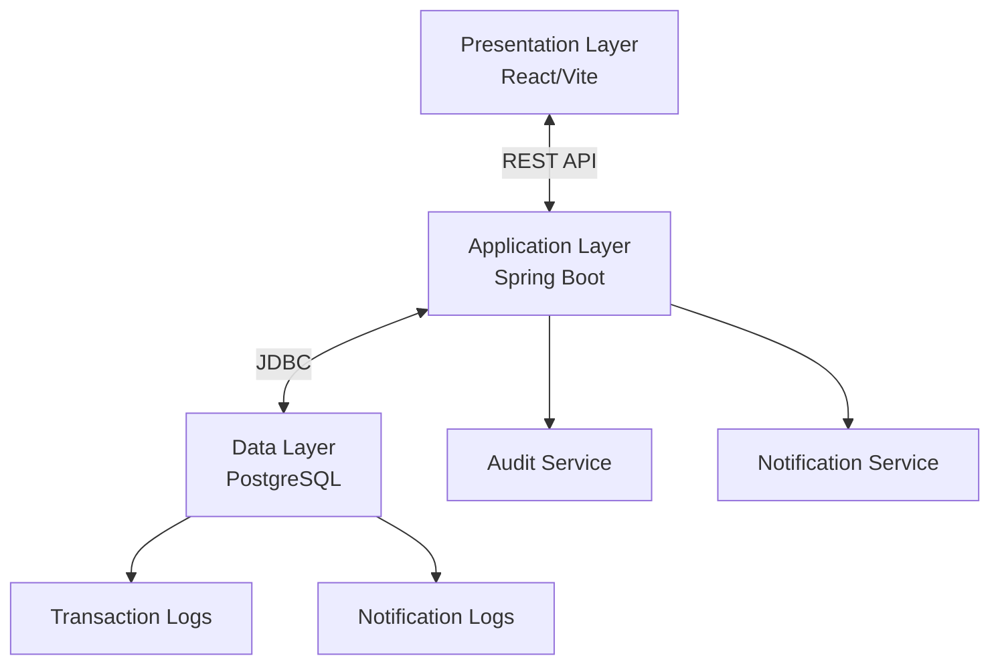

# Release Management System (RMS)

A specialized application designed to facilitate project and staffing planning for software delivery, enabling release managers, program managers, and team leads to efficiently plan, track, and manage resources across multiple releases and phases.

## 🎯 Project Overview

The Release Management System provides comprehensive tools for:

- **Resource Roster Management**: Maintain and manage team member information with skills and capacity
- **Release Planning**: Create and manage software releases with defined phases and timelines
- **Resource Allocation**: Automated allocation of resources based on predefined rules and capacity
- **Scope Management**: Track project scope items with effort estimates by skill and phase
- **Visual Planning**: Gantt charts, capacity views, and utilization dashboards
- **Audit & Compliance**: Complete transaction logging and audit trails
- **Reporting**: Comprehensive reports on utilization, conflicts, and capacity forecasting

## 🏗️ System Architecture

The system follows a modern 3-tier architecture:

- **Presentation Layer**: React 19.1.0 + Vite frontend with responsive design
- **Application Layer**: Spring Boot 3.5.4 + Java 21 REST API backend
- **Data Layer**: PostgreSQL 17.5 with comprehensive audit logging



## 🛠️ Technology Stack

### Frontend
- **Framework**: React 19.1.0 with TypeScript
- **Build Tool**: Vite
- **UI Library**: ShadCB UI components
- **Styling**: Tailwind CSS
- **State Management**: React Query + Context API
- **Testing**: Vitest + React Testing Library
- **Documentation**: Storybook

### Backend
- **Language**: Java 21
- **Framework**: Spring Boot 3.5.4
- **Database**: PostgreSQL 17.5
- **Build Tool**: Gradle
- **Security**: Spring Security with JWT
- **API Documentation**: SpringDoc OpenAPI (Swagger)
- **Testing**: JUnit 5 + Mockito + TestContainers

### DevOps & Tools
- **Containerization**: Docker + Docker Compose
- **CI/CD**: GitHub Actions
- **Code Quality**: ESLint, Prettier, JaCoCo
- **Version Control**: Git with conventional commits

## 🚀 Quick Start

### Prerequisites

- **Docker** (20.10.0+) and **Docker Compose** (2.0.0+)
- **Java 21** (for backend development)
- **Node.js 18+** and **npm 9+** (for frontend development)
- **Git** (2.30.0+)

### Environment Setup

1. **Clone the repository**:
   ```bash
   git clone <repository-url>
   cd relmgmt
   ```

2. **Set up environment variables**:
   ```bash
   # Create environment file
   cd relmgmt/docker
   cp .env.example .env
   # Edit .env with your configuration
   ```

3. **Start the application using Docker**:
   ```bash
   cd relmgmt/docker
   docker-compose up -d
   ```

4. **Access the application**:
   - **Frontend**: http://localhost:3000
   - **Backend API**: http://localhost:8080
   - **API Documentation**: http://localhost:8080/swagger-ui.html
   - **Database Admin**: http://localhost:5050 (PgAdmin)

### Development Setup

#### Backend Development
```bash
cd relmgmt/backend
./gradlew bootRun --args='--spring.profiles.active=dev'
```

#### Frontend Development
```bash
cd relmgmt/frontend
npm install
npm run dev
```

## 📊 Current Status

### ✅ Completed Phases (Production Ready)

#### **Phase 1 & 2: Foundation & Core UI** 
- **Backend**: Complete Spring Boot infrastructure with JWT authentication
- **Frontend**: Complete dashboard UI with responsive design
- **Quality**: 89/89 tests passing (100% success rate)
- **Coverage**: Backend 76%, Frontend 55% (100% on core components)

### 🚧 In Progress

#### **Phase 3: Authentication Integration & Resource Management**
- Frontend authentication routing and login/logout
- Backend resource management APIs
- Resource CRUD operations with Excel import/export

### 📋 Upcoming Phases
- Release and project management
- Resource allocation engine
- Reporting and visualization
- Notification system
- Audit logging and compliance

## 🧪 Testing

### Running Tests

**Backend Tests**:
```bash
cd relmgmt/backend
./gradlew test
./gradlew jacocoTestReport  # Generate coverage report
```

**Frontend Tests**:
```bash
cd relmgmt/frontend
npm test                    # Run tests
npm run test:coverage      # Generate coverage report
npm run test:ui            # Interactive test UI
```

### Quality Metrics
- **Backend**: 61/61 tests passing (100%), 76% code coverage
- **Frontend**: 28/28 tests passing (100%), 55% overall coverage
- **Linting**: Zero errors/warnings across codebase
- **Build**: All production builds successful

## 📝 API Documentation

The REST API follows versioned endpoints with comprehensive OpenAPI documentation:

- **Base URL**: `/api/v1/`
- **Authentication**: JWT Bearer tokens
- **Documentation**: Available at `/swagger-ui.html` when running
- **API Versioning**: URL path versioning for backward compatibility

### Key Endpoints (Planned)
- `/api/v1/auth/login` - User authentication
- `/api/v1/resources` - Resource management
- `/api/v1/releases` - Release management
- `/api/v1/projects` - Project management
- `/api/v1/allocations` - Resource allocation
- `/api/v1/reports` - Report generation

## 🔧 Development Workflow

### Test-Driven Development (TDD)
This project follows strict TDD practices:
1. **Red**: Write failing tests first
2. **Green**: Implement minimal code to pass tests
3. **Refactor**: Improve code while maintaining test coverage

### Code Quality Standards
- **Backend**: Minimum 75% test coverage (80% for service layer)
- **Frontend**: Minimum 75% test coverage (80% for components)
- **Linting**: Zero warnings/errors required
- **Documentation**: JSDoc comments for all public APIs

### Commit Standards
- Use conventional commits: `feat:`, `fix:`, `docs:`, `test:`, `refactor:`
- All commits must pass CI/CD pipeline
- Pull requests require passing tests and code review

## 🚢 Deployment

### Docker Deployment (Recommended)
```bash
cd relmgmt/docker
docker-compose -f docker-compose.prod.yml up -d
```

### Environment Configurations
- **Development**: `application-dev.yml` with hot reload
- **Testing**: `application-test.yml` with TestContainers
- **Production**: `application.yml` with optimized settings

## 📋 Features Overview

### Core Functionality
- [x] **Dashboard**: Overview of releases, resources, and key metrics
- [x] **Authentication**: JWT-based secure access
- [ ] **Resource Management**: Team member roster with skills and capacity
- [ ] **Release Planning**: Multi-phase release management
- [ ] **Project Management**: Project organization within releases
- [ ] **Scope Management**: Feature tracking with effort estimation
- [ ] **Resource Allocation**: Automated assignment based on rules
- [ ] **Reporting**: Utilization, conflicts, and capacity reports
- [ ] **Audit Logging**: Complete transaction history for compliance

### Advanced Features (Future)
- [ ] **Gantt Charts**: Visual timeline representation
- [ ] **Capacity Planning**: Resource load balancing with conflict detection
- [ ] **Excel Integration**: Import/export for resource rosters and reports
- [ ] **Notification System**: Real-time alerts for conflicts and deadlines
- [ ] **Multi-Release View**: Annual planning and visualization

## 🤝 Contributing

### Development Setup
1. Read the [Local Development Setup Guide](docs/local-development-setup.md)
2. Review [Backend Technical Specification](docs/backend-technical-specification.md)
3. Review [Frontend Technical Specification](docs/frontend-technical-specification.md)
4. Check current [Implementation Tasks](tasks/tasks.md)

### Code Contribution
1. Fork the repository
2. Create a feature branch: `git checkout -b feature/your-feature`
3. Write tests first (TDD approach)
4. Implement the feature
5. Ensure all tests pass: `npm test` and `./gradlew test`
6. Commit with conventional format: `git commit -m "feat: add your feature"`
7. Push and create a pull request

### Issue Reporting
- Use GitHub Issues for bug reports and feature requests
- Include steps to reproduce for bugs
- Check existing issues before creating new ones

## 📚 Documentation

- **[Product Requirements](docs/PRD-Release_Management_System.md)**: Complete feature specifications
- **[System Architecture](docs/system-architecture.md)**: Technical design and component relationships
- **[Backend Specification](docs/backend-technical-specification.md)**: Detailed backend implementation guide
- **[Frontend Specification](docs/frontend-technical-specification.md)**: Detailed frontend implementation guide
- **[Local Setup Guide](docs/local-development-setup.md)**: Development environment setup
- **[CI/CD Guide](docs/ci-cd-deployment.md)**: Deployment and pipeline configuration
- **[Current Status](docs/status.md)**: Project progress and known issues

## ⚠️ Important Notes

### Security Considerations
- **JWT Authentication**: Secure token-based authentication system
- **Password Encryption**: BCrypt encoding for user passwords
- **Input Validation**: Comprehensive validation on all endpoints
- **Audit Logging**: Immutable transaction logs for compliance

### Performance Targets
- **Concurrent Users**: Support for 50+ concurrent users
- **Page Load Time**: < 3 seconds under normal conditions
- **API Response Time**: < 500ms for standard operations
- **Resource Allocation**: < 5 seconds for single release calculation

## 📞 Support

For questions, issues, or contributions:
- **Technical Issues**: Create a GitHub Issue
- **Development Questions**: Check existing documentation first
- **Feature Requests**: Use GitHub Issues with enhancement label

## 📄 License

This project is proprietary software developed for enterprise release management. All rights reserved.

---

**Last Updated**: January 2025  
**Version**: MVP Development Phase  
**Status**: Phase 1 & 2 Complete, Phase 3 In Progress