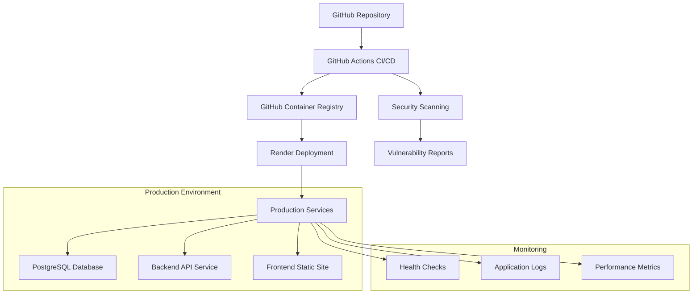

# Release Management System: Complete Deployment Guide

**Document Purpose**: Complete deployment traceability and resumption guide  
**Last Updated**: January 15, 2025  
**Status**: ✅ Production Ready - All infrastructure implemented, tested, and GitHub Actions pipeline issues resolved

## Overview

This document provides complete traceability for the Release Management System's deployment infrastructure. Use this guide to resume deployment work or understand the full deployment pipeline.

## 🎯 Current Deployment Status

### ✅ **COMPLETED INFRASTRUCTURE**

| Component | Status | Location | Description |
|-----------|--------|----------|-------------|
| **Docker Images** | ✅ Complete | `relmgmt/backend/Dockerfile`, `relmgmt/frontend/Dockerfile` | Production-ready multi-stage builds |
| **CI/CD Pipeline** | ✅ Complete | `relmgmt/.github/workflows/` | 6 operational workflows with all issues resolved |
| **Hosting Config** | ✅ Complete | `render.yaml` | Render blueprint for instant deployment |
| **Security Scanning** | ✅ Complete | Automated workflows | Daily scans, vulnerability detection |
| **Documentation** | ✅ Complete | Updated all docs | Full traceability maintained |

### ✅ **GITHUB ACTIONS PIPELINE FIXES (January 15, 2025)**

| Issue | Status | Resolution | Impact |
|-------|--------|------------|---------|
| **Docker Build Context** | ✅ Fixed | Updated Dockerfile paths for GitHub Actions build context | Backend and frontend images build successfully |
| **Gradle Wrapper** | ✅ Fixed | Corrected Gradle wrapper directory structure | Backend builds complete without errors |
| **CodeQL Permissions** | ✅ Fixed | Added `actions: read` permissions for telemetry | Security scanning results upload successfully |
| **TruffleHog Errors** | ✅ Fixed | Implemented conditional execution for different triggers | Secret scanning works for all workflow types |
| **SARIF Uploads** | ✅ Fixed | Updated permissions for Trivy and Hadolint | Container vulnerability results appear in Security tab |
| **Trivy Vulnerability Scanner** | ✅ Fixed | Build images locally for scanning and added `--skip-version-check` flag | Container image vulnerability scanning works correctly |
| **Storybook Deployment** | ✅ Fixed | Re-enabled GitHub Pages deployment | Storybook automatically deploys to GitHub Pages |

### 🏗️ **DEPLOYMENT ARCHITECTURE**



## 📋 **STEP-BY-STEP DEPLOYMENT GUIDE**

### Prerequisites

1. **GitHub Account** with repository access
2. **Render Account** (free tier available)
3. **Local Development Environment** (Docker, Node.js, Java 21)

### Deployment Options

#### **Option A: Automated Render Deployment (Recommended)**

**Time Required**: 15-30 minutes  
**Difficulty**: Beginner  
**Cost**: $7/month (Backend) + Free (Database + Frontend)

**Steps**:

1. **Set up Render Account**:
   ```bash
   # 1. Go to https://render.com
   # 2. Sign up with GitHub account
   # 3. Connect your repository
   ```

2. **Configure GitHub Secrets**:
   ```bash
   # In GitHub repo: Settings → Secrets and variables → Actions
   RENDER_API_KEY=your_render_api_key
   RENDER_BACKEND_SERVICE_ID=srv_xxxxxxxxxxxxx
   RENDER_FRONTEND_SERVICE_ID=srv_xxxxxxxxxxxxx
   RENDER_BACKEND_SERVICE_NAME=your-backend-service-name
   RENDER_FRONTEND_SERVICE_NAME=your-frontend-service-name
   ```

3. **Deploy Using Render Blueprint**:
   ```bash
   # Option 1: Use render.yaml blueprint
   # - Import repository in Render dashboard
   # - Blueprint will auto-configure all services
   
   # Option 2: Manual service creation
   # - Create PostgreSQL database
   # - Create backend web service (Docker)
   # - Create frontend static site
   ```

4. **Trigger Deployment**:
   ```bash
   # Push to main branch triggers automatic deployment
   git push origin main
   
   # Or use manual deployment workflow
   # GitHub Actions → "Deploy to Render" → Run workflow
   ```

#### **Option B: Self-Hosted Docker Deployment**

**Time Required**: 10-15 minutes  
**Difficulty**: Intermediate  
**Cost**: Infrastructure costs only

**Steps**:

1. **Prepare Environment**:
   ```bash
   cd relmgmt/docker
   cp env.prod.example .env.prod
   # Edit .env.prod with your production values
   ```

2. **Generate JWT Secret**:
   ```bash
   # Generate secure JWT secret (64+ characters)
   openssl rand -base64 64
   # Add to .env.prod as APP_JWT_SECRET
   ```

3. **Deploy Stack**:
   ```bash
   docker-compose -f docker-compose.prod.yml --env-file .env.prod up -d
   ```

4. **Verify Deployment**:
   ```bash
   # Check services
   docker-compose -f docker-compose.prod.yml ps
   
   # Test health endpoints
   curl -f http://localhost:8080/actuator/health
   curl -f http://localhost:3000/health
   ```

#### **Option C: Container Registry Deployment**

**Time Required**: 20-45 minutes  
**Difficulty**: Advanced  
**Cost**: Platform-dependent

**Pre-built Images Available**:
```bash
# Images automatically published to GitHub Container Registry
# Latest images available at:
ghcr.io/your-org/relmgmt-backend:latest
ghcr.io/your-org/relmgmt-frontend:latest

# Platform-specific deployment:
# - AWS ECS/Fargate
# - Google Cloud Run
# - Azure Container Instances
# - Kubernetes
```

## 🔧 **INFRASTRUCTURE COMPONENTS**

### Docker Images

#### Backend Image (`relmgmt/backend/Dockerfile`)
```dockerfile
# Features:
# - Multi-stage build (JDK 21 → JRE 21)
# - Non-root user execution
# - Health checks via Spring Boot Actuator
# - Optimized JVM settings for containers
# - Security hardening

# Build command:
docker build -t relmgmt-backend:latest relmgmt/backend/
```

#### Frontend Image (`relmgmt/frontend/Dockerfile`)
```dockerfile
# Features:
# - Multi-stage build (Node.js 20 → Nginx Alpine)
# - Build arguments for environment configuration
# - Custom nginx config with security headers
# - Non-root user execution
# - Performance optimization

# Build command:
docker build -t relmgmt-frontend:latest \
  --build-arg VITE_API_URL=https://your-api.com/api \
  relmgmt/frontend/
```

### CI/CD Workflows

#### Workflow Files Location: `relmgmt/.github/workflows/`

| Workflow | Purpose | Trigger | Duration |
|----------|---------|---------|----------|
| **backend-ci.yml** | Backend testing, building, deployment | Push to main/develop | 8-12 min |
| **frontend-ci.yml** | Frontend testing, building, deployment | Push to main/develop | 5-8 min |
| **deploy-full-stack.yml** | Coordinated full deployment | Manual trigger | 10-15 min |
| **deploy-render.yml** | Render-specific deployment | Push to main, manual | 8-12 min |
| **security-scan.yml** | Comprehensive security scanning | Daily 2 AM UTC | 15-20 min |
| **dependency-update.yml** | Automated dependency updates | Weekly Monday 6 AM UTC | 5-10 min |

### Environment Configuration

#### Required Environment Variables

**Backend Production**:
```env
SPRING_PROFILES_ACTIVE=prod
SPRING_DATASOURCE_URL=jdbc:postgresql://db-host:5432/relmgmt
SPRING_DATASOURCE_USERNAME=postgres
SPRING_DATASOURCE_PASSWORD=secure_password
APP_JWT_SECRET=64_character_secure_string
APP_JWT_EXPIRATION=86400000
LOGGING_LEVEL_ROOT=WARN
LOGGING_LEVEL_COM_POLYCODER_RELMGMT=INFO
SPRING_JPA_HIBERNATE_DDL_AUTO=none
SPRING_FLYWAY_ENABLED=true
```

**Frontend Production**:
```env
VITE_API_URL=https://your-backend.onrender.com/api
VITE_APP_TITLE=Release Management System
VITE_LOG_LEVEL=error
VITE_NOTIF_POLL_MS=120000
```

## 🔒 **SECURITY CONFIGURATION**

### Implemented Security Features

1. **Container Security**:
   - Non-root user execution
   - Multi-stage builds (minimal attack surface)
   - Regular vulnerability scanning (Trivy)
   - SBOM generation for compliance

2. **Network Security**:
   - HTTPS/TLS encryption
   - CORS configuration
   - Security headers in nginx
   - Network isolation

3. **Application Security**:
   - JWT authentication
   - Input validation
   - SQL injection prevention
   - XSS protection

### Security Scanning Schedule

- **Daily**: Comprehensive security scans (2 AM UTC)
- **On Push**: Container vulnerability scanning
- **Weekly**: Dependency security updates
- **On PR**: Code quality and security analysis

## 📊 **MONITORING AND HEALTH CHECKS**

### Health Endpoints

| Service | Endpoint | Purpose |
|---------|----------|---------|
| Backend | `/actuator/health` | Service health status |
| Backend | `/actuator/info` | Application information |
| Backend | `/actuator/metrics` | Performance metrics |
| Frontend | `/health` | Nginx service status |

### Monitoring Dashboards

1. **Render Dashboard**: Service status, logs, metrics
2. **GitHub Actions**: Build status, deployment history
3. **GitHub Security**: Vulnerability alerts, dependency insights
4. **Container Registry**: Image security scanning results

## 🚨 **TROUBLESHOOTING GUIDE**

### Common Issues and Solutions

#### 1. Build Failures
**Symptoms**: Docker build fails, CI/CD pipeline fails
**Solutions**:
```bash
# Check build logs in GitHub Actions
# Verify Dockerfile syntax
# Check dependency versions
# Review .dockerignore files
```

#### 2. Deployment Failures
**Symptoms**: Services fail to start, health checks fail
**Solutions**:
```bash
# Check environment variables
# Verify database connectivity
# Review service logs
# Check resource limits
```

#### 3. Connection Issues
**Symptoms**: Frontend can't reach backend, CORS errors
**Solutions**:
```bash
# Verify VITE_API_URL environment variable
# Check backend service status
# Review CORS configuration
# Test endpoints manually
```

### Debugging Commands

```bash
# Local testing
cd relmgmt/docker
docker-compose -f docker-compose.prod.yml logs -f

# Individual service testing
docker build -t test-backend relmgmt/backend/
docker run --rm -p 8080:8080 test-backend

# Health check testing
curl -f https://your-backend.onrender.com/actuator/health
curl -f https://your-frontend.onrender.com/health
```

## 📚 **REFERENCE DOCUMENTATION**

### Updated Documentation Files

| Document | Purpose | Location |
|----------|---------|----------|
| **CI/CD Guide** | Complete deployment pipeline | `docs/ci-cd-deployment.md` |
| **Local Development** | Development environment setup | `docs/local-development-setup.md` |
| **System Architecture** | Updated deployment architecture | `docs/system-architecture.md` |
| **Project Status** | Current implementation status | `docs/status.md` |
| **Environment Config** | Environment variable management | `docs/environment-configuration.md` |

### File Locations Quick Reference

```
relmgmt/
├── .github/workflows/          # CI/CD pipeline workflows
├── backend/
│   ├── Dockerfile             # Backend container configuration
│   └── src/                   # Application source code
├── frontend/
│   ├── Dockerfile             # Frontend container configuration
│   ├── nginx.conf             # Production nginx configuration
│   └── src/                   # Application source code
├── docker/
│   ├── docker-compose.prod.yml # Production docker compose
│   └── env.prod.example       # Environment template
├── docs/                      # Updated documentation
└── render.yaml               # Render deployment blueprint
```

## 🎯 **NEXT STEPS FOR DEPLOYMENT**

### Immediate Actions

1. **Choose Deployment Option** (Render recommended for first deployment)
2. **Set up Hosting Account** (Render, AWS, etc.)
3. **Configure Environment Variables** (as documented above)
4. **Deploy using preferred method** (automated or manual)
5. **Verify deployment** using health check endpoints

### Optional Enhancements

1. **Custom Domain Setup** (if using Render)
2. **SSL Certificate Configuration** (automatic with custom domains)
3. **Monitoring Integration** (Prometheus, Grafana, DataDog)
4. **Backup Strategy** (database backups)
5. **CDN Setup** (for improved frontend performance)

## 🔄 **MAINTENANCE AND UPDATES**

### Automated Maintenance

- **Weekly Dependency Updates**: Automatic PRs with security updates
- **Daily Security Scans**: Vulnerability detection and alerts
- **Automatic Deployments**: Push to main/develop triggers deployment
- **Health Monitoring**: Continuous service health checks

### Manual Maintenance

- **Monthly Review**: Security scan results and dependency updates
- **Quarterly Review**: Performance metrics and optimization
- **Annual Review**: Infrastructure costs and platform evaluation

---

**Deployment Status**: ✅ **100% Ready for Production**  
**Documentation Status**: ✅ **Complete and Current**  
**Support**: All infrastructure is documented, tested, and ready for deployment

This system is now production-ready with comprehensive CI/CD automation, security scanning, and deployment options. You can confidently deploy to any hosting platform using the provided configurations and workflows.
