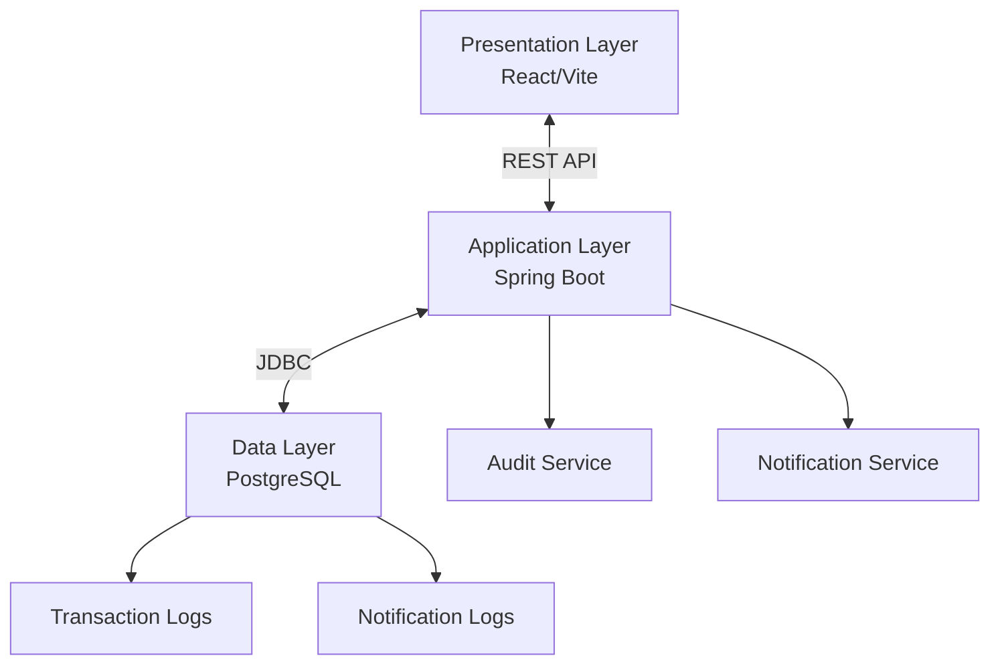
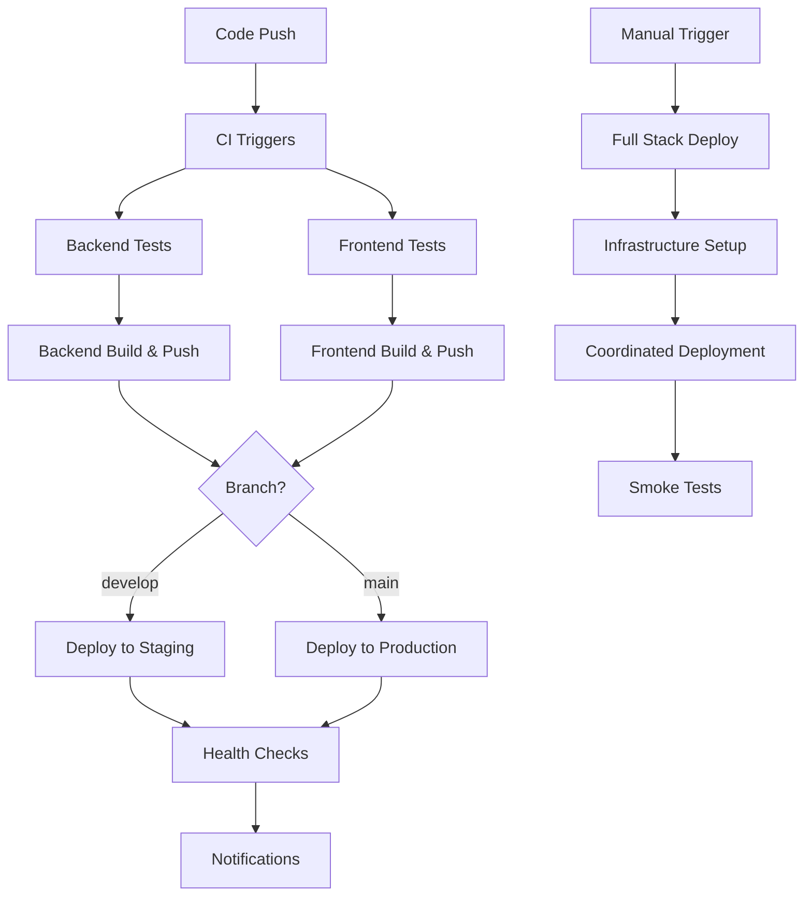
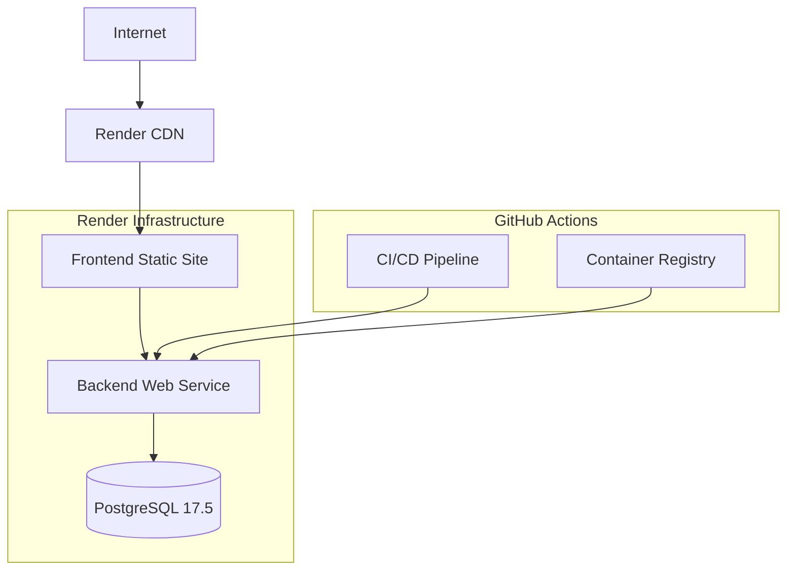

# Release Management System: System Architecture (MVP)

## 1. Overview

The Release Management System (RMS) is designed as a modern web application following a client-server architecture. This document outlines the technical architecture, components, data flow, and deployment considerations for the system.

**Last Updated**: September 8, 2025 - Critical allocation bug fixes and PRD compliance improvements implemented.

## 2. High-Level Architecture

The system follows a 3-tier architecture:

1. **Presentation Layer**: React-based frontend application
2. **Application Layer**: Spring Boot REST API backend with versioning
3. **Data Layer**: PostgreSQL database with transaction logging

## 3. Component Diagram



## 4. Detailed Component Architecture

### 4.1 Presentation Layer

The frontend is built using React 19.1.0 with the following key components:

- **Vite**: Build tool and development server
- **ShadCB UI**: Component library for consistent UI elements
- **Tailwind CSS**: Utility-first CSS framework
- **React Router**: Client-side routing
- **React Query**: Data fetching and state management
- **Recharts/Chart.js**: For Gantt charts and other visualizations

#### Key Frontend Modules:

1. **Layout Module**: Responsive layout with hamburger menu navigation, header with notifications, and sidebar ✅
2. **Dashboard Module**: Overview and summary information with responsive design ✅
3. **Authentication Module**: Handles user login and session management (simplified for MVP)
4. **Resource Management Module**: CRUD operations for resource roster
5. **Release Planning Module**: Creation and management of releases
6. **Project Management Module**: Management of projects within releases
7. **Scope Management Module**: Management of scope items and estimates
8. **Visualization Module**: Gantt charts and capacity views
9. **Reporting Module**: Generation and export of reports
10. **Notification Module**: Display and management of system notifications ✅
11. **Audit Module**: Interface for viewing and searching transaction logs

### 4.2 Application Layer

The backend is built using Spring Boot 3.5.4 with Java 21, structured into the following layers:

- **API Controllers**: REST endpoints for client communication with versioning
- **Service Layer**: Business logic implementation
- **Repository Layer**: Data access and persistence
- **Domain Model**: Entity definitions
- **DTOs**: Data transfer objects for API communication
- **Utilities**: Helper classes and common functionality
- **Audit Aspect**: Cross-cutting concern for transaction logging
- **Notification Service**: Event-based notification generation and management

#### Key Backend Modules:

1. **Authentication**: Simple user authentication (single user for MVP)
2. **Resource Management**: Resource roster operations
3. **Release Management**: Release and phase operations
4. **Project Management**: Project operations
5. **Scope Management**: Scope items and effort estimates
6. **Allocation Engine**: Resource allocation algorithm based on defined rules
7. **Weekly Allocation Service**: Service for managing weekly resource allocations with time-based queries
8. **File Import/Export**: Excel file processing
9. **Reporting Service**: Generation of standard reports
10. **Notification Service**: Management of system notifications
11. **Audit Service**: Transaction logging and audit trail management

### 4.3 Data Layer

The data layer uses PostgreSQL 17 with the following schema design:

- **Users**: Authentication information (simplified for MVP - single user)
- **Resources**: Resource roster data including status and project dates
- **Releases**: Release information including name and blockers
- **Projects**: Project information that belongs to releases
  - id: Primary key
  - release_id: Foreign key to releases
  - name: Project name
  - description: Project description
  - type: Project type (Day 1 or Day 2)
  - created_at: Creation timestamp
  - updated_at: Last update timestamp
- **Phases**: Release phase definitions
- **ScopeItems**: Scope items for projects
- **EffortEstimates**: Effort estimates by skill and phase
- **Allocations**: Resource allocations to releases
- **Notifications**: System notifications and their status
- **TransactionLogs**: Detailed records of all data modifications
- **AuditTrail**: System-level audit events

#### 4.3.1 Transaction Logging Schema

The transaction logging schema includes:

```sql
CREATE TABLE transaction_logs (
    id SERIAL PRIMARY KEY,
    user_id INTEGER NOT NULL REFERENCES users(id),
    action_type VARCHAR(10) NOT NULL, -- CREATE, UPDATE, DELETE
    entity_type VARCHAR(50) NOT NULL, -- Resource, Release, Project, etc.
    entity_id INTEGER NOT NULL,
    timestamp TIMESTAMP WITH TIME ZONE DEFAULT CURRENT_TIMESTAMP,
    ip_address VARCHAR(45),
    old_values JSONB,
    new_values JSONB,
    additional_info JSONB
);

CREATE INDEX idx_transaction_logs_entity ON transaction_logs(entity_type, entity_id);
CREATE INDEX idx_transaction_logs_user ON transaction_logs(user_id);
CREATE INDEX idx_transaction_logs_timestamp ON transaction_logs(timestamp);
```

#### 4.3.2 Notification Schema

The notification schema includes:

```sql
CREATE TABLE notifications (
    id SERIAL PRIMARY KEY,
    user_id INTEGER NOT NULL REFERENCES users(id),
    event_type VARCHAR(50) NOT NULL, -- ALLOCATION_CONFLICT, OVER_ALLOCATION, DEADLINE_APPROACHING, BLOCKER_ADDED, BLOCKER_RESOLVED
    entity_type VARCHAR(50) NOT NULL, -- Resource, Release, Phase, etc.
    entity_id INTEGER NOT NULL,
    message TEXT NOT NULL,
    is_read BOOLEAN DEFAULT FALSE,
    created_at TIMESTAMP WITH TIME ZONE DEFAULT CURRENT_TIMESTAMP,
    read_at TIMESTAMP WITH TIME ZONE
);

CREATE INDEX idx_notifications_user ON notifications(user_id);
CREATE INDEX idx_notifications_is_read ON notifications(is_read);
CREATE INDEX idx_notifications_created_at ON notifications(created_at);
```

## 5. Data Flow

### 5.1 Resource Roster Management

1. User uploads Excel file or manually enters resource data
2. Frontend sends data to backend API
3. Backend validates data and stores in database
4. Audit service logs the transaction with before/after values
5. Confirmation returned to frontend

#### 5.1.1 Resource Deletion

1. User requests to delete a resource
2. Frontend sends deletion request to backend API
3. Backend checks if the resource is allocated to any active release (release with production go-live date in the future)
4. If resource is allocated to active release(s):
   - Backend returns HTTP 409 Conflict with details of the active allocations
   - Frontend displays error message to the user
5. If resource is not allocated to any active release:
   - Backend deletes the resource
   - Audit service logs the deletion
   - Confirmation returned to frontend

### 5.2 Release Planning

1. User creates release with name, phase information, and blockers
2. Frontend sends data to backend API
3. Backend validates and stores release data
4. Audit service logs the transaction
5. User adds projects to the release
6. Backend stores project data
7. Audit service logs the transaction

### 5.3 Project and Scope Management

1. User adds scope items to a project
2. User provides effort estimates for each scope item
3. Backend stores scope and estimate data
4. Audit service logs each transaction

### 5.4 Resource Allocation

1. User requests resource allocation for a release
2. Backend allocation engine:
   - Retrieves release, phase, project, scope, and resource data
   - Applies allocation rules
   - Generates allocation plan
   - Flags resources with over-allocation across releases
   - Stores allocation data
3. Audit service logs the allocation transactions
4. Allocation results returned to frontend
5. Frontend displays allocation in grid/Gantt views with appropriate color coding

### 5.5 Reporting and Export

1. User selects a report type to generate
2. Backend retrieves and processes relevant data
3. Report data is returned to frontend
4. Frontend displays the report with visualizations
5. User can export the report to Excel format

### 5.6 Notification Flow

1. System event triggers notification creation (e.g., allocation conflict detected)
2. Notification service creates notification record
3. Frontend polls for new notifications or receives via WebSocket (future enhancement)
4. User views notifications in notification center
5. User marks notifications as read
6. Notification service updates notification status

### 5.7 Audit Trail Access

1. User accesses the audit log interface
2. User applies filters (date range, action type, entity)
3. Backend retrieves filtered transaction logs
4. Frontend displays the audit trail with pagination
5. User can export the audit data to CSV/Excel if needed

## 6. API Design

The system exposes a RESTful API with versioning and the following key endpoints:

### 6.1 API Versioning

- All API endpoints are versioned using URL path versioning
- Format: `/api/v1/{resource}`
- Initial version is v1
- When breaking changes are required, a new version (v2) will be introduced
- Previous versions will be maintained for backward compatibility

### 6.2 Authentication

- `POST /api/v1/auth/login`: User authentication
- `POST /api/v1/auth/logout`: User logout

### 6.3 Resource Management

- `GET /api/v1/resources`: List all resources
- `POST /api/v1/resources`: Create new resource
- `PUT /api/v1/resources/{id}`: Update resource
- `DELETE /api/v1/resources/{id}`: Delete resource
- `POST /api/v1/resources/import`: Import resources from Excel
- `GET /api/v1/resources/export`: Export resource roster to Excel

### 6.4 Release Management

- `GET /api/v1/releases`: List all releases
- `POST /api/v1/releases`: Create new release
- `PUT /api/v1/releases/{id}`: Update release
- `DELETE /api/v1/releases/{id}`: Delete release
- `GET /api/v1/releases/{id}/phases`: Get phases for a release
- `POST /api/v1/releases/{id}/blockers`: Add blocker to release
- `DELETE /api/v1/releases/{id}/blockers/{blockerId}`: Remove blocker from release

### 6.5 Project Management

- `GET /api/v1/releases/{id}/projects`: Get projects for a release
- `POST /api/v1/releases/{id}/projects`: Add project to release
- `PUT /api/v1/projects/{id}`: Update project
- `DELETE /api/v1/projects/{id}`: Delete project

### 6.6 Scope Management

- `GET /api/v1/projects/{id}/scope`: Get scope items for a project
- `POST /api/v1/projects/{id}/scope`: Add scope item to project
- `PUT /api/v1/scope/{id}`: Update scope item
- `DELETE /api/v1/scope/{id}`: Delete scope item
- `POST /api/v1/scope/{id}/estimates`: Add effort estimates to scope item

### 6.7 Allocation

- `POST /api/v1/releases/{id}/allocate`: Generate resource allocation
- `GET /api/v1/releases/{id}/allocations`: Get allocations for a release
- `GET /api/v1/resources/{id}/allocations`: Get allocations for a resource
- `GET /api/v1/allocations/conflicts`: Get allocation conflicts
- `GET /api/v1/allocations/weekly`: Get weekly allocation matrix with time window
- `PUT /api/v1/allocations/weekly/{resourceId}/{weekStart}`: Update weekly allocation for a resource

### 6.8 Notifications

- `GET /api/v1/notifications`: Get user notifications
- `PUT /api/v1/notifications/{id}/read`: Mark notification as read
- `PUT /api/v1/notifications/read-all`: Mark all notifications as read
- `DELETE /api/v1/notifications/{id}`: Delete notification

### 6.9 Reports

- `GET /api/v1/reports/resource-utilization`: Generate resource utilization report
- `GET /api/v1/reports/release-timeline`: Generate release timeline report
- `GET /api/v1/reports/allocation-conflicts`: Generate allocation conflicts report
- `GET /api/v1/reports/capacity-forecast`: Generate capacity forecast report
- `GET /api/v1/reports/skill-capacity-forecast`: Generate skill-based capacity forecast report
- `GET /api/v1/reports/{reportType}/export`: Export report to Excel

### 6.10 Audit Trail

- `GET /api/v1/audit/logs`: Get transaction logs with filtering
- `GET /api/v1/audit/logs/{id}`: Get details of a specific transaction
- `GET /api/v1/audit/export`: Export audit logs to CSV/Excel

## 7. Security Architecture

### 7.1 Authentication & Authorization

- Simple authentication mechanism for single user (MVP)
- JWT-based authentication
- HTTPS for all communication

### 7.2 Data Protection

- Encryption of sensitive data at rest
- Input validation to prevent injection attacks
- CSRF protection

### 7.3 Audit Security

- Immutable transaction logs (append-only)
- Audit log integrity verification
- Tamper-evident logging with cryptographic signatures

## 8. Deployment Architecture

**Status**: ✅ **FULLY IMPLEMENTED** - Production-ready CI/CD and containerization complete

### 8.1 Docker Containerization

The Release Management System is deployed using production-ready Docker containers with comprehensive CI/CD automation:

#### 8.1.1 Production Docker Images

**Backend Container** (`relmgmt/backend/Dockerfile`):
- **Base Images**: Eclipse Temurin 21 JDK (build) → Eclipse Temurin 21 JRE (runtime)
- **Multi-stage Build**: Optimized for size and security
- **Security**: Non-root user execution, health checks
- **Registry**: GitHub Container Registry (ghcr.io)
- **Platforms**: Multi-platform builds (linux/amd64, linux/arm64)

**Frontend Container** (`relmgmt/frontend/Dockerfile`):
- **Base Images**: Node.js 20 Alpine (build) → Nginx Alpine (runtime)
- **Build Arguments**: Environment-specific configuration support
- **Security**: Custom nginx config with security headers, non-root execution
- **Features**: Gzip compression, SPA routing, health endpoints
- **Registry**: GitHub Container Registry (ghcr.io)

#### 8.1.2 Container Orchestration

**Development Environment**:
```yaml
# relmgmt/docker/docker-compose.yml
services:
  - PostgreSQL 17.5 with volume mounts for development
  - Spring Boot with hot reload and debug ports
  - Vite dev server with HMR
```

**Production Environment**:
```yaml
# relmgmt/docker/docker-compose.prod.yml
services:
  - PostgreSQL 17.5 Alpine with resource limits
  - Containerized backend with health checks
  - Containerized frontend with nginx optimization
  - Network isolation and security hardening
```

#### 8.1.3 Container Registry Integration

**GitHub Container Registry (GHCR)**:
- Automatic image publishing on main/develop branches
- Multi-platform builds (amd64/arm64)
- Vulnerability scanning with Trivy
- SBOM (Software Bill of Materials) generation
- Image tagging strategy: latest, branch-name, sha-prefix

### 8.2 CI/CD Pipeline Architecture

#### 8.2.1 GitHub Actions Workflows

**Implemented Workflows** (Status: ✅ **COMPLETE**):

1. **Backend CI/CD** (`relmgmt/.github/workflows/backend-ci.yml`)
   - PostgreSQL service for integration testing
   - JaCoCo test coverage reporting
   - Multi-platform Docker builds
   - Automatic deployment to staging/production
   - SBOM generation and vulnerability scanning

2. **Frontend CI/CD** (`relmgmt/.github/workflows/frontend-ci.yml`)
   - ESLint/Prettier validation
   - Unit testing with coverage reporting
   - Bundle size analysis
   - Storybook deployment to GitHub Pages
   - Multi-platform Docker builds with build args

3. **Full Stack Deployment** (`relmgmt/.github/workflows/deploy-full-stack.yml`)
   - Manual deployment with environment selection
   - Infrastructure coordination (database, migrations)
   - Health check validation and smoke testing
   - Notification system for deployment status

4. **Render Deployment** (`relmgmt/.github/workflows/deploy-render.yml`)
   - Render API integration for automated deployments
   - Service health monitoring and verification
   - Rollback capabilities

5. **Security Scanning** (`relmgmt/.github/workflows/security-scan.yml`)
   - CodeQL analysis (Java/JavaScript)
   - Container vulnerability scanning (Trivy)
   - Dependency scanning (Gradle/npm audit)
   - Secret scanning (GitLeaks, TruffleHog)

6. **Dependency Management** (`relmgmt/.github/workflows/dependency-update.yml`)
   - Weekly automated dependency updates
   - Security patch automation
   - Automated PR creation with testing

#### 8.2.2 Deployment Flow



### 8.3 Hosting Platform Integration

#### 8.3.1 Render Platform Configuration

**Render Blueprint** (`render.yaml`):
```yaml
services:
  - PostgreSQL Database (Free tier)
  - Backend Web Service (Docker-based)
  - Frontend Static Site (npm build)
```

**Features**:
- Automatic environment variable management
- Health check integration
- Custom domain support
- SSL/TLS certificates
- Auto-scaling capabilities

#### 8.3.2 Environment Management

**Environment Variables**:
- Development: Local .env files
- Production: Render dashboard configuration
- CI/CD: GitHub repository secrets
- Docker: Environment-specific .env files

**Configuration Management**:
- Spring profiles for backend (dev, test, prod)
- Vite environment variables for frontend
- Docker build arguments for environment-specific builds

### 8.4 Infrastructure Requirements

#### 8.4.1 Production Architecture (Render)



#### 8.4.2 Resource Specifications

**Development**:
- **CPU**: 2 cores minimum
- **Memory**: 8GB minimum
- **Storage**: 50GB for containers and data

**Production (Render)**:
- **Database**: PostgreSQL Free tier (1GB storage)
- **Backend**: Starter plan ($7/month, 0.5 CPU, 512MB RAM)
- **Frontend**: Static site hosting (Free)

### 8.5 Security Architecture

#### 8.5.1 Container Security

**Implemented Features**:
- Non-root user execution in all containers
- Multi-stage builds for minimal attack surface
- Regular vulnerability scanning with Trivy
- SBOM generation for compliance
- Security headers in nginx configuration

#### 8.5.2 CI/CD Security

**Security Measures**:
- GitHub repository secrets management
- Automated dependency vulnerability scanning
- Container image security scanning
- Secret scanning in code repository
- Branch protection rules with required status checks

### 8.6 Network Architecture

#### 8.6.1 Development Networking

```yaml
networks:
  relmgmtnet:
    driver: bridge
    ipam:
      config:
        - subnet: 172.20.0.0/16
```

#### 8.6.2 Production Networking

**Render Platform**:
- HTTPS/SSL termination at edge
- Internal service communication over private network
- Database access restricted to backend service
- CORS configuration for frontend-backend communication

### 8.7 Monitoring and Observability

#### 8.7.1 Health Checks

**Backend Health Endpoints**:
- `/actuator/health` - Service health status
- `/actuator/info` - Application information
- `/actuator/metrics` - Performance metrics

**Frontend Health Endpoints**:
- `/health` - Nginx service status
- Custom health check for API connectivity

#### 8.7.2 Logging

**Development**:
- Docker Compose logs
- Real-time log streaming
- Structured logging with levels

**Production**:
- Render service logs
- Application-level logging
- Error tracking and alerts

### 8.8 Backup and Recovery

#### 8.8.1 Database Backup

**Render PostgreSQL**:
- Automatic daily backups (retention varies by plan)
- Point-in-time recovery capabilities
- Database export functionality

#### 8.8.2 Application Recovery

**Docker Images**:
- Versioned images in GitHub Container Registry
- Previous deployment rollback capabilities
- Infrastructure as Code (render.yaml)

### 8.9 Scalability and Performance

#### 8.9.1 Horizontal Scaling

**Current Setup**:
- Single instance per service (MVP)
- Database connection pooling
- Static asset optimization

**Future Scaling Options**:
- Multiple backend instances with load balancing
- CDN integration for global distribution
- Database read replicas for performance

#### 8.9.2 Performance Optimization

**Implemented**:
- Multi-stage Docker builds for smaller images
- Nginx gzip compression
- Frontend bundle optimization
- Database connection pooling
- JVM tuning for containers

## 9. Performance Considerations

### 9.1 Database Optimization

- Indexing on frequently queried fields
- Pagination for large result sets
- Query optimization for complex allocation calculations
- Partitioning of transaction logs by time period
- Separate tablespace for audit logs to minimize impact on operational performance

### 9.2 Application Optimization

- Caching of frequently accessed data
- Asynchronous processing for resource-intensive operations
- Batch processing for bulk operations
- Asynchronous transaction logging to minimize impact on response times

### 9.3 Frontend Optimization

- Code splitting for faster initial load
- Lazy loading of components
- Virtualization for large data grids
- Pagination for audit log display

## 10. Monitoring and Logging

### 10.1 Application Monitoring

- Spring Boot Actuator endpoints for health and metrics
- Prometheus for metrics collection
- Grafana for visualization

### 10.2 Logging

- Structured logging with SLF4J
- Log aggregation with ELK stack (optional)
- Transaction tracing

### 10.3 Audit Monitoring

- Alerts for unusual audit log patterns
- Regular integrity checks on transaction logs
- Monitoring of audit log storage capacity
- Periodic audit log verification

## 11. Backup and Recovery

### 11.1 Database Backup

- Regular automated backups of PostgreSQL database
- Point-in-time recovery capability
- Backup retention policy
- Separate backup strategy for transaction logs

### 11.2 Application Backup

- Configuration backup
- Deployment artifacts versioning

### 11.3 Audit Log Backup

- Immutable backups of transaction logs
- Cryptographically signed backups
- Separate retention policy for audit logs (minimum 3 years)

## 12. Scalability Considerations

### 12.1 Horizontal Scaling

- Stateless backend design for horizontal scaling
- Load balancing for API servers

### 12.2 Vertical Scaling

- Database resource allocation based on data volume
- JVM tuning for backend performance

### 12.3 Audit Log Scaling

- Partitioning strategy for transaction logs
- Archive strategy for older audit data
- Read replicas for audit reporting queries

## 13. Future Architecture Considerations

- Role-based access control for multiple users
- Microservices architecture for larger scale
- Event-driven architecture for real-time updates
- Integration with external HR and project management systems
- Advanced analytics on audit data for security intelligence
- Support for release dependencies and prerequisites
- Real-time notifications via WebSockets
- Enhanced API versioning with content negotiation 

## 10. Development Methodology

### 10.1 Test-Driven Development Approach

The Release Management System will be developed following a Test-Driven Development (TDD) approach:

1. **Write Tests First**: For each component and functionality, tests will be written before implementation.
2. **Red-Green-Refactor Cycle**:
   - Red: Write a failing test that defines the expected behavior
   - Green: Write the minimal code necessary to make the test pass
   - Refactor: Improve the code while ensuring tests continue to pass
3. **Comprehensive Test Coverage**:
   - Backend: Unit tests for services, integration tests for controllers, repository tests
   - Frontend: Component tests, hook tests, service tests, end-to-end tests
4. **Continuous Integration**:
   - Automated test execution on each commit
   - Test coverage reporting
   - Build failures on test failures or insufficient coverage

### 10.2 Test Infrastructure

1. **Backend Testing**:
   - JUnit 5 and Mockito for unit and integration tests
   - TestContainers for database integration tests
   - JaCoCo for test coverage reporting

2. **Frontend Testing**:
   - Vitest and React Testing Library for component and hook tests
   - MSW (Mock Service Worker) for API mocking
   - Cypress for end-to-end testing
   - Storybook for component documentation and visual testing

3. **Test Coverage Goals**:
   - Backend: Minimum 75% overall, 80% for service layer
   - Frontend: Minimum 75% overall, 80% for components 