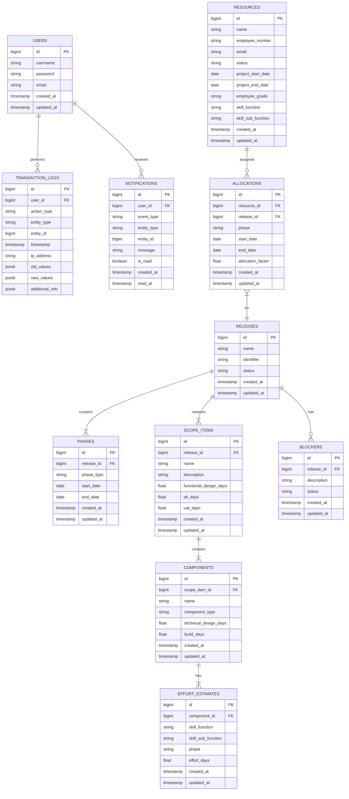

# Release Management System: Backend Technical Specification

## 1. Overview

This document provides the technical specification for the backend implementation of the Release Management System (RMS) MVP. The backend will be built using Spring Boot 3.5.4 with Java 21 and will expose a RESTful API for the frontend to consume.

## 2. Technology Stack

- **Language**: Java 21
- **Framework**: Spring Boot 3.5.4
- **Database**: PostgreSQL 17.5
- **Build Tool**: Gradle
- **API Documentation**: SpringDoc OpenAPI (Swagger)
- **Testing**: JUnit 5, Mockito
- **Security**: Spring Security with JWT
- **Data Access**: Spring Data JPA
- **Excel Processing**: Apache POI
- **Validation**: Hibernate Validator

## 3. Project Structure

```
backend/
├── src/
│   ├── main/
│   │   ├── java/com/polycoder/relmgmt/
│   │   │   ├── config/           # Configuration classes
│   │   │   ├── controller/       # REST API controllers
│   │   │   │   ├── v1/           # API version 1 controllers
│   │   │   │   └── advice/       # Controller advices
│   │   │   ├── dto/              # Data Transfer Objects
│   │   │   ├── entity/           # JPA entities
│   │   │   ├── exception/        # Custom exceptions
│   │   │   ├── repository/       # Spring Data repositories
│   │   │   ├── security/         # Security configuration
│   │   │   ├── service/          # Business logic services
│   │   │   ├── util/             # Utility classes
│   │   │   └── RelmgmtApplication.java  # Main application class
│   │   └── resources/
│   │       ├── application.yml    # Application configuration
│   │       ├── application-dev.yml # Development configuration
│   │       └── db/migration/      # Flyway database migrations
│   └── test/
│       └── java/com/polycoder/relmgmt/
│           ├── controller/        # Controller tests
│           ├── repository/        # Repository tests
│           └── service/           # Service tests
└── build.gradle                   # Gradle configuration
```

## 4. Database Schema

### 4.1 Entity Relationship Diagram



### 4.2 Database Migration

The database schema will be managed using Flyway migrations. Initial migration scripts will create the necessary tables, indexes, and constraints.

#### 4.2.1 Sample Migration Script (V1__initial_schema.sql)

```sql
-- Users table
CREATE TABLE users (
    id SERIAL PRIMARY KEY,
    username VARCHAR(50) NOT NULL UNIQUE,
    password VARCHAR(255) NOT NULL,
    email VARCHAR(100) NOT NULL,
    created_at TIMESTAMP WITH TIME ZONE DEFAULT CURRENT_TIMESTAMP,
    updated_at TIMESTAMP WITH TIME ZONE DEFAULT CURRENT_TIMESTAMP
);

-- Resources table
CREATE TABLE resources (
    id SERIAL PRIMARY KEY,
    name VARCHAR(100) NOT NULL,
    employee_number VARCHAR(8) NOT NULL UNIQUE,
    email VARCHAR(100) NOT NULL,
    status VARCHAR(20) NOT NULL,
    project_start_date DATE NOT NULL,
    project_end_date DATE,
    employee_grade VARCHAR(20) NOT NULL,
    skill_function VARCHAR(50) NOT NULL,
    skill_sub_function VARCHAR(50),
    created_at TIMESTAMP WITH TIME ZONE DEFAULT CURRENT_TIMESTAMP,
    updated_at TIMESTAMP WITH TIME ZONE DEFAULT CURRENT_TIMESTAMP,
    CONSTRAINT chk_status CHECK (status IN ('ACTIVE', 'INACTIVE')),
    CONSTRAINT chk_employee_grade CHECK (employee_grade IN ('LEVEL_1', 'LEVEL_2', 'LEVEL_3', 'LEVEL_4', 'LEVEL_5', 'LEVEL_6', 'LEVEL_7', 'LEVEL_8', 'LEVEL_9', 'LEVEL_10', 'LEVEL_11', 'LEVEL_12')),
    CONSTRAINT chk_skill_function CHECK (skill_function IN ('FUNCTIONAL_DESIGN', 'TECHNICAL_DESIGN', 'BUILD', 'TEST', 'PLATFORM'))
);

-- Releases table
CREATE TABLE releases (
    id SERIAL PRIMARY KEY,
    name VARCHAR(100) NOT NULL,
    identifier VARCHAR(50) NOT NULL UNIQUE,
    status VARCHAR(20) NOT NULL DEFAULT 'PLANNING',
    created_at TIMESTAMP WITH TIME ZONE DEFAULT CURRENT_TIMESTAMP,
    updated_at TIMESTAMP WITH TIME ZONE DEFAULT CURRENT_TIMESTAMP,
    CONSTRAINT chk_release_status CHECK (status IN ('PLANNING', 'IN_PROGRESS', 'COMPLETED', 'CANCELLED'))
);

-- Phases table
CREATE TABLE phases (
    id SERIAL PRIMARY KEY,
    release_id BIGINT NOT NULL,
    phase_type VARCHAR(50) NOT NULL,
    start_date DATE NOT NULL,
    end_date DATE NOT NULL,
    created_at TIMESTAMP WITH TIME ZONE DEFAULT CURRENT_TIMESTAMP,
    updated_at TIMESTAMP WITH TIME ZONE DEFAULT CURRENT_TIMESTAMP,
    CONSTRAINT fk_phases_release FOREIGN KEY (release_id) REFERENCES releases(id) ON DELETE CASCADE,
    CONSTRAINT chk_phase_type CHECK (phase_type IN ('FUNCTIONAL_DESIGN', 'TECHNICAL_DESIGN', 'BUILD', 'SYSTEM_INTEGRATION_TEST', 'USER_ACCEPTANCE_TEST', 'REGRESSION_TESTING', 'SMOKE_TESTING', 'GO_LIVE')),
    CONSTRAINT chk_date_range CHECK (end_date >= start_date)
);

-- Scope items table
CREATE TABLE scope_items (
    id SERIAL PRIMARY KEY,
    release_id BIGINT NOT NULL,
    name VARCHAR(100) NOT NULL,
    description TEXT,
    functional_design_days DECIMAL(10, 2) NOT NULL DEFAULT 0,
    sit_days DECIMAL(10, 2) NOT NULL DEFAULT 0,
    uat_days DECIMAL(10, 2) NOT NULL DEFAULT 0,
    created_at TIMESTAMP WITH TIME ZONE DEFAULT CURRENT_TIMESTAMP,
    updated_at TIMESTAMP WITH TIME ZONE DEFAULT CURRENT_TIMESTAMP,
    CONSTRAINT fk_scope_items_release FOREIGN KEY (release_id) REFERENCES releases(id) ON DELETE CASCADE,
    CONSTRAINT chk_effort_days CHECK (functional_design_days >= 1 AND functional_design_days <= 1000),
    CONSTRAINT chk_sit_days CHECK (sit_days >= 1 AND sit_days <= 1000),
    CONSTRAINT chk_uat_days CHECK (uat_days >= 1 AND uat_days <= 1000)
);

-- Components table
CREATE TABLE components (
    id SERIAL PRIMARY KEY,
    scope_item_id BIGINT NOT NULL,
    name VARCHAR(100) NOT NULL,
    component_type VARCHAR(50) NOT NULL,
    technical_design_days DECIMAL(10, 2) NOT NULL DEFAULT 0,
    build_days DECIMAL(10, 2) NOT NULL DEFAULT 0,
    created_at TIMESTAMP WITH TIME ZONE DEFAULT CURRENT_TIMESTAMP,
    updated_at TIMESTAMP WITH TIME ZONE DEFAULT CURRENT_TIMESTAMP,
    CONSTRAINT fk_components_scope_item FOREIGN KEY (scope_item_id) REFERENCES scope_items(id) ON DELETE CASCADE,
    CONSTRAINT chk_component_type CHECK (component_type IN ('ETL', 'FORGEROCK_IGA', 'FORGEROCK_UI', 'FORGEROCK_IG', 'FORGEROCK_IDM', 'SAILPOINT', 'FUNCTIONAL_TEST')),
    CONSTRAINT chk_technical_design_days CHECK (technical_design_days >= 1 AND technical_design_days <= 1000),
    CONSTRAINT chk_build_days CHECK (build_days >= 1 AND build_days <= 1000)
);

-- Effort estimates table (for component-level efforts)
CREATE TABLE effort_estimates (
    id SERIAL PRIMARY KEY,
    component_id BIGINT NOT NULL,
    skill_function VARCHAR(50) NOT NULL,
    skill_sub_function VARCHAR(50),
    phase VARCHAR(50) NOT NULL,
    effort_days DECIMAL(10, 2) NOT NULL,
    created_at TIMESTAMP WITH TIME ZONE DEFAULT CURRENT_TIMESTAMP,
    updated_at TIMESTAMP WITH TIME ZONE DEFAULT CURRENT_TIMESTAMP,
    CONSTRAINT fk_effort_estimates_component FOREIGN KEY (component_id) REFERENCES components(id) ON DELETE CASCADE,
    CONSTRAINT chk_effort_skill_function CHECK (skill_function IN ('FUNCTIONAL_DESIGN', 'TECHNICAL_DESIGN', 'BUILD', 'TEST', 'PLATFORM')),
    CONSTRAINT chk_effort_phase CHECK (phase IN ('FUNCTIONAL_DESIGN', 'TECHNICAL_DESIGN', 'BUILD', 'SIT', 'UAT', 'SMOKE_TESTING', 'GO_LIVE')),
    CONSTRAINT chk_effort_days CHECK (effort_days >= 1 AND effort_days <= 1000)
);

-- Allocations table
CREATE TABLE allocations (
    id SERIAL PRIMARY KEY,
    resource_id BIGINT NOT NULL,
    release_id BIGINT NOT NULL,
    phase VARCHAR(50) NOT NULL,
    start_date DATE NOT NULL,
    end_date DATE NOT NULL,
    allocation_factor DECIMAL(3, 2) NOT NULL DEFAULT 1.0,
    created_at TIMESTAMP WITH TIME ZONE DEFAULT CURRENT_TIMESTAMP,
    updated_at TIMESTAMP WITH TIME ZONE DEFAULT CURRENT_TIMESTAMP,
    CONSTRAINT fk_allocations_resource FOREIGN KEY (resource_id) REFERENCES resources(id) ON DELETE CASCADE,
    CONSTRAINT fk_allocations_release FOREIGN KEY (release_id) REFERENCES releases(id) ON DELETE CASCADE,
    CONSTRAINT chk_allocation_factor CHECK (allocation_factor >= 0.5 AND allocation_factor <= 1.0),
    CONSTRAINT chk_allocation_date_range CHECK (end_date >= start_date)
);

-- Blockers table
CREATE TABLE blockers (
    id SERIAL PRIMARY KEY,
    release_id BIGINT NOT NULL,
    description TEXT NOT NULL,
    status VARCHAR(20) NOT NULL DEFAULT 'OPEN',
    created_at TIMESTAMP WITH TIME ZONE DEFAULT CURRENT_TIMESTAMP,
    updated_at TIMESTAMP WITH TIME ZONE DEFAULT CURRENT_TIMESTAMP,
    CONSTRAINT fk_blockers_release FOREIGN KEY (release_id) REFERENCES releases(id) ON DELETE CASCADE,
    CONSTRAINT chk_blocker_status CHECK (status IN ('OPEN', 'RESOLVED', 'CLOSED'))
);

-- Notifications table
CREATE TABLE notifications (
    id SERIAL PRIMARY KEY,
    user_id BIGINT NOT NULL,
    event_type VARCHAR(50) NOT NULL,
    entity_type VARCHAR(50) NOT NULL,
    entity_id BIGINT,
    message TEXT NOT NULL,
    is_read BOOLEAN NOT NULL DEFAULT FALSE,
    created_at TIMESTAMP WITH TIME ZONE DEFAULT CURRENT_TIMESTAMP,
    read_at TIMESTAMP WITH TIME ZONE,
    CONSTRAINT fk_notifications_user FOREIGN KEY (user_id) REFERENCES users(id) ON DELETE CASCADE
);

-- Transaction logs table
CREATE TABLE transaction_logs (
    id SERIAL PRIMARY KEY,
    user_id BIGINT NOT NULL,
    action_type VARCHAR(50) NOT NULL,
    entity_type VARCHAR(50) NOT NULL,
    entity_id BIGINT,
    timestamp TIMESTAMP WITH TIME ZONE DEFAULT CURRENT_TIMESTAMP,
    ip_address INET,
    old_values JSONB,
    new_values JSONB,
    additional_info JSONB,
    CONSTRAINT fk_transaction_logs_user FOREIGN KEY (user_id) REFERENCES users(id) ON DELETE CASCADE
);

-- Create indexes for better performance
CREATE INDEX idx_resources_status ON resources(status);
CREATE INDEX idx_resources_skill_function ON resources(skill_function);
CREATE INDEX idx_releases_status ON releases(status);
CREATE INDEX idx_scope_items_release_id ON scope_items(release_id);
CREATE INDEX idx_components_scope_item_id ON components(scope_item_id);
CREATE INDEX idx_components_type ON components(component_type);
CREATE INDEX idx_effort_estimates_component_id ON effort_estimates(component_id);
CREATE INDEX idx_allocations_resource_id ON allocations(resource_id);
CREATE INDEX idx_allocations_release_id ON allocations(release_id);
CREATE INDEX idx_notifications_user_id ON notifications(user_id);
CREATE INDEX idx_notifications_is_read ON notifications(is_read);
CREATE INDEX idx_transaction_logs_user_id ON transaction_logs(user_id);
CREATE INDEX idx_transaction_logs_timestamp ON transaction_logs(timestamp);
```

### 4.3 Entity Classes

#### 4.3.1 Base Entity
```java
@MappedSuperclass
@EntityListeners(AuditingEntityListener.class)
public abstract class BaseEntity {
    @Id
    @GeneratedValue(strategy = GenerationType.IDENTITY)
    private Long id;
    
    @CreatedDate
    @Column(name = "created_at", nullable = false, updatable = false)
    private LocalDateTime createdAt;
    
    @LastModifiedDate
    @Column(name = "updated_at")
    private LocalDateTime updatedAt;
    
    // Getters and setters
}
```

#### 4.3.2 Release Entity
```java
@Entity
@Table(name = "releases")
public class Release extends BaseEntity {
    @Column(nullable = false)
    private String name;
    
    @Column(nullable = false, unique = true)
    private String identifier;
    
    @Enumerated(EnumType.STRING)
    @Column(nullable = false)
    private ReleaseStatusEnum status = ReleaseStatusEnum.PLANNING;
    
    @OneToMany(mappedBy = "release", cascade = CascadeType.ALL, orphanRemoval = true)
    private List<Phase> phases = new ArrayList<>();
    
    @OneToMany(mappedBy = "release", cascade = CascadeType.ALL, orphanRemoval = true)
    private List<ScopeItem> scopeItems = new ArrayList<>();
    
    @OneToMany(mappedBy = "release", cascade = CascadeType.ALL, orphanRemoval = true)
    private List<Blocker> blockers = new ArrayList<>();
    
    // Getters and setters
}
```

#### 4.3.3 ScopeItem Entity
```java
@Entity
@Table(name = "scope_items")
public class ScopeItem extends BaseEntity {
    @ManyToOne(fetch = FetchType.LAZY)
    @JoinColumn(name = "release_id", nullable = false)
    private Release release;
    
    @Column(nullable = false)
    private String name;
    
    private String description;
    
    @Column(name = "functional_design_days", nullable = false)
    @Min(value = 1, message = "Functional design days must be at least 1")
    @Max(value = 1000, message = "Functional design days cannot exceed 1000")
    private Double functionalDesignDays = 0.0;
    
    @Column(name = "sit_days", nullable = false)
    @Min(value = 1, message = "SIT days must be at least 1")
    @Max(value = 1000, message = "SIT days cannot exceed 1000")
    private Double sitDays = 0.0;
    
    @Column(name = "uat_days", nullable = false)
    @Min(value = 1, message = "UAT days must be at least 1")
    @Max(value = 1000, message = "UAT days cannot exceed 1000")
    private Double uatDays = 0.0;
    
    @OneToMany(mappedBy = "scopeItem", cascade = CascadeType.ALL, orphanRemoval = true)
    private List<Component> components = new ArrayList<>();
    
    // Getters and setters
}
```

#### 4.3.4 Component Entity
```java
@Entity
@Table(name = "components")
public class Component extends BaseEntity {
    @ManyToOne(fetch = FetchType.LAZY)
    @JoinColumn(name = "scope_item_id", nullable = false)
    private ScopeItem scopeItem;
    
    @Column(nullable = false)
    private String name;
    
    @Enumerated(EnumType.STRING)
    @Column(name = "component_type", nullable = false)
    private ComponentTypeEnum componentType;
    
    @Column(name = "technical_design_days", nullable = false)
    @Min(value = 1, message = "Technical design days must be at least 1")
    @Max(value = 1000, message = "Technical design days cannot exceed 1000")
    private Double technicalDesignDays = 0.0;
    
    @Column(name = "build_days", nullable = false)
    @Min(value = 1, message = "Build days must be at least 1")
    @Max(value = 1000, message = "Build days cannot exceed 1000")
    private Double buildDays = 0.0;
    
    @OneToMany(mappedBy = "component", cascade = CascadeType.ALL, orphanRemoval = true)
    private List<EffortEstimate> effortEstimates = new ArrayList<>();
    
    // Getters and setters
}
```

#### 4.3.5 ComponentTypeEnum
```java
public enum ComponentTypeEnum {
    ETL("ETL"),
    FORGEROCK_IGA("ForgeRock IGA"),
    FORGEROCK_UI("ForgeRock UI"),
    FORGEROCK_IG("ForgeRock IG"),
    FORGEROCK_IDM("ForgeRock IDM"),
    SAILPOINT("SailPoint"),
    FUNCTIONAL_TEST("Functional Test");
    
    private final String displayName;
    
    ComponentTypeEnum(String displayName) {
        this.displayName = displayName;
    }
    
    public String getDisplayName() {
        return displayName;
    }
}
```

### 4.4 DTOs

#### 4.4.1 ScopeItemRequest
```java
public class ScopeItemRequest {
    @NotBlank(message = "Scope item name is required")
    @Size(max = 100, message = "Scope item name must not exceed 100 characters")
    private String name;
    
    @Size(max = 500, message = "Scope item description must not exceed 500 characters")
    private String description;
    
    @NotNull(message = "Functional design days is required")
    @Min(value = 0, message = "Functional design days must be at least 0")
    @Max(value = 1000, message = "Functional design days cannot exceed 1000")
    private Double functionalDesignDays;

    @NotNull(message = "SIT days is required")
    @Min(value = 0, message = "SIT days must be at least 0")
    @Max(value = 1000, message = "SIT days cannot exceed 1000")
    private Double sitDays;

    @NotNull(message = "UAT days is required")
    @Min(value = 0, message = "UAT days must be at least 0")
    @Max(value = 1000, message = "UAT days cannot exceed 1000")
    private Double uatDays;
    
    private List<ComponentRequest> components = new ArrayList<>();
    
    // Getters and setters
}
```

#### 4.4.2 ComponentRequest
```java
public class ComponentRequest {
    @NotBlank(message = "Component name is required")
    @Size(max = 100, message = "Component name must not exceed 100 characters")
    private String name;
    
    @NotNull(message = "Component type is required")
    private ComponentTypeEnum componentType;
    
    @NotNull(message = "Technical design days is required")
    @Min(value = 0, message = "Technical design days must be at least 0")
    @Max(value = 1000, message = "Technical design days cannot exceed 1000")
    private Double technicalDesignDays;

    @NotNull(message = "Build days is required")
    @Min(value = 0, message = "Build days must be at least 0")
    @Max(value = 1000, message = "Build days cannot exceed 1000")
    private Double buildDays;

    // Getters and setters
}
```

#### 4.4.3 ReleaseEffortSummaryResponse
```java
public class ReleaseEffortSummaryResponse {
    private ComponentTypeEnum componentType;
    private EffortPhase phase;
    private Double totalEffort;

    // Constructors
    public ReleaseEffortSummaryResponse() {}

    public ReleaseEffortSummaryResponse(ComponentTypeEnum componentType, EffortPhase phase, Double totalEffort) {
        this.componentType = componentType;
        this.phase = phase;
        this.totalEffort = totalEffort;
    }

    // Getters and setters
    public ComponentTypeEnum getComponentType() {
        return componentType;
    }

    public void setComponentType(ComponentTypeEnum componentType) {
        this.componentType = componentType;
    }

    public EffortPhase getPhase() {
        return phase;
    }

    public void setPhase(EffortPhase phase) {
        this.phase = phase;
    }

    public Double getTotalEffort() {
        return totalEffort;
    }

    public void setTotalEffort(Double totalEffort) {
        this.totalEffort = totalEffort;
    }
}

public enum EffortPhase {
    FUNCTIONAL_DESIGN,
    TECHNICAL_DESIGN,
    BUILD,
    SIT,
    UAT
}
```

#### 4.4.4 Weekly Allocation DTOs
```java
public class WeeklyAllocationResponse {
    private String weekStart; // YYYY-MM-DD (Monday)
    private Double personDays;
    private String projectName;
    private String projectId;

    // Constructors, getters and setters
}

public class ResourceProfileResponse {
    private String id;
    private String name;
    private String grade;
    private String skillFunction;
    private String skillSubFunction;
    private String profileUrl;

    // Constructors, getters and setters
}

public class WeeklyAllocationMatrixResponse {
    private List<ResourceAllocationResponse> resources;
    private String currentWeekStart;
    private TimeWindowResponse timeWindow;

    // Constructors, getters and setters
}

public class ResourceAllocationResponse {
    private String id;
    private String name;
    private String grade;
    private String skillFunction;
    private String skillSubFunction;
    private String profileUrl;
    private List<WeeklyAllocationResponse> weeklyAllocations;

    // Constructors, getters and setters
}

public class TimeWindowResponse {
    private String startWeek;
    private String endWeek;
    private Integer totalWeeks;

    // Constructors, getters and setters
}
```

### 4.5 Services

#### 4.5.1 ScopeItemService
```java
@Service
public interface ScopeItemService {
    List<ScopeItemResponse> findByReleaseId(Long releaseId);
    ScopeItemResponse findById(Long id);
    ScopeItemResponse create(Long releaseId, ScopeItemRequest request);
    ScopeItemResponse update(Long id, ScopeItemRequest request);
    void delete(Long id);
    boolean canDeleteScopeItem(Long id);

    // Effort calculation methods
    Double calculateTotalFunctionalDesignDays(Long releaseId);
    Double calculateTotalTechnicalDesignDays(Long releaseId);
    Double calculateTotalBuildDays(Long releaseId);
    Double calculateTotalSitDays(Long releaseId);
    Double calculateTotalUatDays(Long releaseId);

    // Effort summary method
    List<ReleaseEffortSummaryResponse> getReleaseEffortSummary(Long releaseId);
}
```

#### 4.5.2 ComponentService
```java
@Service
public interface ComponentService {
    List<ComponentResponse> findByScopeItemId(Long scopeItemId);
    ComponentResponse findById(Long id);
    ComponentResponse create(Long scopeItemId, ComponentRequest request);
    ComponentResponse update(Long id, ComponentRequest request);
    void delete(Long id);
}
```

#### 4.5.3 WeeklyAllocationService
```java
@Service
public interface WeeklyAllocationService {
    WeeklyAllocationMatrixResponse getWeeklyAllocations(String currentWeekStart);
    void updateWeeklyAllocation(String resourceId, String weekStart, Double personDays);
    ResourceProfileResponse getResourceProfile(String resourceId);
    List<WeeklyAllocationResponse> getResourceWeeklyAllocations(String resourceId, String startWeek, String endWeek);
}
```

### 4.6 Controllers

#### 4.6.1 ScopeItemController
```java
@RestController
@RequestMapping("/api/v1")
@Tag(name = "Scope Item Management", description = "APIs for managing scope items and components")
public class ScopeItemController {
    
    @GetMapping("/releases/{releaseId}/scope-items")
    public ResponseEntity<List<ScopeItemResponse>> getScopeItemsByReleaseId(
            @PathVariable Long releaseId) {
        List<ScopeItemResponse> scopeItems = scopeItemService.findByReleaseId(releaseId);
        return ResponseEntity.ok(scopeItems);
    }
    
    @PostMapping("/releases/{releaseId}/scope-items")
    public ResponseEntity<ScopeItemResponse> createScopeItem(
            @PathVariable Long releaseId,
            @Valid @RequestBody ScopeItemRequest request) {
        ScopeItemResponse createdScopeItem = scopeItemService.create(releaseId, request);
        return ResponseEntity.status(HttpStatus.CREATED).body(createdScopeItem);
    }
    
    @PutMapping("/scope-items/{id}")
    public ResponseEntity<ScopeItemResponse> updateScopeItem(
            @PathVariable Long id,
            @Valid @RequestBody ScopeItemRequest request) {
        ScopeItemResponse updatedScopeItem = scopeItemService.update(id, request);
        return ResponseEntity.ok(updatedScopeItem);
    }
    
    @DeleteMapping("/scope-items/{id}")
    public ResponseEntity<Void> deleteScopeItem(@PathVariable Long id) {
        scopeItemService.delete(id);
        return ResponseEntity.noContent().build();
    }
    
    @GetMapping("/releases/{releaseId}/effort-summary")
    public ResponseEntity<ReleaseEffortSummaryResponse> getReleaseEffortSummary(
            @PathVariable Long releaseId) {
        ReleaseEffortSummaryResponse summary = scopeItemService.getReleaseEffortSummary(releaseId);
        return ResponseEntity.ok(summary);
    }
}
```

#### 4.6.2 ComponentController
```java
@RestController
@RequestMapping("/api/v1")
@Tag(name = "Component Management", description = "APIs for managing components within scope items")
public class ComponentController {
    
    @GetMapping("/scope-items/{scopeItemId}/components")
    public ResponseEntity<List<ComponentResponse>> getComponentsByScopeItemId(
            @PathVariable Long scopeItemId) {
        List<ComponentResponse> components = componentService.findByScopeItemId(scopeItemId);
        return ResponseEntity.ok(components);
    }
    
    @PostMapping("/scope-items/{scopeItemId}/components")
    public ResponseEntity<ComponentResponse> createComponent(
            @PathVariable Long scopeItemId,
            @Valid @RequestBody ComponentRequest request) {
        ComponentResponse createdComponent = componentService.create(scopeItemId, request);
        return ResponseEntity.status(HttpStatus.CREATED).body(createdComponent);
    }
    
    @PutMapping("/components/{id}")
    public ResponseEntity<ComponentResponse> updateComponent(
            @PathVariable Long id,
            @Valid @RequestBody ComponentRequest request) {
        ComponentResponse updatedComponent = componentService.update(id, request);
        return ResponseEntity.ok(updatedComponent);
    }
    
    @DeleteMapping("/components/{id}")
    public ResponseEntity<Void> deleteComponent(@PathVariable Long id) {
        componentService.delete(id);
        return ResponseEntity.noContent().build();
    }
}
```

#### 4.6.3 WeeklyAllocationController
```java
@RestController
@RequestMapping("/api/v1")
@Tag(name = "Weekly Allocation Management", description = "APIs for managing weekly resource allocations")
public class WeeklyAllocationController {
    
    @GetMapping("/allocations/weekly")
    public ResponseEntity<WeeklyAllocationMatrixResponse> getWeeklyAllocations(
            @RequestParam String currentWeekStart) {
        WeeklyAllocationMatrixResponse matrix = weeklyAllocationService.getWeeklyAllocations(currentWeekStart);
        return ResponseEntity.ok(matrix);
    }
    
    @PutMapping("/allocations/weekly/{resourceId}/{weekStart}")
    public ResponseEntity<Void> updateWeeklyAllocation(
            @PathVariable String resourceId,
            @PathVariable String weekStart,
            @RequestParam Double personDays) {
        weeklyAllocationService.updateWeeklyAllocation(resourceId, weekStart, personDays);
        return ResponseEntity.ok().build();
    }
    
    @GetMapping("/resources/{resourceId}/profile")
    public ResponseEntity<ResourceProfileResponse> getResourceProfile(
            @PathVariable String resourceId) {
        ResourceProfileResponse profile = weeklyAllocationService.getResourceProfile(resourceId);
        return ResponseEntity.ok(profile);
    }
}
```

### 4.7 Effort Calculation Logic

#### 4.7.1 Release-Level Effort Derivation
```java
@Service
public class EffortCalculationService {
    
    public ReleaseEffortSummaryResponse calculateReleaseEffortSummary(Long releaseId) {
        List<ScopeItem> scopeItems = scopeItemRepository.findByReleaseId(releaseId);
        
        double totalFunctionalDesign = scopeItems.stream()
            .mapToDouble(ScopeItem::getFunctionalDesignDays)
            .sum();
            
        double totalSit = scopeItems.stream()
            .mapToDouble(ScopeItem::getSitDays)
            .sum();
            
        double totalUat = scopeItems.stream()
            .mapToDouble(ScopeItem::getUatDays)
            .sum();
            
        double totalTechnicalDesign = scopeItems.stream()
            .flatMap(si -> si.getComponents().stream())
            .mapToDouble(Component::getTechnicalDesignDays)
            .sum();
            
        double totalBuild = scopeItems.stream()
            .flatMap(si -> si.getComponents().stream())
            .mapToDouble(Component::getBuildDays)
            .sum();
        
        return ReleaseEffortSummaryResponse.builder()
            .releaseId(releaseId)
            .functionalDesignDays(totalFunctionalDesign)
            .technicalDesignDays(totalTechnicalDesign)
            .buildDays(totalBuild)
            .sitDays(totalSit)
            .uatDays(totalUat)
            .build();
    }
}
```

### 4.8 Validation Rules

#### 4.8.1 Effort Validation
- **Minimum effort**: 1 person-day for all effort fields
- **Maximum effort**: 1000 person-days for all effort fields
- **Required phases**: All scope items must have Functional Design, SIT, and UAT efforts
- **Component requirements**: Each component must have Technical Design and Build efforts

#### 4.8.2 Business Rules
- Components cannot be shared across multiple scope items
- Release-level efforts are automatically calculated from scope items
- Manual effort assignment is only allowed for Regression Testing, Smoke Testing, and Go-Live at the release level

### 7.3 API Endpoints

#### 7.3.1 Release Management Endpoints
- **GET /api/v1/releases**: List all releases with pagination and filtering
- **POST /api/v1/releases**: Create a new release
- **GET /api/v1/releases/{id}**: Get release details
- **PUT /api/v1/releases/{id}**: Update release (including status changes)
- **DELETE /api/v1/releases/{id}**: Delete release
- **GET /api/v1/releases/next-identifier**: Get next available release identifier

#### 7.3.2 Enum Validation and Conversion
- **Status Enum Validation**: Proper validation of ReleaseStatus enum values
- **Phase Enum Validation**: Consistent validation of ReleasePhase enum values
- **Enum Conversion**: Proper handling of enum name conversions between frontend and backend
- **Error Handling**: Clear error messages for invalid enum values

### 7.3.3 Effort Estimation and Allocation
- **Effort Derivation**: Automatic calculation of effort estimates from scope items and components
- **Scope Item Effort**: Functional Design + SIT + UAT + Sum of (Technical Design + Build) from all components
- **Release Effort**: Sum of all scope item efforts
- **Allocation Generation**: Requires both phases AND derived effort estimates from scope items
- **Resource Loading Rules**: Build team 35% during SIT, 25% during UAT
- **Zero Effort Handling**: No resource loading when phase effort is 0

#### 7.3.3 Scope Item Endpoints
- `GET /api/v1/releases/{releaseId}/scope-items` - Get all scope items for a release
- `POST /api/v1/releases/{releaseId}/scope-items` - Create a new scope item with components
- `PUT /api/v1/scope-items/{id}` - Update a scope item
- `DELETE /api/v1/scope-items/{id}` - Delete a scope item
- `GET /api/v1/releases/{releaseId}/effort-summary` - Get release effort summary
  - **Response**: Array of effort summary objects containing component type, phase, and total effort
  - **Purpose**: Provides aggregated effort data across all scope items for dashboard and planning
  - **Data Source**: Aggregates both scope item level (Functional Design, SIT, UAT) and component level (Technical Design, Build) estimates

#### 4.9.2 Component Management
- `GET /api/v1/scope-items/{scopeItemId}/components` - Get all components for a scope item
- `POST /api/v1/scope-items/{scopeItemId}/components` - Create a new component
- `PUT /api/v1/components/{id}` - Update a component
- `DELETE /api/v1/components/{id}` - Delete a component

#### 4.9.3 Component Types
- `GET /api/v1/component-types` - Get available component types

### 4.10 Data Migration Strategy

#### 4.10.1 Migration from Project-Based Model
1. **Create new tables**: scope_items, components
2. **Migrate existing data**:
   - Convert projects to scope items (if needed)
   - Migrate existing effort estimates to new component structure
   - Update foreign key relationships
3. **Drop old tables**: projects table and related constraints
4. **Update application code** to use new data model

#### 4.10.2 Migration Scripts
```sql
-- Migration script to create new structure
-- V12__migrate_to_scope_component_model.sql

-- Create new scope_items table
CREATE TABLE scope_items_new (
    id SERIAL PRIMARY KEY,
    release_id BIGINT NOT NULL,
    name VARCHAR(100) NOT NULL,
    description TEXT,
    functional_design_days DECIMAL(10, 2) NOT NULL DEFAULT 0,
    sit_days DECIMAL(10, 2) NOT NULL DEFAULT 0,
    uat_days DECIMAL(10, 2) NOT NULL DEFAULT 0,
    created_at TIMESTAMP WITH TIME ZONE DEFAULT CURRENT_TIMESTAMP,
    updated_at TIMESTAMP WITH TIME ZONE DEFAULT CURRENT_TIMESTAMP,
    CONSTRAINT fk_scope_items_release FOREIGN KEY (release_id) REFERENCES releases(id) ON DELETE CASCADE
);

-- Create new components table
CREATE TABLE components_new (
    id SERIAL PRIMARY KEY,
    scope_item_id BIGINT NOT NULL,
    name VARCHAR(100) NOT NULL,
    component_type VARCHAR(50) NOT NULL,
    technical_design_days DECIMAL(10, 2) NOT NULL DEFAULT 0,
    build_days DECIMAL(10, 2) NOT NULL DEFAULT 0,
    created_at TIMESTAMP WITH TIME ZONE DEFAULT CURRENT_TIMESTAMP,
    updated_at TIMESTAMP WITH TIME ZONE DEFAULT CURRENT_TIMESTAMP,
    CONSTRAINT fk_components_scope_item FOREIGN KEY (scope_item_id) REFERENCES scope_items_new(id) ON DELETE CASCADE
);

-- Migrate data (example - actual migration logic will depend on existing data structure)
-- INSERT INTO scope_items_new (release_id, name, description, functional_design_days, sit_days, uat_days)
-- SELECT release_id, name, description, 0, 0, 0 FROM projects;

-- Drop old tables after successful migration
-- DROP TABLE projects CASCADE;
-- DROP TABLE scope_items CASCADE;
-- DROP TABLE effort_estimates CASCADE;

-- Rename new tables to final names
-- ALTER TABLE scope_items_new RENAME TO scope_items;
-- ALTER TABLE components_new RENAME TO components;
```

This updated backend technical specification reflects the new data model that eliminates the Project entity and establishes direct relationships between Releases, Scope Items, and Components, with proper effort estimation and validation rules.