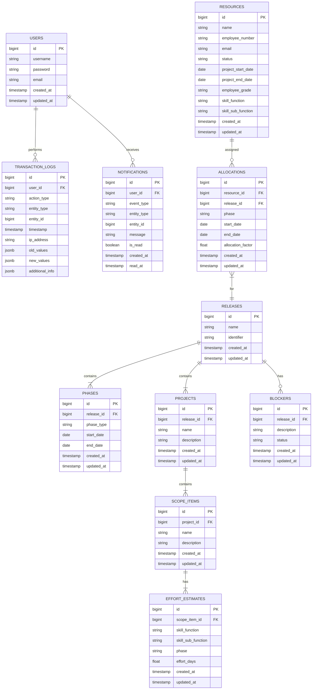
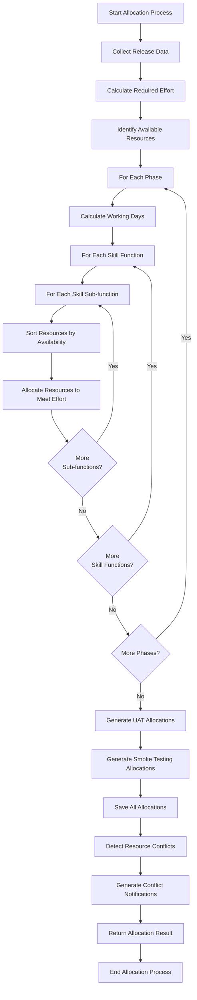

# Release Management System: Backend Technical Specification

## 1. Overview

This document provides the technical specification for the backend implementation of the Release Management System (RMS) MVP. The backend will be built using Spring Boot 3.5.4 with Java 21 and will expose a RESTful API for the frontend to consume.

## 2. Technology Stack

- **Language**: Java 21
- **Framework**: Spring Boot 3.5.4
- **Database**: PostgreSQL 17
- **Build Tool**: Maven
- **API Documentation**: SpringDoc OpenAPI (Swagger)
- **Testing**: JUnit 5, Mockito
- **Security**: Spring Security with JWT
- **Data Access**: Spring Data JPA
- **Excel Processing**: Apache POI
- **Validation**: Hibernate Validator

## 3. Project Structure

```
backend/
├── src/
│   ├── main/
│   │   ├── java/com/polycoder/relmgmt/
│   │   │   ├── config/           # Configuration classes
│   │   │   ├── controller/       # REST API controllers
│   │   │   │   ├── v1/           # API version 1 controllers
│   │   │   │   └── advice/       # Controller advices
│   │   │   ├── dto/              # Data Transfer Objects
│   │   │   ├── entity/           # JPA entities
│   │   │   ├── exception/        # Custom exceptions
│   │   │   ├── repository/       # Spring Data repositories
│   │   │   ├── security/         # Security configuration
│   │   │   ├── service/          # Business logic services
│   │   │   ├── util/             # Utility classes
│   │   │   └── RelmgmtApplication.java  # Main application class
│   │   └── resources/
│   │       ├── application.yml    # Application configuration
│   │       ├── application-dev.yml # Development configuration
│   │       └── db/migration/      # Flyway database migrations
│   └── test/
│       └── java/com/polycoder/relmgmt/
│           ├── controller/        # Controller tests
│           ├── repository/        # Repository tests
│           └── service/           # Service tests
└── pom.xml                        # Maven configuration
```

## 4. Database Schema

### 4.1 Entity Relationship Diagram



### 4.2 Database Migration

The database schema will be managed using Flyway migrations. Initial migration scripts will create the necessary tables, indexes, and constraints.

#### 4.2.1 Sample Migration Script (V1__initial_schema.sql)

```sql
-- Users table
CREATE TABLE users (
    id SERIAL PRIMARY KEY,
    username VARCHAR(50) NOT NULL UNIQUE,
    password VARCHAR(255) NOT NULL,
    email VARCHAR(100) NOT NULL,
    created_at TIMESTAMP WITH TIME ZONE DEFAULT CURRENT_TIMESTAMP,
    updated_at TIMESTAMP WITH TIME ZONE DEFAULT CURRENT_TIMESTAMP
);

-- Resources table
CREATE TABLE resources (
    id SERIAL PRIMARY KEY,
    name VARCHAR(100) NOT NULL,
    employee_number VARCHAR(8) NOT NULL UNIQUE,
    email VARCHAR(100) NOT NULL,
    status VARCHAR(20) NOT NULL,
    project_start_date DATE NOT NULL,
    project_end_date DATE,
    employee_grade VARCHAR(20) NOT NULL,
    skill_function VARCHAR(50) NOT NULL,
    skill_sub_function VARCHAR(50),
    created_at TIMESTAMP WITH TIME ZONE DEFAULT CURRENT_TIMESTAMP,
    updated_at TIMESTAMP WITH TIME ZONE DEFAULT CURRENT_TIMESTAMP,
    CONSTRAINT chk_status CHECK (status IN ('ACTIVE', 'INACTIVE')),
    CONSTRAINT chk_employee_grade CHECK (employee_grade IN ('LEVEL_1', 'LEVEL_2', 'LEVEL_3', 'LEVEL_4', 'LEVEL_5', 'LEVEL_6', 'LEVEL_7', 'LEVEL_8', 'LEVEL_9', 'LEVEL_10', 'LEVEL_11', 'LEVEL_12')),
    CONSTRAINT chk_skill_function CHECK (skill_function IN ('FUNCTIONAL_DESIGN', 'TECHNICAL_DESIGN', 'BUILD', 'TEST', 'PLATFORM'))
);

-- Releases table
CREATE TABLE releases (
    id SERIAL PRIMARY KEY,
    name VARCHAR(100) NOT NULL,
    identifier VARCHAR(50) NOT NULL UNIQUE,
    created_at TIMESTAMP WITH TIME ZONE DEFAULT CURRENT_TIMESTAMP,
    updated_at TIMESTAMP WITH TIME ZONE DEFAULT CURRENT_TIMESTAMP
);

-- Phases table
CREATE TABLE phases (
    id SERIAL PRIMARY KEY,
    release_id BIGINT NOT NULL,
    phase_type VARCHAR(50) NOT NULL,
    start_date DATE NOT NULL,
    end_date DATE NOT NULL,
    created_at TIMESTAMP WITH TIME ZONE DEFAULT CURRENT_TIMESTAMP,
    updated_at TIMESTAMP WITH TIME ZONE DEFAULT CURRENT_TIMESTAMP,
    CONSTRAINT fk_phases_release FOREIGN KEY (release_id) REFERENCES releases(id) ON DELETE CASCADE,
    CONSTRAINT chk_phase_type CHECK (phase_type IN ('FUNCTIONAL_DESIGN', 'TECHNICAL_DESIGN', 'BUILD', 'SIT', 'UAT', 'SMOKE_TESTING', 'PRODUCTION_GO_LIVE')),
    CONSTRAINT chk_date_range CHECK (end_date >= start_date)
);

-- Projects table
CREATE TABLE projects (
    id SERIAL PRIMARY KEY,
    release_id BIGINT NOT NULL,
    name VARCHAR(100) NOT NULL,
    description TEXT,
    type VARCHAR(20) NOT NULL,
    created_at TIMESTAMP WITH TIME ZONE DEFAULT CURRENT_TIMESTAMP,
    updated_at TIMESTAMP WITH TIME ZONE DEFAULT CURRENT_TIMESTAMP,
    CONSTRAINT fk_projects_release FOREIGN KEY (release_id) REFERENCES releases(id) ON DELETE CASCADE,
    CONSTRAINT chk_project_type CHECK (type IN ('DAY_1', 'DAY_2'))
);

-- Scope items table
CREATE TABLE scope_items (
    id SERIAL PRIMARY KEY,
    project_id BIGINT NOT NULL,
    name VARCHAR(100) NOT NULL,
    description TEXT,
    created_at TIMESTAMP WITH TIME ZONE DEFAULT CURRENT_TIMESTAMP,
    updated_at TIMESTAMP WITH TIME ZONE DEFAULT CURRENT_TIMESTAMP,
    CONSTRAINT fk_scope_items_project FOREIGN KEY (project_id) REFERENCES projects(id) ON DELETE CASCADE
);

-- Effort estimates table
CREATE TABLE effort_estimates (
    id SERIAL PRIMARY KEY,
    scope_item_id BIGINT NOT NULL,
    skill_function VARCHAR(50) NOT NULL,
    skill_sub_function VARCHAR(50),
    phase VARCHAR(50) NOT NULL,
    effort_days DECIMAL(10, 2) NOT NULL,
    created_at TIMESTAMP WITH TIME ZONE DEFAULT CURRENT_TIMESTAMP,
    updated_at TIMESTAMP WITH TIME ZONE DEFAULT CURRENT_TIMESTAMP,
    CONSTRAINT fk_effort_estimates_scope_item FOREIGN KEY (scope_item_id) REFERENCES scope_items(id) ON DELETE CASCADE,
    CONSTRAINT chk_effort_skill_function CHECK (skill_function IN ('FUNCTIONAL_DESIGN', 'TECHNICAL_DESIGN', 'BUILD', 'TEST', 'PLATFORM')),
    CONSTRAINT chk_effort_phase CHECK (phase IN ('FUNCTIONAL_DESIGN', 'TECHNICAL_DESIGN', 'BUILD', 'SIT', 'UAT', 'SMOKE_TESTING', 'PRODUCTION_GO_LIVE'))
);

-- Allocations table
CREATE TABLE allocations (
    id SERIAL PRIMARY KEY,
    resource_id BIGINT NOT NULL,
    release_id BIGINT NOT NULL,
    phase VARCHAR(50) NOT NULL,
    start_date DATE NOT NULL,
    end_date DATE NOT NULL,
    allocation_factor DECIMAL(3, 2) NOT NULL,
    created_at TIMESTAMP WITH TIME ZONE DEFAULT CURRENT_TIMESTAMP,
    updated_at TIMESTAMP WITH TIME ZONE DEFAULT CURRENT_TIMESTAMP,
    CONSTRAINT fk_allocations_resource FOREIGN KEY (resource_id) REFERENCES resources(id),
    CONSTRAINT fk_allocations_release FOREIGN KEY (release_id) REFERENCES releases(id) ON DELETE CASCADE,
    CONSTRAINT chk_allocation_phase CHECK (phase IN ('FUNCTIONAL_DESIGN', 'TECHNICAL_DESIGN', 'BUILD', 'SIT', 'UAT', 'SMOKE_TESTING', 'PRODUCTION_GO_LIVE')),
    CONSTRAINT chk_allocation_factor CHECK (allocation_factor >= 0.5 AND allocation_factor <= 1.0),
    CONSTRAINT chk_allocation_date_range CHECK (end_date >= start_date)
);

-- Blockers table
CREATE TABLE blockers (
    id SERIAL PRIMARY KEY,
    release_id BIGINT NOT NULL,
    description TEXT NOT NULL,
    status VARCHAR(20) NOT NULL,
    created_at TIMESTAMP WITH TIME ZONE DEFAULT CURRENT_TIMESTAMP,
    updated_at TIMESTAMP WITH TIME ZONE DEFAULT CURRENT_TIMESTAMP,
    CONSTRAINT fk_blockers_release FOREIGN KEY (release_id) REFERENCES releases(id) ON DELETE CASCADE,
    CONSTRAINT chk_blocker_status CHECK (status IN ('OPEN', 'RESOLVED'))
);

-- Transaction logs table
CREATE TABLE transaction_logs (
    id SERIAL PRIMARY KEY,
    user_id BIGINT NOT NULL,
    action_type VARCHAR(10) NOT NULL,
    entity_type VARCHAR(50) NOT NULL,
    entity_id BIGINT NOT NULL,
    timestamp TIMESTAMP WITH TIME ZONE DEFAULT CURRENT_TIMESTAMP,
    ip_address VARCHAR(45),
    old_values JSONB,
    new_values JSONB,
    additional_info JSONB,
    CONSTRAINT fk_transaction_logs_user FOREIGN KEY (user_id) REFERENCES users(id),
    CONSTRAINT chk_action_type CHECK (action_type IN ('CREATE', 'UPDATE', 'DELETE'))
);

-- Notifications table
CREATE TABLE notifications (
    id SERIAL PRIMARY KEY,
    user_id BIGINT NOT NULL,
    event_type VARCHAR(50) NOT NULL,
    entity_type VARCHAR(50) NOT NULL,
    entity_id BIGINT NOT NULL,
    message TEXT NOT NULL,
    is_read BOOLEAN DEFAULT FALSE,
    created_at TIMESTAMP WITH TIME ZONE DEFAULT CURRENT_TIMESTAMP,
    read_at TIMESTAMP WITH TIME ZONE,
    CONSTRAINT fk_notifications_user FOREIGN KEY (user_id) REFERENCES users(id),
    CONSTRAINT chk_event_type CHECK (event_type IN ('ALLOCATION_CONFLICT', 'OVER_ALLOCATION', 'DEADLINE_APPROACHING', 'BLOCKER_ADDED', 'BLOCKER_RESOLVED'))
);

-- Create indexes
CREATE INDEX idx_resources_skill_function ON resources(skill_function);
CREATE INDEX idx_resources_skill_sub_function ON resources(skill_sub_function);
CREATE INDEX idx_resources_status ON resources(status);
CREATE INDEX idx_phases_release_id ON phases(release_id);
CREATE INDEX idx_phases_phase_type ON phases(phase_type);
CREATE INDEX idx_projects_release_id ON projects(release_id);
CREATE INDEX idx_scope_items_project_id ON scope_items(project_id);
CREATE INDEX idx_effort_estimates_scope_item_id ON effort_estimates(scope_item_id);
CREATE INDEX idx_effort_estimates_skill_function ON effort_estimates(skill_function);
CREATE INDEX idx_allocations_resource_id ON allocations(resource_id);
CREATE INDEX idx_allocations_release_id ON allocations(release_id);
CREATE INDEX idx_allocations_phase ON allocations(phase);
CREATE INDEX idx_allocations_dates ON allocations(start_date, end_date);
CREATE INDEX idx_blockers_release_id ON blockers(release_id);
CREATE INDEX idx_blockers_status ON blockers(status);
CREATE INDEX idx_transaction_logs_user_id ON transaction_logs(user_id);
CREATE INDEX idx_transaction_logs_entity ON transaction_logs(entity_type, entity_id);
CREATE INDEX idx_transaction_logs_timestamp ON transaction_logs(timestamp);
CREATE INDEX idx_notifications_user_id ON notifications(user_id);
CREATE INDEX idx_notifications_is_read ON notifications(is_read);
CREATE INDEX idx_notifications_created_at ON notifications(created_at);

-- Insert initial admin user (password: admin123)
INSERT INTO users (username, password, email) 
VALUES ('admin', '$2a$10$dXJ3SW6G7P50lGmMkkmwe.20cQQubK3.HZWzG3YB1tlRy.fqvM/BG', 'admin@example.com');
```

#### 4.2.2 Migration Strategy

Flyway will be configured to run migrations automatically when the application starts. The migration scripts will be placed in the `src/main/resources/db/migration` directory and follow the naming convention `V{version}__{description}.sql`.

For development and testing environments, the application will use the `spring.flyway.clean-on-validation-error=true` property to clean the database and reapply migrations if there's a validation error. This should not be enabled in production.

### 4.3 Enum Definitions

#### 4.3.1 EmployeeGradeEnum
```java
public enum EmployeeGradeEnum {
    LEVEL_1("Level 1"),
    LEVEL_2("Level 2"),
    LEVEL_3("Level 3"),
    LEVEL_4("Level 4"),
    LEVEL_5("Level 5"),
    LEVEL_6("Level 6"),
    LEVEL_7("Level 7"),
    LEVEL_8("Level 8"),
    LEVEL_9("Level 9"),
    LEVEL_10("Level 10"),
    LEVEL_11("Level 11"),
    LEVEL_12("Level 12");
    
    private final String displayName;
    
    EmployeeGradeEnum(String displayName) {
        this.displayName = displayName;
    }
    
    public String getDisplayName() {
        return displayName;
    }
}
```

#### 4.3.2 StatusEnum
```java
public enum StatusEnum {
    ACTIVE("Active"),
    INACTIVE("Inactive");
    
    private final String displayName;
    
    StatusEnum(String displayName) {
        this.displayName = displayName;
    }
    
    public String getDisplayName() {
        return displayName;
    }
}
```

#### 4.3.3 SkillFunctionEnum
```java
public enum SkillFunctionEnum {
    FUNCTIONAL_DESIGN("Functional Design"),
    TECHNICAL_DESIGN("Technical Design"),
    BUILD("Build"),
    TEST("Test"),
    PLATFORM("Platform");
    
    private final String displayName;
    
    SkillFunctionEnum(String displayName) {
        this.displayName = displayName;
    }
    
    public String getDisplayName() {
        return displayName;
    }
}
```

#### 4.3.4 SkillSubFunctionEnum
```java
public enum SkillSubFunctionEnum {
    TALEND("Talend", Arrays.asList(SkillFunctionEnum.TECHNICAL_DESIGN, SkillFunctionEnum.BUILD)),
    FORGEROCK_IDM("ForgeRock IDM", Arrays.asList(SkillFunctionEnum.TECHNICAL_DESIGN, SkillFunctionEnum.BUILD)),
    FORGEROCK_IG("ForgeRock IG", Arrays.asList(SkillFunctionEnum.TECHNICAL_DESIGN, SkillFunctionEnum.BUILD)),
    SAILPOINT("SailPoint", Arrays.asList(SkillFunctionEnum.TECHNICAL_DESIGN, SkillFunctionEnum.BUILD)),
    FORGEROCK_UI("ForgeRock UI", Arrays.asList(SkillFunctionEnum.TECHNICAL_DESIGN, SkillFunctionEnum.BUILD)),
    AUTOMATED("Automated", Arrays.asList(SkillFunctionEnum.TEST)),
    MANUAL("Manual", Arrays.asList(SkillFunctionEnum.TEST));
    
    private final String displayName;
    private final List<SkillFunctionEnum> applicableFunctions;
    
    SkillSubFunctionEnum(String displayName, List<SkillFunctionEnum> applicableFunctions) {
        this.displayName = displayName;
        this.applicableFunctions = applicableFunctions;
    }
    
    public String getDisplayName() {
        return displayName;
    }
    
    public List<SkillFunctionEnum> getApplicableFunctions() {
        return applicableFunctions;
    }
    
    public static List<SkillSubFunctionEnum> getByFunction(SkillFunctionEnum function) {
        return Arrays.stream(SkillSubFunctionEnum.values())
                .filter(subFunction -> subFunction.getApplicableFunctions().contains(function))
                .collect(Collectors.toList());
    }
}
```

#### 4.3.5 PhaseTypeEnum
```java
public enum PhaseTypeEnum {
    FUNCTIONAL_DESIGN("Functional Design"),
    TECHNICAL_DESIGN("Technical Design"),
    BUILD("Build"),
    SIT("System Integration Test"),
    UAT("User Acceptance Test"),
    SMOKE_TESTING("Smoke Testing"),
    PRODUCTION_GO_LIVE("Production Go-Live");
    
    private final String displayName;
    
    PhaseTypeEnum(String displayName) {
        this.displayName = displayName;
    }
    
    public String getDisplayName() {
        return displayName;
    }
}
```

#### 4.3.6 ActionTypeEnum
```java
public enum ActionTypeEnum {
    CREATE,
    UPDATE,
    DELETE
}
```

#### 4.3.7 EventTypeEnum
```java
public enum EventTypeEnum {
    ALLOCATION_CONFLICT("Allocation Conflict"),
    OVER_ALLOCATION("Over Allocation"),
    DEADLINE_APPROACHING("Deadline Approaching"),
    BLOCKER_ADDED("Blocker Added"),
    BLOCKER_RESOLVED("Blocker Resolved");
    
    private final String displayName;
    
    EventTypeEnum(String displayName) {
        this.displayName = displayName;
    }
    
    public String getDisplayName() {
        return displayName;
    }
}
```

#### 4.3.8 BlockerStatusEnum
```java
public enum BlockerStatusEnum {
    OPEN("Open"),
    RESOLVED("Resolved");
    
    private final String displayName;
    
    BlockerStatusEnum(String displayName) {
        this.displayName = displayName;
    }
    
    public String getDisplayName() {
        return displayName;
    }
}
```

#### 4.3.9 ProjectTypeEnum
```java
public enum ProjectTypeEnum {
    DAY_1("Day 1"),
    DAY_2("Day 2");
    
    private final String displayName;
    
    ProjectTypeEnum(String displayName) {
        this.displayName = displayName;
    }
    
    public String getDisplayName() {
        return displayName;
    }
}
```

### 4.4 Entity Definitions

#### 4.4.1 User Entity
```java
@Entity
@Table(name = "users")
public class User {
    @Id
    @GeneratedValue(strategy = GenerationType.IDENTITY)
    private Long id;
    
    @Column(nullable = false, unique = true)
    private String username;
    
    @Column(nullable = false)
    private String password;
    
    @Column(nullable = false)
    private String email;
    
    @Column(name = "created_at", nullable = false, updatable = false)
    private LocalDateTime createdAt;
    
    @Column(name = "updated_at")
    private LocalDateTime updatedAt;
    
    // Getters and setters
}
```

#### 4.4.2 Resource Entity
```java
@Entity
@Table(name = "resources")
public class Resource {
    @Id
    @GeneratedValue(strategy = GenerationType.IDENTITY)
    private Long id;
    
    @Column(nullable = false)
    private String name;
    
    @Column(name = "employee_number", nullable = false, unique = true, length = 8)
    private String employeeNumber;
    
    @Column(nullable = false)
    private String email;
    
    @Enumerated(EnumType.STRING)
    @Column(nullable = false)
    private StatusEnum status;
    
    @Column(name = "project_start_date", nullable = false)
    private LocalDate projectStartDate;
    
    @Column(name = "project_end_date")
    private LocalDate projectEndDate;
    
    @Enumerated(EnumType.STRING)
    @Column(name = "employee_grade", nullable = false)
    private EmployeeGradeEnum employeeGrade;
    
    @Enumerated(EnumType.STRING)
    @Column(name = "skill_function", nullable = false)
    private SkillFunctionEnum skillFunction;
    
    @Enumerated(EnumType.STRING)
    @Column(name = "skill_sub_function")
    private SkillSubFunctionEnum skillSubFunction;
    
    @Column(name = "created_at", nullable = false, updatable = false)
    private LocalDateTime createdAt;
    
    @Column(name = "updated_at")
    private LocalDateTime updatedAt;
    
    // Getters and setters
}
```

#### 4.4.3 Release Entity
```java
@Entity
@Table(name = "releases")
public class Release {
    @Id
    @GeneratedValue(strategy = GenerationType.IDENTITY)
    private Long id;
    
    @Column(nullable = false)
    private String name;
    
    @Column(nullable = false, unique = true)
    private String identifier;
    
    @OneToMany(mappedBy = "release", cascade = CascadeType.ALL, orphanRemoval = true)
    private List<Phase> phases = new ArrayList<>();
    
    @OneToMany(mappedBy = "release", cascade = CascadeType.ALL, orphanRemoval = true)
    private List<Project> projects = new ArrayList<>();
    
    @OneToMany(mappedBy = "release", cascade = CascadeType.ALL, orphanRemoval = true)
    private List<Blocker> blockers = new ArrayList<>();
    
    @Column(name = "created_at", nullable = false, updatable = false)
    private LocalDateTime createdAt;
    
    @Column(name = "updated_at")
    private LocalDateTime updatedAt;
    
    // Getters and setters
}
```

#### 4.4.4 Phase Entity
```java
@Entity
@Table(name = "phases")
public class Phase {
    @Id
    @GeneratedValue(strategy = GenerationType.IDENTITY)
    private Long id;
    
    @ManyToOne(fetch = FetchType.LAZY)
    @JoinColumn(name = "release_id", nullable = false)
    private Release release;
    
    @Enumerated(EnumType.STRING)
    @Column(name = "phase_type", nullable = false)
    private PhaseTypeEnum phaseType;
    
    @Column(name = "start_date", nullable = false)
    private LocalDate startDate;
    
    @Column(name = "end_date", nullable = false)
    private LocalDate endDate;
    
    @Column(name = "created_at", nullable = false, updatable = false)
    private LocalDateTime createdAt;
    
    @Column(name = "updated_at")
    private LocalDateTime updatedAt;
    
    // Getters and setters
}
```

#### 4.4.5 Project Entity
```java
@Entity
@Table(name = "projects")
public class Project {
    @Id
    @GeneratedValue(strategy = GenerationType.IDENTITY)
    private Long id;
    
    @ManyToOne(fetch = FetchType.LAZY)
    @JoinColumn(name = "release_id", nullable = false)
    private Release release;
    
    @Column(nullable = false)
    private String name;
    
    private String description;
    
    @Enumerated(EnumType.STRING)
    @Column(nullable = false)
    private ProjectTypeEnum type;
    
    @OneToMany(mappedBy = "project", cascade = CascadeType.ALL, orphanRemoval = true)
    private List<ScopeItem> scopeItems = new ArrayList<>();
    
    @Column(name = "created_at", nullable = false, updatable = false)
    private LocalDateTime createdAt;
    
    @Column(name = "updated_at")
    private LocalDateTime updatedAt;
    
    // Getters and setters
}
```

#### 4.4.6 ScopeItem Entity
```java
@Entity
@Table(name = "scope_items")
public class ScopeItem {
    @Id
    @GeneratedValue(strategy = GenerationType.IDENTITY)
    private Long id;
    
    @ManyToOne(fetch = FetchType.LAZY)
    @JoinColumn(name = "project_id", nullable = false)
    private Project project;
    
    @Column(nullable = false)
    private String name;
    
    private String description;
    
    @OneToMany(mappedBy = "scopeItem", cascade = CascadeType.ALL, orphanRemoval = true)
    private List<EffortEstimate> effortEstimates = new ArrayList<>();
    
    @Column(name = "created_at", nullable = false, updatable = false)
    private LocalDateTime createdAt;
    
    @Column(name = "updated_at")
    private LocalDateTime updatedAt;
    
    // Getters and setters
}
```

#### 4.4.7 EffortEstimate Entity
```java
@Entity
@Table(name = "effort_estimates")
public class EffortEstimate {
    @Id
    @GeneratedValue(strategy = GenerationType.IDENTITY)
    private Long id;
    
    @ManyToOne(fetch = FetchType.LAZY)
    @JoinColumn(name = "scope_item_id", nullable = false)
    private ScopeItem scopeItem;
    
    @Enumerated(EnumType.STRING)
    @Column(name = "skill_function", nullable = false)
    private SkillFunctionEnum skillFunction;
    
    @Enumerated(EnumType.STRING)
    @Column(name = "skill_sub_function")
    private SkillSubFunctionEnum skillSubFunction;
    
    @Enumerated(EnumType.STRING)
    @Column(nullable = false)
    private PhaseTypeEnum phase;
    
    @Column(name = "effort_days", nullable = false)
    private Float effortDays;
    
    @Column(name = "created_at", nullable = false, updatable = false)
    private LocalDateTime createdAt;
    
    @Column(name = "updated_at")
    private LocalDateTime updatedAt;
    
    // Getters and setters
}
```

#### 4.4.8 Allocation Entity
```java
@Entity
@Table(name = "allocations")
public class Allocation {
    @Id
    @GeneratedValue(strategy = GenerationType.IDENTITY)
    private Long id;
    
    @ManyToOne(fetch = FetchType.LAZY)
    @JoinColumn(name = "resource_id", nullable = false)
    private Resource resource;
    
    @ManyToOne(fetch = FetchType.LAZY)
    @JoinColumn(name = "release_id", nullable = false)
    private Release release;
    
    @Enumerated(EnumType.STRING)
    @Column(nullable = false)
    private PhaseTypeEnum phase;
    
    @Column(name = "start_date", nullable = false)
    private LocalDate startDate;
    
    @Column(name = "end_date", nullable = false)
    private LocalDate endDate;
    
    @Column(name = "allocation_factor", nullable = false)
    private Float allocationFactor;
    
    @Column(name = "created_at", nullable = false, updatable = false)
    private LocalDateTime createdAt;
    
    @Column(name = "updated_at")
    private LocalDateTime updatedAt;
    
    // Getters and setters
}
```

#### 4.4.9 Blocker Entity
```java
@Entity
@Table(name = "blockers")
public class Blocker {
    @Id
    @GeneratedValue(strategy = GenerationType.IDENTITY)
    private Long id;
    
    @ManyToOne(fetch = FetchType.LAZY)
    @JoinColumn(name = "release_id", nullable = false)
    private Release release;
    
    @Column(nullable = false)
    private String description;
    
    @Enumerated(EnumType.STRING)
    @Column(nullable = false)
    private BlockerStatusEnum status;
    
    @Column(name = "created_at", nullable = false, updatable = false)
    private LocalDateTime createdAt;
    
    @Column(name = "updated_at")
    private LocalDateTime updatedAt;
    
    // Getters and setters
}
```

#### 4.4.10 Notification Entity
```java
@Entity
@Table(name = "notifications")
public class Notification {
    @Id
    @GeneratedValue(strategy = GenerationType.IDENTITY)
    private Long id;
    
    @ManyToOne(fetch = FetchType.LAZY)
    @JoinColumn(name = "user_id", nullable = false)
    private User user;
    
    @Enumerated(EnumType.STRING)
    @Column(name = "event_type", nullable = false)
    private EventTypeEnum eventType;
    
    @Column(name = "entity_type", nullable = false)
    private String entityType;
    
    @Column(name = "entity_id", nullable = false)
    private Long entityId;
    
    @Column(nullable = false)
    private String message;
    
    @Column(name = "is_read", nullable = false)
    private Boolean isRead = false;
    
    @Column(name = "created_at", nullable = false, updatable = false)
    private LocalDateTime createdAt;
    
    @Column(name = "read_at")
    private LocalDateTime readAt;
    
    // Getters and setters
}
```

#### 4.4.11 TransactionLog Entity
```java
@Entity
@Table(name = "transaction_logs")
public class TransactionLog {
    @Id
    @GeneratedValue(strategy = GenerationType.IDENTITY)
    private Long id;
    
    @ManyToOne(fetch = FetchType.LAZY)
    @JoinColumn(name = "user_id", nullable = false)
    private User user;
    
    @Enumerated(EnumType.STRING)
    @Column(name = "action_type", nullable = false)
    private ActionTypeEnum actionType;
    
    @Column(name = "entity_type", nullable = false)
    private String entityType;
    
    @Column(name = "entity_id", nullable = false)
    private Long entityId;
    
    @Column(nullable = false)
    private LocalDateTime timestamp;
    
    @Column(name = "ip_address")
    private String ipAddress;
    
    @Column(name = "old_values", columnDefinition = "jsonb")
    private String oldValues;
    
    @Column(name = "new_values", columnDefinition = "jsonb")
    private String newValues;
    
    @Column(name = "additional_info", columnDefinition = "jsonb")
    private String additionalInfo;
    
    // Getters and setters
}
```

## 5. API Endpoints

### 5.1 API Versioning

The API will be versioned using URL path versioning. All endpoints will be prefixed with `/api/v1/` for the initial version. This approach allows for introducing new versions (e.g., `/api/v2/`) in the future while maintaining backward compatibility.

Key versioning principles:
- All endpoints will be under `/api/v1/` namespace
- Breaking changes will be introduced in new versions
- Non-breaking changes can be added to existing versions
- At least one previous version will be supported when introducing a new version

### 5.2 Authentication

#### 5.2.1 Login

- **Endpoint**: `POST /api/v1/auth/login`
- **Request Body**:
  ```json
  {
    "username": "admin",
    "password": "password"
  }
  ```
- **Response**:
  ```json
  {
    "token": "jwt_token_here",
    "expiresIn": 3600
  }
  ```

#### 5.2.2 Logout

- **Endpoint**: `POST /api/v1/auth/logout`
- **Headers**: `Authorization: Bearer {token}`
- **Response**: HTTP 200 OK

### 5.3 Resource Management

#### 5.3.1 List Resources

- **Endpoint**: `GET /api/v1/resources`
- **Query Parameters**:
  - `status` (optional): Filter by status (Active, Inactive)
  - `skillFunction` (optional): Filter by skill function
  - `page` (optional): Page number (default: 0)
  - `size` (optional): Page size (default: 20)
  - `sort` (optional): Sort field and direction (e.g., `name,asc`)
- **Response**:
  ```json
  {
    "content": [
      {
        "id": 1,
        "name": "John Doe",
        "employeeNumber": "12345678",
        "email": "john.doe@example.com",
        "status": "Active",
        "projectStartDate": "2024-01-15",
        "projectEndDate": "2024-12-31",
        "employeeGrade": "Level 8",
        "skillFunction": "Build",
        "skillSubFunction": "ForgeRock IDM"
      }
    ],
    "pageable": {
      "pageNumber": 0,
      "pageSize": 20,
      "sort": {
        "sorted": true,
        "unsorted": false,
        "empty": false
      },
      "offset": 0,
      "paged": true,
      "unpaged": false
    },
    "totalElements": 1,
    "totalPages": 1,
    "last": true,
    "size": 20,
    "number": 0,
    "sort": {
      "sorted": true,
      "unsorted": false,
      "empty": false
    },
    "numberOfElements": 1,
    "first": true,
    "empty": false
  }
  ```

#### 5.3.2 Create Resource

- **Endpoint**: `POST /api/v1/resources`
- **Request Body**:
  ```json
  {
    "name": "John Doe",
    "employeeNumber": "12345678",
    "email": "john.doe@example.com",
    "status": "Active",
    "projectStartDate": "2024-01-15",
    "projectEndDate": "2024-12-31",
    "employeeGrade": "Level 8",
    "skillFunction": "Build",
    "skillSubFunction": "ForgeRock IDM"
  }
  ```
- **Response**: Created resource with HTTP 201

#### 5.3.3 Get Resource

- **Endpoint**: `GET /api/v1/resources/{id}`
- **Response**: Resource details

#### 5.3.4 Update Resource

- **Endpoint**: `PUT /api/v1/resources/{id}`
- **Request Body**: Updated resource details
- **Response**: Updated resource with HTTP 200

#### 5.3.5 Delete Resource

- **Endpoint**: `DELETE /api/v1/resources/{id}`
- **Validation Rules**:
  - The resource must not be allocated to any active release (a release with production go-live date in the future)
  - If the resource is allocated to an active release, the API will return HTTP 409 Conflict with an error message
- **Response**: 
  - HTTP 204 No Content (if successful)
  - HTTP 409 Conflict (if validation fails)
    ```json
    {
      "status": 409,
      "error": "Conflict",
      "message": "Cannot delete resource. Resource is allocated to active releases.",
      "details": [
        "Resource is allocated to Release R24Q1 (Production Go-Live: 2024-09-15)"
      ],
      "timestamp": "2024-06-01T12:34:56.789Z",
      "path": "/api/v1/resources/123"
    }
    ```

#### 5.3.6 Import Resources

- **Endpoint**: `POST /api/v1/resources/import`
- **Request**: Multipart form with Excel file
- **Response**:
  ```json
  {
    "totalProcessed": 10,
    "successful": 8,
    "failed": 2,
    "errors": [
      {
        "row": 3,
        "message": "Invalid email format"
      }
    ]
  }
  ```

#### 5.3.7 Export Resources

- **Endpoint**: `GET /api/v1/resources/export`
- **Response**: Excel file download

### 5.4 Release Management

#### 5.4.1 List Releases

- **Endpoint**: `GET /api/v1/releases`
- **Query Parameters**: Pagination and sorting
- **Response**: Paginated list of releases

#### 5.4.2 Create Release

- **Endpoint**: `POST /api/v1/releases`
- **Request Body**:
  ```json
  {
    "name": "Release 2024-Q1",
    "identifier": "R24Q1",
    "phases": [
      {
        "phaseType": "Functional Design",
        "startDate": "2024-01-15",
        "endDate": "2024-02-15"
      },
      {
        "phaseType": "Technical Design",
        "startDate": "2024-02-16",
        "endDate": "2024-03-15"
      }
    ]
  }
  ```
- **Response**: Created release with HTTP 201

#### 5.4.3 Get Release

- **Endpoint**: `GET /api/v1/releases/{id}`
- **Response**: Release details with phases

#### 5.4.4 Update Release

- **Endpoint**: `PUT /api/v1/releases/{id}`
- **Request Body**: Updated release details
- **Response**: Updated release with HTTP 200

#### 5.4.5 Delete Release

- **Endpoint**: `DELETE /api/v1/releases/{id}`
- **Response**: HTTP 204 No Content

#### 5.4.6 Get Release Phases

- **Endpoint**: `GET /api/v1/releases/{id}/phases`
- **Response**: List of phases for the release

#### 5.4.7 Add Blocker

- **Endpoint**: `POST /api/v1/releases/{id}/blockers`
- **Request Body**:
  ```json
  {
    "description": "Pending approval from security team",
    "status": "Open"
  }
  ```
- **Response**: Created blocker with HTTP 201

#### 5.4.8 Remove Blocker

- **Endpoint**: `DELETE /api/v1/releases/{id}/blockers/{blockerId}`
- **Response**: HTTP 204 No Content

### 5.5 Project Management

#### 5.5.1 List Projects for Release

- **Endpoint**: `GET /api/v1/releases/{id}/projects`
- **Response**: List of projects for the release

#### 5.5.2 Add Project to Release

- **Endpoint**: `POST /api/v1/releases/{id}/projects`
- **Request Body**:
  ```json
  {
    "name": "User Authentication Module",
    "description": "Implementation of user authentication features",
    "type": "Day 1"
  }
  ```
- **Response**: Created project with HTTP 201

#### 5.5.3 Update Project

- **Endpoint**: `PUT /api/v1/projects/{id}`
- **Request Body**: Updated project details
- **Response**: Updated project with HTTP 200

#### 5.5.4 Delete Project

- **Endpoint**: `DELETE /api/v1/projects/{id}`
- **Response**: HTTP 204 No Content

### 5.6 Scope Management

#### 5.6.1 List Scope Items for Project

- **Endpoint**: `GET /api/v1/projects/{id}/scope`
- **Response**: List of scope items for the project

#### 5.6.2 Add Scope Item to Project

- **Endpoint**: `POST /api/v1/projects/{id}/scope`
- **Request Body**:
  ```json
  {
    "name": "Login Feature",
    "description": "User login functionality with JWT"
  }
  ```
- **Response**: Created scope item with HTTP 201

#### 5.6.3 Update Scope Item

- **Endpoint**: `PUT /api/v1/scope/{id}`
- **Request Body**: Updated scope item details
- **Response**: Updated scope item with HTTP 200

#### 5.6.4 Delete Scope Item

- **Endpoint**: `DELETE /api/v1/scope/{id}`
- **Response**: HTTP 204 No Content

#### 5.6.5 Add Effort Estimates

- **Endpoint**: `POST /api/v1/scope/{id}/estimates`
- **Request Body**:
  ```json
  {
    "estimates": [
      {
        "skillFunction": "Technical Design",
        "skillSubFunction": "ForgeRock IDM",
        "phase": "Technical Design",
        "effortDays": 5.0
      },
      {
        "skillFunction": "Build",
        "skillSubFunction": "ForgeRock IDM",
        "phase": "Build",
        "effortDays": 10.0
      }
    ]
  }
  ```
- **Response**: Created estimates with HTTP 201

### 5.7 Allocation

#### 5.7.1 Generate Resource Allocation

- **Endpoint**: `POST /api/v1/releases/{id}/allocate`
- **Response**: Summary of allocation results
  ```json
  {
    "releaseId": 123,
    "releaseName": "Release 2024-Q1",
    "allocationSummary": {
      "totalResources": 15,
      "totalAllocationDays": 450.5,
      "allocationsByPhase": [
        {
          "phase": "Functional Design",
          "resourceCount": 5,
          "allocationDays": 112.5
        },
        {
          "phase": "Technical Design",
          "resourceCount": 8,
          "allocationDays": 135.0
        },
        {
          "phase": "Build",
          "resourceCount": 10,
          "allocationDays": 157.5
        },
        {
          "phase": "System Integration Test",
          "resourceCount": 4,
          "allocationDays": 45.5
        }
      ],
      "conflicts": [
        {
          "resourceId": 42,
          "resourceName": "John Doe",
          "weekStarting": "2024-03-15",
          "totalAllocation": 5.5,
          "overAllocation": 1.0
        }
      ]
    }
  }
  ```

#### 5.7.2 Get Allocations for Release

- **Endpoint**: `GET /api/v1/releases/{id}/allocations`
- **Response**: List of allocations for the release
  ```json
  {
    "releaseId": 123,
    "releaseName": "Release 2024-Q1",
    "allocations": [
      {
        "id": 456,
        "resourceId": 42,
        "resourceName": "John Doe",
        "skillFunction": "Build",
        "skillSubFunction": "ForgeRock IDM",
        "phase": "Build",
        "startDate": "2024-03-01",
        "endDate": "2024-04-15",
        "allocationFactor": 1.0,
        "allocationDays": 33.0
      },
      {
        "id": 457,
        "resourceId": 43,
        "resourceName": "Jane Smith",
        "skillFunction": "Test",
        "skillSubFunction": "Manual",
        "phase": "System Integration Test",
        "startDate": "2024-04-16",
        "endDate": "2024-05-15",
        "allocationFactor": 0.5,
        "allocationDays": 11.0
      }
    ],
    "pageable": {
      "pageNumber": 0,
      "pageSize": 20,
      "sort": {
        "sorted": true,
        "unsorted": false,
        "empty": false
      },
      "offset": 0,
      "paged": true,
      "unpaged": false
    },
    "totalElements": 25,
    "totalPages": 2,
    "last": false,
    "size": 20,
    "number": 0,
    "sort": {
      "sorted": true,
      "unsorted": false,
      "empty": false
    },
    "numberOfElements": 20,
    "first": true,
    "empty": false
  }
  ```

#### 5.7.3 Get Allocations for Resource

- **Endpoint**: `GET /api/v1/resources/{id}/allocations`
- **Response**: List of allocations for the resource
  ```json
  {
    "resourceId": 42,
    "resourceName": "John Doe",
    "allocations": [
      {
        "id": 456,
        "releaseId": 123,
        "releaseName": "Release 2024-Q1",
        "phase": "Build",
        "startDate": "2024-03-01",
        "endDate": "2024-04-15",
        "allocationFactor": 1.0,
        "allocationDays": 33.0
      },
      {
        "id": 789,
        "releaseId": 124,
        "releaseName": "Release 2024-Q2",
        "phase": "Technical Design",
        "startDate": "2024-05-01",
        "endDate": "2024-05-31",
        "allocationFactor": 0.5,
        "allocationDays": 11.0
      }
    ],
    "weeklyAllocations": [
      {
        "weekStarting": "2024-02-26",
        "totalAllocation": 4.5,
        "allocations": [
          {
            "releaseId": 123,
            "releaseName": "Release 2024-Q1",
            "phase": "Build",
            "allocationFactor": 4.5
          }
        ]
      },
      {
        "weekStarting": "2024-03-04",
        "totalAllocation": 4.5,
        "allocations": [
          {
            "releaseId": 123,
            "releaseName": "Release 2024-Q1",
            "phase": "Build",
            "allocationFactor": 4.5
          }
        ]
      },
      {
        "weekStarting": "2024-03-11",
        "totalAllocation": 5.5,
        "allocations": [
          {
            "releaseId": 123,
            "releaseName": "Release 2024-Q1",
            "phase": "Build",
            "allocationFactor": 4.5
          },
          {
            "releaseId": 124,
            "releaseName": "Release 2024-Q2",
            "phase": "Technical Design",
            "allocationFactor": 1.0
          }
        ],
        "overAllocated": true
      }
    ]
  }
  ```

#### 5.7.4 Get Allocation Conflicts

- **Endpoint**: `GET /api/v1/allocations/conflicts`
- **Response**: List of allocation conflicts
  ```json
  {
    "conflicts": [
      {
        "resourceId": 42,
        "resourceName": "John Doe",
        "skillFunction": "Build",
        "skillSubFunction": "ForgeRock IDM",
        "weeklyConflicts": [
          {
            "weekStarting": "2024-03-11",
            "totalAllocation": 5.5,
            "standardLoad": 4.5,
            "overAllocation": 1.0,
            "allocations": [
              {
                "releaseId": 123,
                "releaseName": "Release 2024-Q1",
                "phase": "Build",
                "allocationFactor": 4.5
              },
              {
                "releaseId": 124,
                "releaseName": "Release 2024-Q2",
                "phase": "Technical Design",
                "allocationFactor": 1.0
              }
            ]
          },
          {
            "weekStarting": "2024-03-18",
            "totalAllocation": 6.0,
            "standardLoad": 4.5,
            "overAllocation": 1.5,
            "allocations": [
              {
                "releaseId": 123,
                "releaseName": "Release 2024-Q1",
                "phase": "Build",
                "allocationFactor": 4.5
              },
              {
                "releaseId": 124,
                "releaseName": "Release 2024-Q2",
                "phase": "Technical Design",
                "allocationFactor": 1.5
              }
            ]
          }
        ]
      },
      {
        "resourceId": 43,
        "resourceName": "Jane Smith",
        "skillFunction": "Test",
        "skillSubFunction": "Manual",
        "weeklyConflicts": [
          {
            "weekStarting": "2024-04-22",
            "totalAllocation": 5.0,
            "standardLoad": 4.5,
            "overAllocation": 0.5,
            "allocations": [
              {
                "releaseId": 123,
                "releaseName": "Release 2024-Q1",
                "phase": "System Integration Test",
                "allocationFactor": 3.0
              },
              {
                "releaseId": 124,
                "releaseName": "Release 2024-Q2",
                "phase": "System Integration Test",
                "allocationFactor": 2.0
              }
            ]
          }
        ]
      }
    ],
    "summary": {
      "totalConflicts": 2,
      "totalConflictWeeks": 3,
      "maxOverAllocation": 1.5,
      "averageOverAllocation": 1.0
    },
    "pageable": {
      "pageNumber": 0,
      "pageSize": 20,
      "sort": {
        "sorted": true,
        "unsorted": false,
        "empty": false
      },
      "offset": 0,
      "paged": true,
      "unpaged": false
    },
    "totalElements": 2,
    "totalPages": 1,
    "last": true,
    "size": 20,
    "number": 0,
    "sort": {
      "sorted": true,
      "unsorted": false,
      "empty": false
    },
    "numberOfElements": 2,
    "first": true,
    "empty": false
  }
  ```

### 5.8 Notifications

#### 5.8.1 Get Notifications

- **Endpoint**: `GET /api/v1/notifications`
- **Query Parameters**:
  - `isRead` (optional): Filter by read status (true, false)
  - `eventType` (optional): Filter by event type
  - `page` (optional): Page number
  - `size` (optional): Page size
- **Response**: Paginated list of notifications
  ```json
  {
    "content": [
      {
        "id": 1,
        "eventType": "ALLOCATION_CONFLICT",
        "entityType": "Resource",
        "entityId": 5,
        "message": "Resource John Doe has allocation conflict in week of 2024-07-01",
        "isRead": false,
        "createdAt": "2024-06-28T10:15:30Z",
        "readAt": null
      }
    ],
    "pageable": {
      "pageNumber": 0,
      "pageSize": 20,
      "sort": {
        "sorted": true,
        "unsorted": false,
        "empty": false
      },
      "offset": 0,
      "paged": true,
      "unpaged": false
    },
    "totalElements": 1,
    "totalPages": 1,
    "last": true,
    "size": 20,
    "number": 0,
    "sort": {
      "sorted": true,
      "unsorted": false,
      "empty": false
    },
    "numberOfElements": 1,
    "first": true,
    "empty": false
  }
  ```

#### 5.8.2 Mark Notification as Read

- **Endpoint**: `PUT /api/v1/notifications/{id}/read`
- **Response**: HTTP 200 OK

#### 5.8.3 Mark All Notifications as Read

- **Endpoint**: `PUT /api/v1/notifications/read-all`
- **Response**: HTTP 200 OK

#### 5.8.4 Delete Notification

- **Endpoint**: `DELETE /api/v1/notifications/{id}`
- **Response**: HTTP 204 No Content

### 5.9 Reports

#### 5.9.1 Resource Utilization Report

- **Endpoint**: `GET /api/v1/reports/resource-utilization`
- **Query Parameters**:
  - `startDate` (optional): Filter by start date
  - `endDate` (optional): Filter by end date
  - `resourceIds` (optional): Filter by resource IDs
- **Response**: Resource utilization data
  ```json
  {
    "reportMetadata": {
      "reportType": "Resource Utilization",
      "generatedAt": "2024-06-01T12:34:56.789Z",
      "filters": {
        "startDate": "2024-01-01",
        "endDate": "2024-06-30",
        "resourceIds": [42, 43, 44]
      }
    },
    "summary": {
      "totalResources": 3,
      "averageUtilization": 85.2,
      "underUtilizedResources": 1,
      "optimallyUtilizedResources": 1,
      "overUtilizedResources": 1
    },
    "resourceUtilization": [
      {
        "resourceId": 42,
        "resourceName": "John Doe",
        "skillFunction": "Build",
        "skillSubFunction": "ForgeRock IDM",
        "averageUtilization": 102.2,
        "utilizationStatus": "OVER_UTILIZED",
        "weeklyUtilization": [
          {
            "weekStarting": "2024-01-01",
            "utilization": 100.0,
            "allocationDays": 4.5,
            "standardLoad": 4.5
          },
          {
            "weekStarting": "2024-01-08",
            "utilization": 111.1,
            "allocationDays": 5.0,
            "standardLoad": 4.5
          },
          {
            "weekStarting": "2024-01-15",
            "utilization": 100.0,
            "allocationDays": 4.5,
            "standardLoad": 4.5
          }
        ],
        "monthlyUtilization": [
          {
            "month": "January 2024",
            "utilization": 103.7,
            "allocationDays": 18.0,
            "standardLoad": 17.35
          },
          {
            "month": "February 2024",
            "utilization": 100.0,
            "allocationDays": 18.0,
            "standardLoad": 18.0
          }
        ]
      },
      {
        "resourceId": 43,
        "resourceName": "Jane Smith",
        "skillFunction": "Test",
        "skillSubFunction": "Manual",
        "averageUtilization": 100.0,
        "utilizationStatus": "OPTIMAL",
        "weeklyUtilization": [
          {
            "weekStarting": "2024-01-01",
            "utilization": 100.0,
            "allocationDays": 4.5,
            "standardLoad": 4.5
          }
        ],
        "monthlyUtilization": [
          {
            "month": "January 2024",
            "utilization": 100.0,
            "allocationDays": 18.0,
            "standardLoad": 18.0
          }
        ]
      },
      {
        "resourceId": 44,
        "resourceName": "Bob Johnson",
        "skillFunction": "Technical Design",
        "skillSubFunction": "Talend",
        "averageUtilization": 53.3,
        "utilizationStatus": "UNDER_UTILIZED",
        "weeklyUtilization": [
          {
            "weekStarting": "2024-01-01",
            "utilization": 44.4,
            "allocationDays": 2.0,
            "standardLoad": 4.5
          },
          {
            "weekStarting": "2024-01-08",
            "utilization": 66.7,
            "allocationDays": 3.0,
            "standardLoad": 4.5
          }
        ],
        "monthlyUtilization": [
          {
            "month": "January 2024",
            "utilization": 53.3,
            "allocationDays": 9.6,
            "standardLoad": 18.0
          }
        ]
      }
    ]
  }
  ```

#### 5.9.2 Release Timeline Report

- **Endpoint**: `GET /api/v1/reports/release-timeline`
- **Query Parameters**:
  - `year` (optional): Filter by year
- **Response**: Release timeline data
  ```json
  {
    "reportMetadata": {
      "reportType": "Release Timeline",
      "generatedAt": "2024-06-01T12:34:56.789Z",
      "filters": {
        "year": 2024
      }
    },
    "summary": {
      "totalReleases": 3,
      "releasesPerMonth": [
        {
          "month": "January",
          "count": 0,
          "goLives": 0
        },
        {
          "month": "February",
          "count": 1,
          "goLives": 0
        },
        {
          "month": "March",
          "count": 2,
          "goLives": 1
        },
        {
          "month": "April",
          "count": 2,
          "goLives": 0
        },
        {
          "month": "May",
          "count": 1,
          "goLives": 0
        },
        {
          "month": "June",
          "count": 1,
          "goLives": 1
        }
      ]
    },
    "releases": [
      {
        "releaseId": 123,
        "releaseName": "Release 2024-Q1",
        "identifier": "R24Q1",
        "phases": [
          {
            "phaseType": "Functional Design",
            "startDate": "2024-02-01",
            "endDate": "2024-02-28"
          },
          {
            "phaseType": "Technical Design",
            "startDate": "2024-03-01",
            "endDate": "2024-03-31"
          },
          {
            "phaseType": "Build",
            "startDate": "2024-04-01",
            "endDate": "2024-04-30"
          },
          {
            "phaseType": "System Integration Test",
            "startDate": "2024-05-01",
            "endDate": "2024-05-31"
          },
          {
            "phaseType": "User Acceptance Test",
            "startDate": "2024-06-01",
            "endDate": "2024-06-15"
          },
          {
            "phaseType": "Smoke Testing",
            "startDate": "2024-06-16",
            "endDate": "2024-06-22"
          },
          {
            "phaseType": "Production Go-Live",
            "startDate": "2024-06-30",
            "endDate": "2024-06-30"
          }
        ],
        "resourceCount": 15,
        "totalAllocationDays": 450.5,
        "blockers": [
          {
            "description": "Pending security review",
            "status": "Open"
          }
        ]
      },
      {
        "releaseId": 124,
        "releaseName": "Release 2024-Q2",
        "identifier": "R24Q2",
        "phases": [
          {
            "phaseType": "Functional Design",
            "startDate": "2024-03-15",
            "endDate": "2024-04-15"
          },
          {
            "phaseType": "Technical Design",
            "startDate": "2024-04-16",
            "endDate": "2024-05-15"
          }
        ],
        "resourceCount": 8,
        "totalAllocationDays": 120.0,
        "blockers": []
      },
      {
        "releaseId": 125,
        "releaseName": "Hotfix 2024-03",
        "identifier": "HF2403",
        "phases": [
          {
            "phaseType": "Technical Design",
            "startDate": "2024-03-01",
            "endDate": "2024-03-07"
          },
          {
            "phaseType": "Build",
            "startDate": "2024-03-08",
            "endDate": "2024-03-15"
          },
          {
            "phaseType": "System Integration Test",
            "startDate": "2024-03-16",
            "endDate": "2024-03-22"
          },
          {
            "phaseType": "Production Go-Live",
            "startDate": "2024-03-25",
            "endDate": "2024-03-25"
          }
        ],
        "resourceCount": 3,
        "totalAllocationDays": 45.0,
        "blockers": []
      }
    ]
  }
  ```

#### 5.9.3 Allocation Conflicts Report

- **Endpoint**: `GET /api/v1/reports/allocation-conflicts`
- **Response**: Allocation conflicts data
  ```json
  {
    "reportMetadata": {
      "reportType": "Allocation Conflicts",
      "generatedAt": "2024-06-01T12:34:56.789Z"
    },
    "summary": {
      "totalConflicts": 2,
      "totalResourcesWithConflicts": 2,
      "totalConflictWeeks": 3,
      "maxOverAllocation": 1.5,
      "averageOverAllocation": 1.0,
      "conflictsByMonth": [
        {
          "month": "March 2024",
          "conflictCount": 2,
          "resourceCount": 1
        },
        {
          "month": "April 2024",
          "conflictCount": 1,
          "resourceCount": 1
        }
      ]
    },
    "conflicts": [
      {
        "resourceId": 42,
        "resourceName": "John Doe",
        "skillFunction": "Build",
        "skillSubFunction": "ForgeRock IDM",
        "weeklyConflicts": [
          {
            "weekStarting": "2024-03-11",
            "totalAllocation": 5.5,
            "standardLoad": 4.5,
            "overAllocation": 1.0,
            "allocations": [
              {
                "releaseId": 123,
                "releaseName": "Release 2024-Q1",
                "phase": "Build",
                "allocationFactor": 4.5
              },
              {
                "releaseId": 124,
                "releaseName": "Release 2024-Q2",
                "phase": "Technical Design",
                "allocationFactor": 1.0
              }
            ]
          },
          {
            "weekStarting": "2024-03-18",
            "totalAllocation": 6.0,
            "standardLoad": 4.5,
            "overAllocation": 1.5,
            "allocations": [
              {
                "releaseId": 123,
                "releaseName": "Release 2024-Q1",
                "phase": "Build",
                "allocationFactor": 4.5
              },
              {
                "releaseId": 124,
                "releaseName": "Release 2024-Q2",
                "phase": "Technical Design",
                "allocationFactor": 1.5
              }
            ]
          }
        ],
        "conflictSummary": {
          "totalConflictWeeks": 2,
          "maxOverAllocation": 1.5,
          "averageOverAllocation": 1.25
        }
      },
      {
        "resourceId": 43,
        "resourceName": "Jane Smith",
        "skillFunction": "Test",
        "skillSubFunction": "Manual",
        "weeklyConflicts": [
          {
            "weekStarting": "2024-04-22",
            "totalAllocation": 5.0,
            "standardLoad": 4.5,
            "overAllocation": 0.5,
            "allocations": [
              {
                "releaseId": 123,
                "releaseName": "Release 2024-Q1",
                "phase": "System Integration Test",
                "allocationFactor": 3.0
              },
              {
                "releaseId": 124,
                "releaseName": "Release 2024-Q2",
                "phase": "System Integration Test",
                "allocationFactor": 2.0
              }
            ]
          }
        ],
        "conflictSummary": {
          "totalConflictWeeks": 1,
          "maxOverAllocation": 0.5,
          "averageOverAllocation": 0.5
        }
      }
    ]
  }
  ```

#### 5.9.4 Capacity Forecast Report

- **Endpoint**: `GET /api/v1/reports/capacity-forecast`
- **Query Parameters**:
  - `months` (optional): Number of months to forecast (default: 6)
- **Response**: Capacity forecast data
  ```json
  {
    "reportMetadata": {
      "reportType": "Capacity Forecast",
      "generatedAt": "2024-06-01T12:34:56.789Z",
      "filters": {
        "months": 6
      }
    },
    "summary": {
      "forecastPeriod": {
        "startDate": "2024-06-01",
        "endDate": "2024-11-30"
      },
      "totalResources": 25,
      "averageCapacityUtilization": 78.4,
      "skillFunctionCapacity": [
        {
          "skillFunction": "Functional Design",
          "resourceCount": 5,
          "totalCapacity": 540.0,
          "allocatedCapacity": 405.0,
          "utilization": 75.0
        },
        {
          "skillFunction": "Technical Design",
          "resourceCount": 6,
          "totalCapacity": 648.0,
          "allocatedCapacity": 486.0,
          "utilization": 75.0,
          "subFunctions": [
            {
              "skillSubFunction": "Talend",
              "resourceCount": 2,
              "totalCapacity": 216.0,
              "allocatedCapacity": 162.0,
              "utilization": 75.0
            },
            {
              "skillSubFunction": "ForgeRock IDM",
              "resourceCount": 2,
              "totalCapacity": 216.0,
              "allocatedCapacity": 194.4,
              "utilization": 90.0
            },
            {
              "skillSubFunction": "ForgeRock IG",
              "resourceCount": 1,
              "totalCapacity": 108.0,
              "allocatedCapacity": 64.8,
              "utilization": 60.0
            },
            {
              "skillSubFunction": "ForgeRock UI",
              "resourceCount": 1,
              "totalCapacity": 108.0,
              "allocatedCapacity": 64.8,
              "utilization": 60.0
            }
          ]
        },
        {
          "skillFunction": "Build",
          "resourceCount": 10,
          "totalCapacity": 1080.0,
          "allocatedCapacity": 864.0,
          "utilization": 80.0,
          "subFunctions": [
            {
              "skillSubFunction": "Talend",
              "resourceCount": 3,
              "totalCapacity": 324.0,
              "allocatedCapacity": 259.2,
              "utilization": 80.0
            },
            {
              "skillSubFunction": "ForgeRock IDM",
              "resourceCount": 3,
              "totalCapacity": 324.0,
              "allocatedCapacity": 291.6,
              "utilization": 90.0
            },
            {
              "skillSubFunction": "ForgeRock IG",
              "resourceCount": 2,
              "totalCapacity": 216.0,
              "allocatedCapacity": 172.8,
              "utilization": 80.0
            },
            {
              "skillSubFunction": "SailPoint",
              "resourceCount": 1,
              "totalCapacity": 108.0,
              "allocatedCapacity": 86.4,
              "utilization": 80.0
            },
            {
              "skillSubFunction": "ForgeRock UI",
              "resourceCount": 1,
              "totalCapacity": 108.0,
              "allocatedCapacity": 54.0,
              "utilization": 50.0
            }
          ]
        },
        {
          "skillFunction": "Test",
          "resourceCount": 4,
          "totalCapacity": 432.0,
          "allocatedCapacity": 367.2,
          "utilization": 85.0,
          "subFunctions": [
            {
              "skillSubFunction": "Automated",
              "resourceCount": 1,
              "totalCapacity": 108.0,
              "allocatedCapacity": 97.2,
              "utilization": 90.0
            },
            {
              "skillSubFunction": "Manual",
              "resourceCount": 3,
              "totalCapacity": 324.0,
              "allocatedCapacity": 270.0,
              "utilization": 83.3
            }
          ]
        }
      ],
      "monthlyCapacity": [
        {
          "month": "June 2024",
          "totalCapacity": 450.0,
          "allocatedCapacity": 382.5,
          "utilization": 85.0
        },
        {
          "month": "July 2024",
          "totalCapacity": 450.0,
          "allocatedCapacity": 360.0,
          "utilization": 80.0
        },
        {
          "month": "August 2024",
          "totalCapacity": 450.0,
          "allocatedCapacity": 382.5,
          "utilization": 85.0
        },
        {
          "month": "September 2024",
          "totalCapacity": 450.0,
          "allocatedCapacity": 360.0,
          "utilization": 80.0
        },
        {
          "month": "October 2024",
          "totalCapacity": 450.0,
          "allocatedCapacity": 337.5,
          "utilization": 75.0
        },
        {
          "month": "November 2024",
          "totalCapacity": 450.0,
          "allocatedCapacity": 292.5,
          "utilization": 65.0
        }
      ]
    },
    "resourceForecasts": [
      {
        "resourceId": 42,
        "resourceName": "John Doe",
        "skillFunction": "Build",
        "skillSubFunction": "ForgeRock IDM",
        "monthlyCapacity": [
          {
            "month": "June 2024",
            "totalCapacity": 18.0,
            "allocatedCapacity": 18.0,
            "utilization": 100.0,
            "allocations": [
              {
                "releaseId": 123,
                "releaseName": "Release 2024-Q1",
                "phase": "Build",
                "allocationDays": 18.0
              }
            ]
          },
          {
            "month": "July 2024",
            "totalCapacity": 18.0,
            "allocatedCapacity": 9.0,
            "utilization": 50.0,
            "allocations": [
              {
                "releaseId": 124,
                "releaseName": "Release 2024-Q2",
                "phase": "Build",
                "allocationDays": 9.0
              }
            ]
          }
        ]
      }
    ]
  }
  ```

#### 5.9.5 Skill-Based Capacity Forecast Report

- **Endpoint**: `GET /api/v1/reports/skill-capacity-forecast`
- **Query Parameters**:
  - `months` (optional): Number of months to forecast (default: 6)
  - `skillFunction` (optional): Filter by skill function
  - `skillSubFunction` (optional): Filter by skill sub-function
- **Response**: Skill-based capacity forecast data
  ```json
  {
    "reportMetadata": {
      "reportType": "Skill-Based Capacity Forecast",
      "generatedAt": "2024-06-01T12:34:56.789Z",
      "filters": {
        "months": 6,
        "skillFunction": "Build",
        "skillSubFunction": null
      }
    },
    "summary": {
      "forecastPeriod": {
        "startDate": "2024-06-01",
        "endDate": "2024-11-30"
      },
      "totalCapacity": 1080.0,
      "allocatedCapacity": 864.0,
      "availableCapacity": 216.0,
      "utilizationPercentage": 80.0
    },
    "skillFunctionCapacity": {
      "skillFunction": "Build",
      "resourceCount": 10,
      "totalCapacity": 1080.0,
      "allocatedCapacity": 864.0,
      "availableCapacity": 216.0,
      "utilizationPercentage": 80.0,
      "subFunctions": [
        {
          "skillSubFunction": "Talend",
          "resourceCount": 3,
          "totalCapacity": 324.0,
          "allocatedCapacity": 259.2,
          "availableCapacity": 64.8,
          "utilizationPercentage": 80.0,
          "resources": [
            {
              "resourceId": 42,
              "resourceName": "John Doe",
              "totalCapacity": 108.0,
              "allocatedCapacity": 97.2,
              "availableCapacity": 10.8,
              "utilizationPercentage": 90.0
            },
            {
              "resourceId": 43,
              "resourceName": "Jane Smith",
              "totalCapacity": 108.0,
              "allocatedCapacity": 81.0,
              "availableCapacity": 27.0,
              "utilizationPercentage": 75.0
            },
            {
              "resourceId": 44,
              "resourceName": "Bob Johnson",
              "totalCapacity": 108.0,
              "allocatedCapacity": 81.0,
              "availableCapacity": 27.0,
              "utilizationPercentage": 75.0
            }
          ]
        },
        {
          "skillSubFunction": "ForgeRock IDM",
          "resourceCount": 3,
          "totalCapacity": 324.0,
          "allocatedCapacity": 291.6,
          "availableCapacity": 32.4,
          "utilizationPercentage": 90.0,
          "resources": [
            {
              "resourceId": 45,
              "resourceName": "Alice Brown",
              "totalCapacity": 108.0,
              "allocatedCapacity": 97.2,
              "availableCapacity": 10.8,
              "utilizationPercentage": 90.0
            },
            {
              "resourceId": 46,
              "resourceName": "Charlie Davis",
              "totalCapacity": 108.0,
              "allocatedCapacity": 97.2,
              "availableCapacity": 10.8,
              "utilizationPercentage": 90.0
            },
            {
              "resourceId": 47,
              "resourceName": "Eve Franklin",
              "totalCapacity": 108.0,
              "allocatedCapacity": 97.2,
              "availableCapacity": 10.8,
              "utilizationPercentage": 90.0
            }
          ]
        },
        {
          "skillSubFunction": "ForgeRock IG",
          "resourceCount": 2,
          "totalCapacity": 216.0,
          "allocatedCapacity": 172.8,
          "availableCapacity": 43.2,
          "utilizationPercentage": 80.0,
          "resources": [
            {
              "resourceId": 48,
              "resourceName": "Grace Hill",
              "totalCapacity": 108.0,
              "allocatedCapacity": 86.4,
              "availableCapacity": 21.6,
              "utilizationPercentage": 80.0
            },
            {
              "resourceId": 49,
              "resourceName": "Henry Irving",
              "totalCapacity": 108.0,
              "allocatedCapacity": 86.4,
              "availableCapacity": 21.6,
              "utilizationPercentage": 80.0
            }
          ]
        },
        {
          "skillSubFunction": "SailPoint",
          "resourceCount": 1,
          "totalCapacity": 108.0,
          "allocatedCapacity": 86.4,
          "availableCapacity": 21.6,
          "utilizationPercentage": 80.0,
          "resources": [
            {
              "resourceId": 50,
              "resourceName": "Irene Johnson",
              "totalCapacity": 108.0,
              "allocatedCapacity": 86.4,
              "availableCapacity": 21.6,
              "utilizationPercentage": 80.0
            }
          ]
        },
        {
          "skillSubFunction": "ForgeRock UI",
          "resourceCount": 1,
          "totalCapacity": 108.0,
          "allocatedCapacity": 54.0,
          "availableCapacity": 54.0,
          "utilizationPercentage": 50.0,
          "resources": [
            {
              "resourceId": 51,
              "resourceName": "Jack King",
              "totalCapacity": 108.0,
              "allocatedCapacity": 54.0,
              "availableCapacity": 54.0,
              "utilizationPercentage": 50.0
            }
          ]
        }
      ]
    },
    "monthlyCapacity": [
      {
        "month": "June 2024",
        "totalCapacity": 180.0,
        "allocatedCapacity": 153.0,
        "availableCapacity": 27.0,
        "utilizationPercentage": 85.0
      },
      {
        "month": "July 2024",
        "totalCapacity": 180.0,
        "allocatedCapacity": 144.0,
        "availableCapacity": 36.0,
        "utilizationPercentage": 80.0
      },
      {
        "month": "August 2024",
        "totalCapacity": 180.0,
        "allocatedCapacity": 153.0,
        "availableCapacity": 27.0,
        "utilizationPercentage": 85.0
      },
      {
        "month": "September 2024",
        "totalCapacity": 180.0,
        "allocatedCapacity": 144.0,
        "availableCapacity": 36.0,
        "utilizationPercentage": 80.0
      },
      {
        "month": "October 2024",
        "totalCapacity": 180.0,
        "allocatedCapacity": 135.0,
        "availableCapacity": 45.0,
        "utilizationPercentage": 75.0
      },
      {
        "month": "November 2024",
        "totalCapacity": 180.0,
        "allocatedCapacity": 135.0,
        "availableCapacity": 45.0,
        "utilizationPercentage": 75.0
      }
    ]
  }
  ```

#### 5.9.6 Export Report

- **Endpoint**: `GET /api/v1/reports/{reportType}/export`
- **Query Parameters**: Same as the respective report endpoint
- **Response**: Excel file download (binary data)

### 5.10 Audit Trail

#### 5.10.1 Get Audit Logs

- **Endpoint**: `GET /api/v1/audit/logs`
- **Query Parameters**:
  - `startDate` (optional): Filter by start date
  - `endDate` (optional): Filter by end date
  - `actionType` (optional): Filter by action type
  - `entityType` (optional): Filter by entity type
  - `page` (optional): Page number
  - `size` (optional): Page size
- **Response**: Paginated list of audit logs

#### 5.10.2 Get Audit Log Details

- **Endpoint**: `GET /api/v1/audit/logs/{id}`
- **Response**: Detailed audit log entry

#### 5.10.3 Export Audit Logs

- **Endpoint**: `GET /api/v1/audit/export`
- **Query Parameters**: Same as the get audit logs endpoint
- **Response**: Excel file download

## 6. Service Layer

### 6.1 Authentication Service

- **Methods**:
  - `authenticate(username, password)`: Authenticate user and generate JWT
  - `validateToken(token)`: Validate JWT token
  - `logout(token)`: Invalidate token

### 6.2 Resource Service

- **Methods**:
  - `findAll(pageable, filters)`: Get paginated list of resources
  - `findById(id)`: Get resource by ID
  - `create(resourceDto)`: Create new resource
  - `update(id, resourceDto)`: Update resource
  - `delete(id)`: Delete resource
    - Validates that the resource is not allocated to any active release
    - Throws ResourceInUseException if validation fails
  - `importFromExcel(file)`: Import resources from Excel
  - `exportToExcel()`: Export resources to Excel
  - `isResourceAllocatedToActiveRelease(id)`: Check if resource is allocated to any active release

### 6.3 Release Service

- **Methods**:
  - `findAll(pageable)`: Get paginated list of releases
  - `findById(id)`: Get release by ID
  - `create(releaseDto)`: Create new release with phases
  - `update(id, releaseDto)`: Update release
  - `delete(id)`: Delete release
  - `getPhases(releaseId)`: Get phases for a release
  - `addBlocker(releaseId, blockerDto)`: Add blocker to release
  - `removeBlocker(releaseId, blockerId)`: Remove blocker from release

### 6.4 Project Service

- **Methods**:
  - `findByReleaseId(releaseId)`: Get projects for a release
  - `create(releaseId, projectDto)`: Add project to release
  - `update(id, projectDto)`: Update project
  - `delete(id)`: Delete project

### 6.5 Scope Service

- **Methods**:
  - `findByProjectId(projectId)`: Get scope items for a project
  - `create(projectId, scopeItemDto)`: Add scope item to project
  - `update(id, scopeItemDto)`: Update scope item
  - `delete(id)`: Delete scope item
  - `addEstimates(scopeItemId, estimatesDto)`: Add effort estimates to scope item

### 6.6 Allocation Service

- **Methods**:
  - `allocateResources(releaseId)`: Generate resource allocation for a release
  - `findByReleaseId(releaseId)`: Get allocations for a release
  - `findByResourceId(resourceId)`: Get allocations for a resource
  - `findConflicts()`: Find allocation conflicts

### 6.7 Notification Service

- **Methods**:
  - `createNotification(userId, eventType, entityType, entityId, message)`: Create new notification
  - `findByUserId(userId, pageable, filters)`: Get paginated list of notifications for a user
  - `markAsRead(id)`: Mark notification as read
  - `markAllAsRead(userId)`: Mark all notifications as read
  - `delete(id)`: Delete notification
  - `generateAllocationConflictNotification(resourceId, weekStartDate)`: Generate notification for allocation conflict
  - `generateOverAllocationNotification(resourceId, weekStartDate)`: Generate notification for over-allocation
  - `generateDeadlineApproachingNotification(phaseId)`: Generate notification for approaching deadline
  - `generateBlockerNotification(blockerId, isAdded)`: Generate notification for blocker added/resolved

### 6.8 Report Service

- **Methods**:
  - `generateResourceUtilizationReport(params)`: Generate resource utilization report
  - `generateReleaseTimelineReport(params)`: Generate release timeline report
  - `generateAllocationConflictsReport()`: Generate allocation conflicts report
  - `generateCapacityForecastReport(months)`: Generate capacity forecast report
  - `generateSkillCapacityForecastReport(months, skillFunction, skillSubFunction)`: Generate skill-based capacity forecast report
  - `exportReport(reportType, params)`: Export report to Excel

### 6.9 Audit Service

- **Methods**:
  - `logTransaction(action, entity, oldValues, newValues)`: Log transaction
  - `findLogs(pageable, filters)`: Get paginated list of audit logs
  - `findLogById(id)`: Get audit log by ID
  - `exportLogs(filters)`: Export audit logs to Excel

## 7. Allocation Engine

### 7.1 Algorithm Overview

The allocation engine will implement the rules specified in the PRD:

1. Standard loading of 4.5 person-days per week
2. Support for partial allocation (minimum 0.5 person-days)
3. Phase-specific allocation based on skill function and sub-function
4. Special rules for UAT and Smoke Testing phases

### 7.2 Allocation Process

1. For each release:
   - Gather all scope items and their effort estimates
   - Group effort estimates by phase, skill function, and sub-function
   - For each phase:
     - Find eligible resources based on skill requirements
     - Calculate required effort in person-days
     - Distribute effort among available resources
     - Create allocation records
   - Apply special rules for UAT and Smoke Testing phases
   - Check for allocation conflicts across all releases

### 7.3 Conflict Detection

- Track total allocation for each resource per week
- Flag resources with allocation exceeding 4.5 person-days in a week
- Generate warnings for over-allocated resources

## 8. Security Implementation

### 8.1 Authentication

- JWT-based authentication
- Token expiration and refresh mechanism
- Password encryption using BCrypt

### 8.2 API Security

- Secure all endpoints with Spring Security
- HTTPS for all communications
- CSRF protection
- Input validation

### 8.3 Audit Security

- Immutable transaction logs
- Cryptographic signatures for audit integrity

## 9. Error Handling

### 9.1 Exception Hierarchy

- `BaseException`: Base exception class
  - `ResourceNotFoundException`: Entity not found
  - `ValidationException`: Input validation failed
  - `AuthenticationException`: Authentication failed
  - `AuthorizationException`: Authorization failed
  - `BusinessRuleException`: Business rule violation
    - `ResourceInUseException`: Resource cannot be deleted because it is in use
  - `SystemException`: System-level error

### 9.2 Global Exception Handler

- Centralized exception handling with `@ControllerAdvice`
- Consistent error response format
- Appropriate HTTP status codes

### 9.3 Error Response Format

```json
{
  "status": 400,
  "error": "Bad Request",
  "message": "Invalid input",
  "details": [
    "Employee number must be 8 digits",
    "Email format is invalid"
  ],
  "timestamp": "2024-06-01T12:34:56.789Z",
  "path": "/api/resources"
}
```

## 10. Testing Strategy

### 10.1 Test-Driven Development Approach

The development of the backend will follow a Test-Driven Development (TDD) approach:

1. **Write the Test First**: For each feature or functionality, write tests before implementing the actual code.
2. **Run the Test**: Run the test to verify that it fails (since the implementation doesn't exist yet).
3. **Implement the Code**: Write the minimum code necessary to make the test pass.
4. **Run the Test Again**: Verify that the test now passes with the implementation.
5. **Refactor**: Clean up the code while ensuring the test continues to pass.
6. **Repeat**: Continue this cycle for each new feature or functionality.

### 10.2 Unit Testing

- Test individual components in isolation
- Use Mockito for mocking dependencies
- Focus on service layer and allocation algorithm
- Each service method should have corresponding unit tests
- Test both positive scenarios and edge cases/error conditions
- Test coverage target: minimum 80% for service layer

#### 10.2.1 Example Unit Test Structure

```java
@ExtendWith(MockitoExtension.class)
public class ResourceServiceTest {

    @Mock
    private ResourceRepository resourceRepository;
    
    @Mock
    private AllocationRepository allocationRepository;
    
    @InjectMocks
    private ResourceServiceImpl resourceService;
    
    @Test
    void findById_shouldReturnResource_whenResourceExists() {
        // Arrange
        Long resourceId = 1L;
        Resource expectedResource = new Resource();
        expectedResource.setId(resourceId);
        expectedResource.setName("John Doe");
        
        when(resourceRepository.findById(resourceId)).thenReturn(Optional.of(expectedResource));
        
        // Act
        Resource result = resourceService.findById(resourceId);
        
        // Assert
        assertNotNull(result);
        assertEquals(resourceId, result.getId());
        assertEquals("John Doe", result.getName());
        verify(resourceRepository).findById(resourceId);
    }
    
    @Test
    void findById_shouldThrowResourceNotFoundException_whenResourceDoesNotExist() {
        // Arrange
        Long resourceId = 1L;
        when(resourceRepository.findById(resourceId)).thenReturn(Optional.empty());
        
        // Act & Assert
        assertThrows(ResourceNotFoundException.class, () -> resourceService.findById(resourceId));
        verify(resourceRepository).findById(resourceId);
    }
    
    @Test
    void delete_shouldThrowResourceInUseException_whenResourceIsAllocatedToActiveRelease() {
        // Arrange
        Long resourceId = 1L;
        Resource resource = new Resource();
        resource.setId(resourceId);
        
        when(resourceRepository.findById(resourceId)).thenReturn(Optional.of(resource));
        when(allocationRepository.existsByResourceIdAndReleaseActiveTrue(resourceId)).thenReturn(true);
        
        // Act & Assert
        assertThrows(ResourceInUseException.class, () -> resourceService.delete(resourceId));
    }
}
```

### 10.3 Integration Testing

- Test API endpoints with MockMvc
- Test database interactions with TestContainers
- Verify security constraints
- Test the complete request-response cycle
- Focus on controller layer and repository layer
- Test coverage target: minimum 70% for controller layer

#### 10.3.1 Example Integration Test Structure

```java
@SpringBootTest
@AutoConfigureMockMvc
public class ResourceControllerIntegrationTest {

    @Autowired
    private MockMvc mockMvc;
    
    @Autowired
    private ObjectMapper objectMapper;
    
    @MockBean
    private ResourceService resourceService;
    
    @Test
    void getResource_shouldReturnResource_whenResourceExists() throws Exception {
        // Arrange
        Long resourceId = 1L;
        ResourceDto resourceDto = new ResourceDto();
        resourceDto.setId(resourceId);
        resourceDto.setName("John Doe");
        
        when(resourceService.findById(resourceId)).thenReturn(resourceDto);
        
        // Act & Assert
        mockMvc.perform(get("/api/v1/resources/{id}", resourceId)
                .contentType(MediaType.APPLICATION_JSON))
                .andExpect(status().isOk())
                .andExpect(jsonPath("$.id").value(resourceId))
                .andExpect(jsonPath("$.name").value("John Doe"));
    }
    
    @Test
    void deleteResource_shouldReturnConflict_whenResourceIsInUse() throws Exception {
        // Arrange
        Long resourceId = 1L;
        doThrow(new ResourceInUseException("Cannot delete resource. Resource is allocated to active releases."))
                .when(resourceService).delete(resourceId);
        
        // Act & Assert
        mockMvc.perform(delete("/api/v1/resources/{id}", resourceId))
                .andExpect(status().isConflict())
                .andExpect(jsonPath("$.message").value("Cannot delete resource. Resource is allocated to active releases."));
    }
}
```

### 10.4 Repository Testing

- Test repository methods with an actual database
- Use TestContainers to spin up a PostgreSQL instance for testing
- Focus on custom query methods
- Verify that JPA queries return the expected results

#### 10.4.1 Example Repository Test Structure

```java
@DataJpaTest
@TestPropertySource(properties = {
    "spring.jpa.hibernate.ddl-auto=create-drop"
})
@Testcontainers
public class ResourceRepositoryTest {

    @Container
    static PostgreSQLContainer<?> postgres = new PostgreSQLContainer<>("postgres:17")
            .withDatabaseName("testdb")
            .withUsername("test")
            .withPassword("test");
    
    @DynamicPropertySource
    static void registerProperties(DynamicPropertyRegistry registry) {
        registry.add("spring.datasource.url", postgres::getJdbcUrl);
        registry.add("spring.datasource.username", postgres::getUsername);
        registry.add("spring.datasource.password", postgres::getPassword);
    }
    
    @Autowired
    private ResourceRepository resourceRepository;
    
    @Autowired
    private TestEntityManager entityManager;
    
    @Test
    void findBySkillFunctionAndStatus_shouldReturnMatchingResources() {
        // Arrange
        Resource resource1 = new Resource();
        resource1.setName("John Doe");
        resource1.setSkillFunction(SkillFunctionEnum.BUILD);
        resource1.setStatus(StatusEnum.ACTIVE);
        entityManager.persist(resource1);
        
        Resource resource2 = new Resource();
        resource2.setName("Jane Smith");
        resource2.setSkillFunction(SkillFunctionEnum.TEST);
        resource2.setStatus(StatusEnum.ACTIVE);
        entityManager.persist(resource2);
        
        entityManager.flush();
        
        // Act
        List<Resource> resources = resourceRepository.findBySkillFunctionAndStatus(
                SkillFunctionEnum.BUILD, StatusEnum.ACTIVE);
        
        // Assert
        assertEquals(1, resources.size());
        assertEquals("John Doe", resources.get(0).getName());
    }
}
```

### 10.5 Service Layer Testing

- Focus on business logic and validation rules
- Test allocation algorithm thoroughly
- Verify that business rules are enforced correctly
- Test error handling and edge cases

### 10.6 Performance Testing

- Test allocation algorithm with large datasets
- Verify response times meet requirements
- Use JMeter for load testing
- Identify and address performance bottlenecks

### 10.7 Test Automation and CI/CD Integration

- Automate all tests as part of the CI/CD pipeline
- Run unit tests on every commit
- Run integration tests on pull requests
- Generate test coverage reports
- Fail the build if test coverage falls below thresholds
- Integrate with SonarQube for code quality analysis

### 10.8 Test Documentation

- Document test cases in a test plan
- Maintain test coverage reports
- Document testing approach for complex components
- Update test documentation as requirements change

## 11. Deployment

### 11.1 Packaging

- Build executable JAR file with Maven
- Include all dependencies

### 11.2 Environment Configuration

- Use Spring profiles for different environments
- Externalize configuration with environment variables

### 11.3 Docker Containerization

#### 11.3.1 Docker Build Process

The backend application will be containerized using Docker to ensure consistent deployment across environments. The Docker build process will be as follows:

1. **Base Dockerfile**: The backend will use a multi-stage build process to optimize the final image size.

```dockerfile
# Build stage
FROM maven:3.9-eclipse-temurin-21 AS build
WORKDIR /app
COPY pom.xml .
# Download dependencies separately to leverage Docker cache
RUN mvn dependency:go-offline -B
COPY src ./src
# Run tests and build the application
RUN mvn clean package -DskipTests

# Runtime stage
FROM eclipse-temurin:21-jre
WORKDIR /app
# Copy the built artifact from the build stage
COPY --from=build /app/target/*.jar app.jar
# Add wait-for-it script to ensure database is ready before starting the application
COPY wait-for-it.sh /wait-for-it.sh
RUN chmod +x /wait-for-it.sh

# Set environment variables with defaults (can be overridden at runtime)
ENV SPRING_PROFILES_ACTIVE=prod
ENV SPRING_DATASOURCE_URL=jdbc:postgresql://relmgmtpostgres:5432/relmgmt
ENV SPRING_DATASOURCE_USERNAME=postgres
ENV SPRING_DATASOURCE_PASSWORD=bBzp16eHfA29wZUvr

EXPOSE 8080

# Use wait-for-it to ensure database is ready before starting the application
ENTRYPOINT ["/wait-for-it.sh", "relmgmtpostgres:5432", "--", "java", "-jar", "app.jar"]
```

2. **Test-Specific Dockerfile**: A separate Dockerfile for running tests in the CI/CD pipeline.

```dockerfile
FROM maven:3.9-eclipse-temurin-21
WORKDIR /app
COPY pom.xml .
COPY src ./src
# Run tests with coverage reporting
CMD ["mvn", "clean", "verify", "jacoco:report"]
```

#### 11.3.2 Docker Compose Configuration

The Docker Compose configuration will include services for development and testing environments:

```yaml
version: '3.8'

services:
  # Database
  relmgmtpostgres:
    image: postgres:17
    container_name: relmgmtpostgres
    environment:
      POSTGRES_USER: postgres
      POSTGRES_PASSWORD: bBzp16eHfA29wZUvr
      POSTGRES_DB: relmgmt
    ports:
      - '5432:5432'
    networks:
      - relmgmtnet
    volumes:
      - relmgmt_postgres_data:/var/lib/postgresql/data
    healthcheck:
      test: ["CMD-SHELL", "pg_isready -U postgres"]
      interval: 10s
      timeout: 5s
      retries: 5

  # Database Admin Tool
  pgadmin:
    image: dpage/pgadmin4:8
    container_name: pgadmin
    environment:
      PGADMIN_DEFAULT_EMAIL: admin@example.com
      PGADMIN_DEFAULT_PASSWORD: devpgadmin
    ports:
      - '5050:80'
    networks:
      - relmgmtnet
    depends_on:
      - relmgmtpostgres

  # Backend API
  relmgmt-backend:
    build:
      context: .
      dockerfile: Dockerfile
    container_name: relmgmt-backend
    ports:
      - '8080:8080'
    environment:
      - SPRING_PROFILES_ACTIVE=dev
      - SPRING_DATASOURCE_URL=jdbc:postgresql://relmgmtpostgres:5432/relmgmt
      - SPRING_DATASOURCE_USERNAME=postgres
      - SPRING_DATASOURCE_PASSWORD=bBzp16eHfA29wZUvr
      - SPRING_JPA_HIBERNATE_DDL_AUTO=update
    networks:
      - relmgmtnet
    depends_on:
      relmgmtpostgres:
        condition: service_healthy

networks:
  relmgmtnet:
    driver: bridge

volumes:
  relmgmt_postgres_data:
```

#### 11.3.3 Docker Build and Run Commands

To build and run the backend application using Docker:

```bash
# Build the Docker image
docker build -t relmgmt-backend:latest .

# Run the Docker container
docker run -p 8080:8080 --name relmgmt-backend \
  -e SPRING_PROFILES_ACTIVE=dev \
  -e SPRING_DATASOURCE_URL=jdbc:postgresql://host.docker.internal:5432/relmgmt \
  -e SPRING_DATASOURCE_USERNAME=postgres \
  -e SPRING_DATASOURCE_PASSWORD=bBzp16eHfA29wZUvr \
  relmgmt-backend:latest
```

To use Docker Compose for the entire stack:

```bash
# Start all services
docker-compose up -d

# View logs
docker-compose logs -f

# Stop all services
docker-compose down
```

#### 11.3.4 CI/CD Pipeline Integration

The Docker build process will be integrated into the CI/CD pipeline:

1. **Build Stage**:
   ```yaml
   build:
     image: docker:20.10.16
     stage: build
     services:
       - docker:20.10.16-dind
     script:
       - docker build -t relmgmt-backend:$CI_COMMIT_SHA .
       - docker tag relmgmt-backend:$CI_COMMIT_SHA $CI_REGISTRY_IMAGE:$CI_COMMIT_SHA
       - docker push $CI_REGISTRY_IMAGE:$CI_COMMIT_SHA
   ```

2. **Test Stage**:
   ```yaml
   test:
     image: docker:20.10.16
     stage: test
     services:
       - docker:20.10.16-dind
       - postgres:17
     variables:
       POSTGRES_DB: relmgmt_test
       POSTGRES_USER: postgres
       POSTGRES_PASSWORD: test
     script:
       - docker build -f Dockerfile.test -t relmgmt-backend-test:$CI_COMMIT_SHA .
       - docker run --rm -e SPRING_DATASOURCE_URL=jdbc:postgresql://postgres:5432/relmgmt_test -e SPRING_DATASOURCE_USERNAME=postgres -e SPRING_DATASOURCE_PASSWORD=test relmgmt-backend-test:$CI_COMMIT_SHA
   ```

#### 11.3.5 Environment-Specific Docker Configurations

The Docker configuration will support different environments through environment variables:

1. **Development**:
   - Spring profile: `dev`
   - Features: Hot reload, detailed logging, H2 console (if needed)
   - JVM options: `-Xms256m -Xmx512m`

2. **Testing**:
   - Spring profile: `test`
   - Features: In-memory database or TestContainers
   - JVM options: `-Xms256m -Xmx512m`

3. **Production**:
   - Spring profile: `prod`
   - Features: Performance optimizations, minimal logging
   - JVM options: `-Xms512m -Xmx1024m -XX:+UseG1GC`

#### 11.3.6 Docker Volume Management

The application will use Docker volumes for persistent data:

1. **Database Volume**: `relmgmt_postgres_data` for PostgreSQL data
2. **Logs Volume**: `relmgmt_logs` for application logs
3. **Backup Volume**: `relmgmt_backups` for database backups

#### 11.3.7 Docker Network Configuration

The application will use a dedicated Docker network (`relmgmtnet`) to isolate the application components and provide secure communication between services.

## 12. API Versioning Strategy

### 12.1 Version Management

- **URL Path Versioning**: All API endpoints will be versioned in the URL path (e.g., `/api/v1/resources`)
- **Version Compatibility**: When introducing a new version, backward compatibility will be maintained for at least one previous version
- **Version Documentation**: Each API version will be documented separately in Swagger/OpenAPI

### 12.2 Breaking vs. Non-Breaking Changes

- **Breaking Changes**: Require a new API version
  - Removing or renaming endpoints
  - Removing or renaming required request parameters
  - Changing response structure in incompatible ways
  - Changing endpoint behavior significantly

- **Non-Breaking Changes**: Can be added to existing API version
  - Adding new endpoints
  - Adding optional request parameters
  - Adding new fields to responses (without changing existing fields)
  - Bug fixes that don't change the API contract

### 12.3 Implementation Approach

- **Controller Organization**: Controllers will be organized in version-specific packages
- **Service Reuse**: Service layer will be shared across versions where possible
- **Version Routing**: Spring MVC will route requests to the appropriate controller version
- **Deprecation Policy**: Endpoints in older versions will be marked as deprecated before removal 

## 13. Implementation Plan

### 13.1 TDD Implementation Approach

The implementation will follow a strict Test-Driven Development approach for all components:

1. **Phase 1: Project Setup and Core Infrastructure**
   - Set up Spring Boot project with required dependencies
   - Configure PostgreSQL database connection
   - Set up test infrastructure (JUnit, Mockito, TestContainers)
   - Create CI/CD pipeline with test automation
   - Implement base entity classes with tests

2. **Phase 2: Authentication and User Management**
   - Write tests for authentication service
   - Implement JWT authentication
   - Write tests for user repository and service
   - Implement user entity and repository
   - Write tests for security configuration
   - Implement security configuration

3. **Phase 3: Resource Management**
   - Write tests for resource repository
   - Implement resource entity and repository
   - Write tests for resource service
   - Implement resource service
   - Write tests for resource controller
   - Implement resource controller
   - Write tests for Excel import/export
   - Implement Excel import/export functionality

4. **Phase 4: Release Management**
   - Write tests for release repository
   - Implement release entity and repository
   - Write tests for phase repository
   - Implement phase entity and repository
   - Write tests for release service
   - Implement release service
   - Write tests for release controller
   - Implement release controller

5. **Phase 5: Project and Scope Management**
   - Write tests for project repository
   - Implement project entity and repository
   - Write tests for scope item repository
   - Implement scope item entity and repository
   - Write tests for effort estimate repository
   - Implement effort estimate entity and repository
   - Write tests for project and scope services
   - Implement project and scope services
   - Write tests for project and scope controllers
   - Implement project and scope controllers

6. **Phase 6: Allocation Engine**
   - Write tests for allocation algorithm components
   - Implement allocation algorithm
   - Write tests for allocation service
   - Implement allocation service
   - Write tests for allocation controller
   - Implement allocation controller
   - Write tests for conflict detection
   - Implement conflict detection

7. **Phase 7: Reporting**
   - Write tests for each report type
   - Implement report generation services
   - Write tests for report controllers
   - Implement report controllers
   - Write tests for export functionality
   - Implement export functionality

8. **Phase 8: Notification System**
   - Write tests for notification repository
   - Implement notification entity and repository
   - Write tests for notification service
   - Implement notification service
   - Write tests for notification controller
   - Implement notification controller

9. **Phase 9: Audit and Transaction Logging**
   - Write tests for transaction logging aspect
   - Implement transaction logging aspect
   - Write tests for audit service
   - Implement audit service
   - Write tests for audit controller
   - Implement audit controller

10. **Phase 10: Integration Testing and Performance Optimization**
    - Write integration tests for complete workflows
    - Optimize database queries
    - Implement caching where appropriate
    - Performance test allocation algorithm
    - Address any performance bottlenecks

### 13.2 Test Coverage Goals

- Unit test coverage: minimum 80% for service layer
- Integration test coverage: minimum 70% for controller layer
- Repository test coverage: minimum 90% for custom queries
- Overall test coverage: minimum 75%

### 13.3 Timeline Estimate

- Phase 1: 1 week
- Phase 2: 1 week
- Phase 3: 2 weeks
- Phase 4: 2 weeks
- Phase 5: 2 weeks
- Phase 6: 3 weeks
- Phase 7: 2 weeks
- Phase 8: 1 week
- Phase 9: 1 week
- Phase 10: 2 weeks

Total estimated time: 17 weeks

## 7. Security Implementation

### 7.1 Authentication

#### 7.1.1 JWT Authentication

The application will use JWT (JSON Web Token) for authentication. The JWT will be generated upon successful login and sent to the client. The client will include the JWT in the Authorization header of subsequent requests.

```java
@Configuration
@EnableWebSecurity
public class SecurityConfig {

    @Autowired
    private UserDetailsService userDetailsService;
    
    @Autowired
    private JwtAuthenticationEntryPoint unauthorizedHandler;
    
    @Bean
    public SecurityFilterChain filterChain(HttpSecurity http) throws Exception {
        http
            .cors().and().csrf().disable()
            .exceptionHandling().authenticationEntryPoint(unauthorizedHandler).and()
            .sessionManagement().sessionCreationPolicy(SessionCreationPolicy.STATELESS).and()
            .authorizeHttpRequests()
                .requestMatchers("/api/v1/auth/**").permitAll()
                .requestMatchers("/swagger-ui/**", "/v3/api-docs/**").permitAll()
                .anyRequest().authenticated();
        
        http.addFilterBefore(jwtAuthenticationFilter(), UsernamePasswordAuthenticationFilter.class);
        
        return http.build();
    }
    
    @Bean
    public JwtAuthenticationFilter jwtAuthenticationFilter() {
        return new JwtAuthenticationFilter();
    }
    
    @Bean
    public PasswordEncoder passwordEncoder() {
        return new BCryptPasswordEncoder();
    }
    
    @Bean
    public AuthenticationManager authenticationManager(AuthenticationConfiguration authConfig) throws Exception {
        return authConfig.getAuthenticationManager();
    }
}
```

#### 7.1.2 JWT Utilities

The JWT utilities will handle token generation, validation, and extraction of user details from the token.

```java
@Component
public class JwtUtils {

    @Value("${app.jwt.secret}")
    private String jwtSecret;
    
    @Value("${app.jwt.expiration}")
    private int jwtExpirationMs;
    
    public String generateJwtToken(Authentication authentication) {
        UserDetailsImpl userPrincipal = (UserDetailsImpl) authentication.getPrincipal();
        
        return Jwts.builder()
                .setSubject(userPrincipal.getUsername())
                .setIssuedAt(new Date())
                .setExpiration(new Date((new Date()).getTime() + jwtExpirationMs))
                .signWith(SignatureAlgorithm.HS512, jwtSecret)
                .compact();
    }
    
    public String getUsernameFromJwtToken(String token) {
        return Jwts.parser().setSigningKey(jwtSecret).parseClaimsJws(token).getBody().getSubject();
    }
    
    public boolean validateJwtToken(String authToken) {
        try {
            Jwts.parser().setSigningKey(jwtSecret).parseClaimsJws(authToken);
            return true;
        } catch (Exception e) {
            // Log exception details
            return false;
        }
    }
}
```

#### 7.1.3 Initial Admin User Setup

For the MVP, a single admin user will be created during the initial database setup. This is handled in two ways:

1. **Database Migration**: The initial admin user is created as part of the V1__initial_schema.sql migration script:

```sql
-- Insert initial admin user (password: admin123)
INSERT INTO users (username, password, email) 
VALUES ('admin', '$2a$10$dXJ3SW6G7P50lGmMkkmwe.20cQQubK3.HZWzG3YB1tlRy.fqvM/BG', 'admin@example.com');
```

2. **Application Bootstrap**: As a fallback, the application will check for the existence of an admin user during startup and create one if none exists:

```java
@Component
public class AdminUserInitializer {

    private static final Logger logger = LoggerFactory.getLogger(AdminUserInitializer.class);
    
    @Autowired
    private UserRepository userRepository;
    
    @Autowired
    private PasswordEncoder passwordEncoder;
    
    @PostConstruct
    public void init() {
        if (userRepository.count() == 0) {
            logger.info("No users found in database. Creating default admin user.");
            
            User adminUser = new User();
            adminUser.setUsername("admin");
            adminUser.setPassword(passwordEncoder.encode("admin123"));
            adminUser.setEmail("admin@example.com");
            
            userRepository.save(adminUser);
            
            logger.info("Default admin user created successfully.");
        }
    }
}
```

#### 7.1.4 Authentication Controller

The authentication controller will handle user login and provide the JWT token upon successful authentication:

```java
@RestController
@RequestMapping("/api/v1/auth")
public class AuthController {

    @Autowired
    private AuthenticationManager authenticationManager;
    
    @Autowired
    private JwtUtils jwtUtils;
    
    @PostMapping("/login")
    public ResponseEntity<?> authenticateUser(@Valid @RequestBody LoginRequest loginRequest) {
        Authentication authentication = authenticationManager.authenticate(
            new UsernamePasswordAuthenticationToken(
                loginRequest.getUsername(),
                loginRequest.getPassword()
            )
        );
        
        SecurityContextHolder.getContext().setAuthentication(authentication);
        String jwt = jwtUtils.generateJwtToken(authentication);
        
        UserDetailsImpl userDetails = (UserDetailsImpl) authentication.getPrincipal();
        
        return ResponseEntity.ok(new JwtResponse(
            jwt,
            userDetails.getId(),
            userDetails.getUsername(),
            userDetails.getEmail()
        ));
    }
}
```

#### 7.1.5 Application Properties

The JWT configuration will be specified in the application properties:

```yaml
app:
  jwt:
    secret: relmgmtSecretKey123456789012345678901234567890
    expiration: 86400000  # 24 hours in milliseconds

# For development only - change in production
spring:
  security:
    user:
      name: admin
      password: admin123
```

#### 7.1.6 Password Reset (Future Enhancement)

For the MVP, password reset functionality is not implemented. In future versions, a password reset mechanism can be added using email-based verification.

## 6. Service Implementation

### 6.3 Allocation Service

#### 6.3.1 Resource Allocation Algorithm

The resource allocation algorithm is a core component of the system that assigns resources to releases based on scope estimates and availability. The algorithm follows these steps:

1. **Collect Required Data**:
   - Release details with phases and dates
   - Projects and scope items for the release
   - Effort estimates for each scope item
   - Available resources with their skills and capacity

2. **Calculate Required Effort**:
   - Group effort estimates by phase, skill function, and skill sub-function
   - Calculate total effort required for each combination

3. **Identify Available Resources**:
   - Filter resources by status (Active)
   - Filter resources by skill function and sub-function
   - Calculate available capacity for each resource during the phase dates

4. **Allocate Resources**:
   - Prioritize resources based on skill match and availability
   - Allocate resources to phases based on effort requirements
   - Apply allocation rules (standard loading, partial allocation)
   - Handle special cases for UAT and Smoke Testing phases

5. **Detect Conflicts**:
   - Check for over-allocated resources across releases
   - Flag conflicts based on threshold (4.5 person-days per week)
   - Generate notifications for conflicts

Here's the detailed implementation of the allocation algorithm:

```java
@Service
public class AllocationServiceImpl implements AllocationService {

    @Autowired
    private ReleaseRepository releaseRepository;
    
    @Autowired
    private ProjectRepository projectRepository;
    
    @Autowired
    private ScopeItemRepository scopeItemRepository;
    
    @Autowired
    private EffortEstimateRepository effortEstimateRepository;
    
    @Autowired
    private ResourceRepository resourceRepository;
    
    @Autowired
    private AllocationRepository allocationRepository;
    
    @Autowired
    private NotificationService notificationService;
    
    @Override
    @Transactional
    public AllocationResult generateAllocation(Long releaseId) {
        // Step 1: Collect required data
        Release release = releaseRepository.findById(releaseId)
            .orElseThrow(() -> new ResourceNotFoundException("Release not found with id: " + releaseId));
        
        Map<PhaseTypeEnum, Phase> phases = release.getPhases().stream()
            .collect(Collectors.toMap(Phase::getPhaseType, Function.identity()));
        
        List<Project> projects = projectRepository.findByReleaseId(releaseId);
        
        // Step 2: Calculate required effort by phase, skill function, and sub-function
        Map<PhaseTypeEnum, Map<SkillFunctionEnum, Map<SkillSubFunctionEnum, BigDecimal>>> requiredEffort = 
            calculateRequiredEffort(projects);
        
        // Step 3: Identify available resources
        Map<SkillFunctionEnum, Map<SkillSubFunctionEnum, List<Resource>>> availableResources = 
            findAvailableResources();
        
        // Step 4: Allocate resources
        List<Allocation> allocations = new ArrayList<>();
        Map<PhaseTypeEnum, List<ResourceAllocation>> allocationsByPhase = new HashMap<>();
        
        // Process each phase in sequence
        for (PhaseTypeEnum phaseType : PhaseTypeEnum.values()) {
            if (!phases.containsKey(phaseType)) {
                continue;
            }
            
            Phase phase = phases.get(phaseType);
            Map<SkillFunctionEnum, Map<SkillSubFunctionEnum, BigDecimal>> effortForPhase = 
                requiredEffort.getOrDefault(phaseType, Collections.emptyMap());
            
            List<ResourceAllocation> phaseAllocations = allocateResourcesForPhase(
                phase, effortForPhase, availableResources);
            
            allocationsByPhase.put(phaseType, phaseAllocations);
            
            // Convert to allocation entities
            allocations.addAll(convertToAllocationEntities(release, phase, phaseAllocations));
        }
        
        // Handle special phases: UAT and Smoke Testing
        allocations.addAll(generateUatAllocations(release, phases, allocationsByPhase));
        allocations.addAll(generateSmokeTestingAllocations(release, phases, allocationsByPhase));
        
        // Save allocations
        allocationRepository.saveAll(allocations);
        
        // Step 5: Detect conflicts
        List<AllocationConflict> conflicts = detectConflicts(allocations);
        
        // Generate notifications for conflicts
        if (!conflicts.isEmpty()) {
            notificationService.createAllocationConflictNotifications(conflicts);
        }
        
        return createAllocationResult(release, allocations, conflicts);
    }
    
    private Map<PhaseTypeEnum, Map<SkillFunctionEnum, Map<SkillSubFunctionEnum, BigDecimal>>> calculateRequiredEffort(
            List<Project> projects) {
        Map<PhaseTypeEnum, Map<SkillFunctionEnum, Map<SkillSubFunctionEnum, BigDecimal>>> result = new HashMap<>();
        
        for (Project project : projects) {
            List<ScopeItem> scopeItems = scopeItemRepository.findByProjectId(project.getId());
            
            for (ScopeItem scopeItem : scopeItems) {
                List<EffortEstimate> estimates = effortEstimateRepository.findByScopeItemId(scopeItem.getId());
                
                for (EffortEstimate estimate : estimates) {
                    PhaseTypeEnum phaseType = PhaseTypeEnum.valueOf(estimate.getPhase());
                    SkillFunctionEnum skillFunction = SkillFunctionEnum.valueOf(estimate.getSkillFunction());
                    
                    // Initialize maps if needed
                    result.putIfAbsent(phaseType, new HashMap<>());
                    result.get(phaseType).putIfAbsent(skillFunction, new HashMap<>());
                    
                    // Handle skill sub-function (may be null for some functions)
                    SkillSubFunctionEnum skillSubFunction = null;
                    if (estimate.getSkillSubFunction() != null) {
                        skillSubFunction = SkillSubFunctionEnum.valueOf(estimate.getSkillSubFunction());
                    }
                    
                    // Add effort
                    BigDecimal currentEffort = result.get(phaseType)
                        .get(skillFunction)
                        .getOrDefault(skillSubFunction, BigDecimal.ZERO);
                    
                    BigDecimal newEffort = currentEffort.add(BigDecimal.valueOf(estimate.getEffortDays()));
                    
                    result.get(phaseType)
                        .get(skillFunction)
                        .put(skillSubFunction, newEffort);
                }
            }
        }
        
        return result;
    }
    
    private Map<SkillFunctionEnum, Map<SkillSubFunctionEnum, List<Resource>>> findAvailableResources() {
        Map<SkillFunctionEnum, Map<SkillSubFunctionEnum, List<Resource>>> result = new HashMap<>();
        
        List<Resource> activeResources = resourceRepository.findByStatus(StatusEnum.ACTIVE);
        
        for (Resource resource : activeResources) {
            SkillFunctionEnum skillFunction = SkillFunctionEnum.valueOf(resource.getSkillFunction());
            
            // Initialize map if needed
            result.putIfAbsent(skillFunction, new HashMap<>());
            
            // Handle skill sub-function (may be null for some functions)
            SkillSubFunctionEnum skillSubFunction = null;
            if (resource.getSkillSubFunction() != null) {
                skillSubFunction = SkillSubFunctionEnum.valueOf(resource.getSkillSubFunction());
            }
            
            // Add resource to appropriate list
            result.get(skillFunction).putIfAbsent(skillSubFunction, new ArrayList<>());
            result.get(skillFunction).get(skillSubFunction).add(resource);
        }
        
        return result;
    }
    
    private List<ResourceAllocation> allocateResourcesForPhase(
            Phase phase,
            Map<SkillFunctionEnum, Map<SkillSubFunctionEnum, BigDecimal>> effortForPhase,
            Map<SkillFunctionEnum, Map<SkillSubFunctionEnum, List<Resource>>> availableResources) {
        
        List<ResourceAllocation> result = new ArrayList<>();
        
        // Calculate working days in phase
        int workingDays = calculateWorkingDays(phase.getStartDate(), phase.getEndDate());
        
        // Process each skill function
        for (Map.Entry<SkillFunctionEnum, Map<SkillSubFunctionEnum, BigDecimal>> entry : effortForPhase.entrySet()) {
            SkillFunctionEnum skillFunction = entry.getKey();
            Map<SkillSubFunctionEnum, BigDecimal> effortBySubFunction = entry.getValue();
            
            // Process each skill sub-function
            for (Map.Entry<SkillSubFunctionEnum, BigDecimal> subEntry : effortBySubFunction.entrySet()) {
                SkillSubFunctionEnum skillSubFunction = subEntry.getKey();
                BigDecimal requiredEffort = subEntry.getValue();
                
                // Get available resources for this skill function/sub-function
                List<Resource> resources = availableResources
                    .getOrDefault(skillFunction, Collections.emptyMap())
                    .getOrDefault(skillSubFunction, Collections.emptyList());
                
                // Sort resources by availability
                resources.sort(Comparator.comparing(this::getResourceAvailability).reversed());
                
                // Allocate resources
                BigDecimal remainingEffort = requiredEffort;
                for (Resource resource : resources) {
                    if (remainingEffort.compareTo(BigDecimal.ZERO) <= 0) {
                        break;
                    }
                    
                    // Calculate resource capacity for this phase
                    BigDecimal capacity = calculateResourceCapacity(resource, phase.getStartDate(), phase.getEndDate());
                    
                    // Determine allocation
                    BigDecimal allocation = remainingEffort.min(capacity);
                    
                    if (allocation.compareTo(BigDecimal.ZERO) > 0) {
                        // Calculate allocation factor (person-days per day)
                        BigDecimal allocationFactor = allocation.divide(
                            BigDecimal.valueOf(workingDays), 2, RoundingMode.HALF_UP);
                        
                        // Ensure minimum allocation factor of 0.5
                        if (allocationFactor.compareTo(BigDecimal.valueOf(0.5)) < 0) {
                            allocationFactor = BigDecimal.valueOf(0.5);
                        }
                        
                        // Ensure maximum allocation factor of 1.0
                        if (allocationFactor.compareTo(BigDecimal.ONE) > 0) {
                            allocationFactor = BigDecimal.ONE;
                        }
                        
                        // Recalculate actual allocation based on factor
                        BigDecimal actualAllocation = allocationFactor.multiply(BigDecimal.valueOf(workingDays));
                        
                        // Create allocation
                        ResourceAllocation resourceAllocation = new ResourceAllocation(
                            resource,
                            phase.getPhaseType(),
                            allocationFactor.doubleValue(),
                            actualAllocation.doubleValue()
                        );
                        
                        result.add(resourceAllocation);
                        
                        // Update remaining effort
                        remainingEffort = remainingEffort.subtract(actualAllocation);
                    }
                }
            }
        }
        
        return result;
    }
    
    private List<Allocation> generateUatAllocations(
            Release release,
            Map<PhaseTypeEnum, Phase> phases,
            Map<PhaseTypeEnum, List<ResourceAllocation>> allocationsByPhase) {
        
        List<Allocation> uatAllocations = new ArrayList<>();
        
        if (!phases.containsKey(PhaseTypeEnum.UAT)) {
            return uatAllocations;
        }
        
        Phase uatPhase = phases.get(PhaseTypeEnum.UAT);
        
        // 30% of SIT phase effort for Test resources
        List<ResourceAllocation> sitTestAllocations = allocationsByPhase
            .getOrDefault(PhaseTypeEnum.SIT, Collections.emptyList())
            .stream()
            .filter(ra -> ra.getResource().getSkillFunction().equals(SkillFunctionEnum.TEST.name()))
            .collect(Collectors.toList());
        
        for (ResourceAllocation sitAllocation : sitTestAllocations) {
            double uatEffort = sitAllocation.getAllocatedEffort() * 0.3;
            
            Allocation allocation = new Allocation();
            allocation.setRelease(release);
            allocation.setResource(sitAllocation.getResource());
            allocation.setPhase(PhaseTypeEnum.UAT.name());
            allocation.setStartDate(uatPhase.getStartDate());
            allocation.setEndDate(uatPhase.getEndDate());
            allocation.setAllocationFactor(
                calculateAllocationFactor(uatEffort, uatPhase.getStartDate(), uatPhase.getEndDate()));
            
            uatAllocations.add(allocation);
        }
        
        // 30% of Build phase effort for Build resources
        List<ResourceAllocation> buildAllocations = allocationsByPhase
            .getOrDefault(PhaseTypeEnum.BUILD, Collections.emptyList())
            .stream()
            .filter(ra -> ra.getResource().getSkillFunction().equals(SkillFunctionEnum.BUILD.name()))
            .collect(Collectors.toList());
        
        for (ResourceAllocation buildAllocation : buildAllocations) {
            double uatEffort = buildAllocation.getAllocatedEffort() * 0.3;
            
            Allocation allocation = new Allocation();
            allocation.setRelease(release);
            allocation.setResource(buildAllocation.getResource());
            allocation.setPhase(PhaseTypeEnum.UAT.name());
            allocation.setStartDate(uatPhase.getStartDate());
            allocation.setEndDate(uatPhase.getEndDate());
            allocation.setAllocationFactor(
                calculateAllocationFactor(uatEffort, uatPhase.getStartDate(), uatPhase.getEndDate()));
            
            uatAllocations.add(allocation);
        }
        
        return uatAllocations;
    }
    
    private List<Allocation> generateSmokeTestingAllocations(
            Release release,
            Map<PhaseTypeEnum, Phase> phases,
            Map<PhaseTypeEnum, List<ResourceAllocation>> allocationsByPhase) {
        
        // Similar to UAT but with 10% allocation factor
        // Implementation omitted for brevity but follows the same pattern
        
        return new ArrayList<>(); // Placeholder
    }
    
    private List<AllocationConflict> detectConflicts(List<Allocation> newAllocations) {
        List<AllocationConflict> conflicts = new ArrayList<>();
        
        // Get all resources from new allocations
        Set<Long> resourceIds = newAllocations.stream()
            .map(a -> a.getResource().getId())
            .collect(Collectors.toSet());
        
        // For each resource, check all allocations (including existing ones)
        for (Long resourceId : resourceIds) {
            // Get all allocations for this resource
            List<Allocation> resourceAllocations = new ArrayList<>();
            resourceAllocations.addAll(newAllocations.stream()
                .filter(a -> a.getResource().getId().equals(resourceId))
                .collect(Collectors.toList()));
            resourceAllocations.addAll(allocationRepository.findByResourceId(resourceId));
            
            // Group allocations by week
            Map<LocalDate, List<Allocation>> allocationsByWeek = groupAllocationsByWeek(resourceAllocations);
            
            // Check each week for over-allocation
            for (Map.Entry<LocalDate, List<Allocation>> entry : allocationsByWeek.entrySet()) {
                LocalDate weekStart = entry.getKey();
                List<Allocation> weekAllocations = entry.getValue();
                
                // Calculate total allocation for the week
                double totalAllocation = calculateTotalAllocation(weekAllocations, weekStart);
                
                // Check if over-allocated (standard: 4.5 person-days per week)
                if (totalAllocation > 4.5) {
                    Resource resource = resourceRepository.findById(resourceId)
                        .orElseThrow(() -> new ResourceNotFoundException("Resource not found with id: " + resourceId));
                    
                    AllocationConflict conflict = new AllocationConflict(
                        resource,
                        weekStart,
                        totalAllocation,
                        totalAllocation - 4.5,
                        weekAllocations
                    );
                    
                    conflicts.add(conflict);
                }
            }
        }
        
        return conflicts;
    }
    
    // Helper methods
    private int calculateWorkingDays(LocalDate startDate, LocalDate endDate) {
        int workingDays = 0;
        LocalDate currentDate = startDate;
        
        while (!currentDate.isAfter(endDate)) {
            if (currentDate.getDayOfWeek() != DayOfWeek.SATURDAY && 
                currentDate.getDayOfWeek() != DayOfWeek.SUNDAY) {
                workingDays++;
            }
            currentDate = currentDate.plusDays(1);
        }
        
        return workingDays;
    }
    
    private BigDecimal calculateResourceCapacity(Resource resource, LocalDate startDate, LocalDate endDate) {
        // Calculate working days in period
        int workingDays = calculateWorkingDays(startDate, endDate);
        
        // Standard capacity: 4.5 person-days per week (0.9 per day)
        BigDecimal dailyCapacity = BigDecimal.valueOf(0.9);
        
        return dailyCapacity.multiply(BigDecimal.valueOf(workingDays));
    }
    
    private double getResourceAvailability(Resource resource) {
        // Implementation to calculate resource availability
        // based on existing allocations
        return 1.0; // Placeholder
    }
    
    private double calculateAllocationFactor(double effort, LocalDate startDate, LocalDate endDate) {
        int workingDays = calculateWorkingDays(startDate, endDate);
        
        if (workingDays == 0) {
            return 0.0;
        }
        
        double factor = effort / workingDays;
        
        // Ensure minimum allocation factor of 0.5
        if (factor < 0.5) {
            factor = 0.5;
        }
        
        // Ensure maximum allocation factor of 1.0
        if (factor > 1.0) {
            factor = 1.0;
        }
        
        return factor;
    }
    
    private Map<LocalDate, List<Allocation>> groupAllocationsByWeek(List<Allocation> allocations) {
        Map<LocalDate, List<Allocation>> result = new HashMap<>();
        
        for (Allocation allocation : allocations) {
            // Get all weeks that this allocation spans
            LocalDate currentDate = allocation.getStartDate();
            
            while (!currentDate.isAfter(allocation.getEndDate())) {
                // Find start of week (Monday)
                LocalDate weekStart = currentDate;
                while (weekStart.getDayOfWeek() != DayOfWeek.MONDAY) {
                    weekStart = weekStart.minusDays(1);
                }
                
                // Add allocation to this week
                result.putIfAbsent(weekStart, new ArrayList<>());
                if (!result.get(weekStart).contains(allocation)) {
                    result.get(weekStart).add(allocation);
                }
                
                // Move to next day
                currentDate = currentDate.plusDays(1);
            }
        }
        
        return result;
    }
    
    private double calculateTotalAllocation(List<Allocation> allocations, LocalDate weekStart) {
        LocalDate weekEnd = weekStart.plusDays(6);
        
        double totalAllocation = 0.0;
        
        for (Allocation allocation : allocations) {
            // Calculate overlap between allocation and week
            LocalDate overlapStart = allocation.getStartDate().isAfter(weekStart) ? 
                allocation.getStartDate() : weekStart;
            LocalDate overlapEnd = allocation.getEndDate().isBefore(weekEnd) ? 
                allocation.getEndDate() : weekEnd;
            
            // Calculate working days in overlap
            int workingDays = calculateWorkingDays(overlapStart, overlapEnd);
            
            // Add allocation for this week
            totalAllocation += workingDays * allocation.getAllocationFactor();
        }
        
        return totalAllocation;
    }
    
    // Inner classes for internal use
    private static class ResourceAllocation {
        private Resource resource;
        private PhaseTypeEnum phaseType;
        private double allocationFactor;
        private double allocatedEffort;
        
        // Constructor and getters omitted for brevity
    }
    
    private static class AllocationConflict {
        private Resource resource;
        private LocalDate weekStarting;
        private double totalAllocation;
        private double overAllocation;
        private List<Allocation> allocations;
        
        // Constructor and getters omitted for brevity
    }
    
    private AllocationResult createAllocationResult(
            Release release, List<Allocation> allocations, List<AllocationConflict> conflicts) {
        // Create and return allocation result DTO
        return new AllocationResult(); // Placeholder
    }
}
```

#### 6.3.2 Allocation Algorithm Flowchart



#### 6.3.3 Special Allocation Rules

The allocation algorithm handles special cases for UAT and Smoke Testing phases:

1. **UAT Phase**:
   - Test resources: 30% of SIT phase effort for all loaded Test resources
   - Build resources: 30% of Build phase effort for all loaded Build resources

2. **Smoke Testing Phase** (standard 1-week window following UAT):
   - Test resources: 10% of SIT phase effort for all loaded Test resources
   - Build resources: 10% of Build phase effort for all loaded Build resources

#### 6.3.4 Conflict Detection

The allocation algorithm detects conflicts when resources are over-allocated:

1. **Weekly Allocation Calculation**:
   - Group allocations by resource and week
   - Calculate total allocation for each resource in each week
   - Standard loading: 4.5 person-days per week (0.9 per day)

2. **Conflict Thresholds**:
   - GREEN: Resource loaded for exactly 4.5 person-days in a week
   - AMBER: Resource loaded for over 4.5 person-days in a week
   - YELLOW: Resource loaded for less than 4.5 person-days in a week

3. **Conflict Notification**:
   - Generate notification for each conflict
   - Include resource details, week, and allocation amount

// ... existing content ...